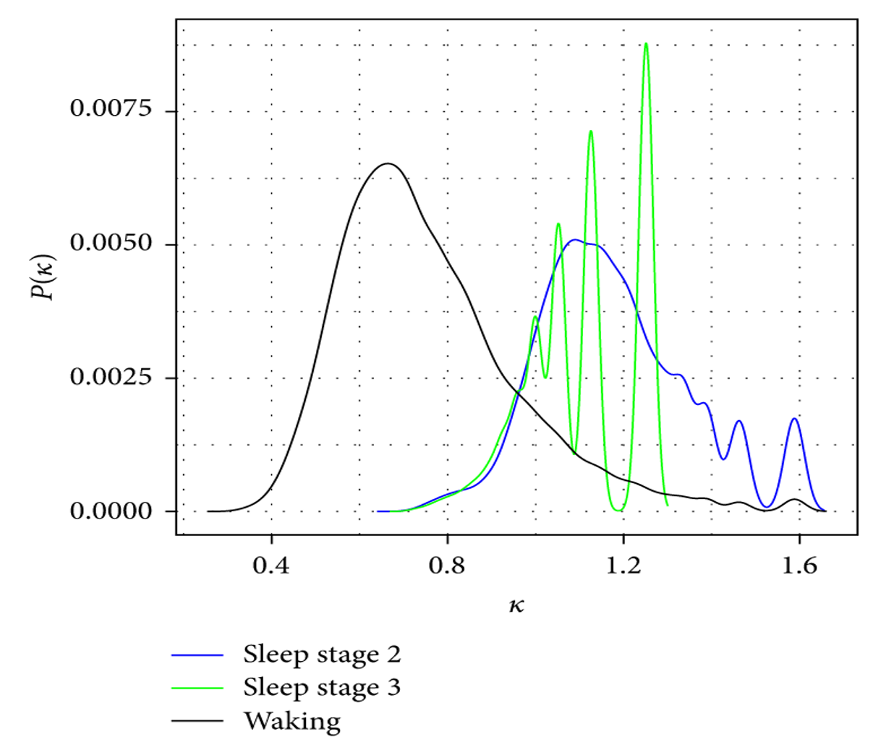

Todd Zorick and I wrote a neuroscience paper on using information equilibrium to tell the difference between different sleep states with EEG data. The title is "Generalized Information Equilibrium Approaches to [EEG](https://en.wikipedia.org/wiki/Electroencephalography) Sleep Stage Discrimination" and it was (finally) [published today](http://www.hindawi.com/journals/cmmm/2016/6450126/).

This adds to the series of information equilibrium framework applications for complex systems like [traffic](http://informationtransfereconomics.blogspot.com/2016/03/traffic-model-on-wicksellian-roundabout.html) or simple systems like [transistors](http://informationtransfereconomics.blogspot.com/2016/02/information-equilibrium-and-transistors.html).

One can think of these distributions as ensembles of "information transfer states" analogous to [productivity states](http://informationtransfereconomics.blogspot.com/2016/07/an-ensemble-of-labor-markets.html), [profit states](http://informationtransfereconomics.blogspot.com/2016/07/a-statistical-equilibrium-approach-to.html) (below), or [growth states](http://informationtransfereconomics.blogspot.com/2014/09/the-great-stagnation-information.html).

