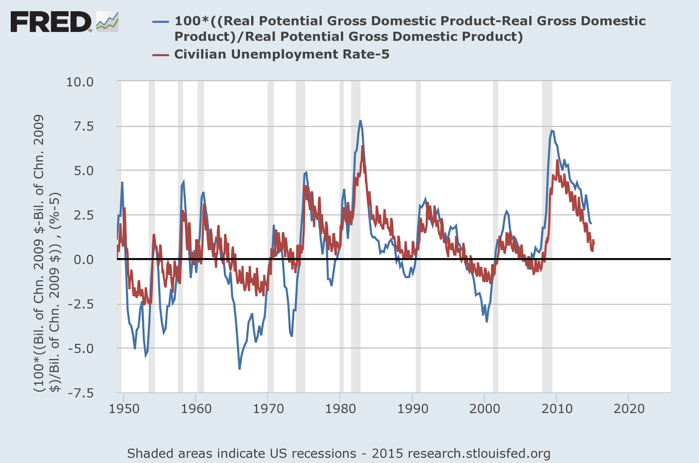

When I used this estimate of the "macroeconomic information equilibrium" (MIE) to claim that the mid-2000s were a "bubble" (i.e. RGDP was above the MIE), [John Handley](https://twitter.com/infotranecon/status/753350950199242757) asked me what the counterfactual employment would be. Let's start with the MIE (gray) versus data (red) and "potential RGDP" from the CBO (via FRED) (black) from this [post](http://informationtransfereconomics.blogspot.com/2015/03/potential-rgdp-and-forecast-rgdp.html) \[1\]:

The red line is above the gray line from rouhgly 2004 to 2008 -- that's the "bubble". We can use the information equilibrium relationship _P : NGDP ⇄ EMP_ (EMP = PAYEMS on FRED, total non-farm employees) to say the growth rate of _RGDP = NGDP/P_ is proportional to the growth rate of EMP; therefore the growth rate of the MIE should be the equilibrium growth rate of employment. And it is:

In \[1\], I noted that the information equilibrium unemployment result was a relationship between the growth rates of employment and MIE RGDP (shown in the picture above) rather than the output gap level and the unemployment rate. Basically, in the information equilibrium model

However, the derivative in equation (1) basically tells us that we measure the unemployment rate relative to some constant value in the IE model, but we have no idea what that value is -- it's the constant of integration you get from from integrating equation (1) -- but it also doesn't matter. Choose an arbitrary level of unemployment and then we'd say unemployment is "low" or "high" relative to that level. It is similar to the case of temperature -- 200 Kelvin is "cold", but 200 Celsius is "hot" because of the choice of zero point. Picking the average (5.9%) is as good a choice as any:

And so -- unemployment was low during the mid-2000s (well, falling since we are talking about rates). The eras where RGDP grows parallel to the MIE are also "equilibria" where unemployment is "normal" -- early 1960s; late 80s to 1990; the mid-90s; 2001-2004.

As a side note, I'd like to refer back to [this post](http://informationtransfereconomics.blogspot.com/2016/06/unemployment-equilibrium.html) \[2\] which looked at unemployment equilibria in terms of the rate of decline of unemployment (rate of growth of employment). You can see how this picture basically conforms with the picture above -- the MIE is an equilibrium of growth rates, not levels. Re-fitting the data to the cases of positive employment growth in the figure above, we get this picture:

There is an employment growth equilibrium (blue line) and negative deviations (i.e. a plucking model), which is exactly the model of \[2\] -- unemployment decline equilibrium and unemployment increases. The model of \[2\] can be considered to be the approximation to the model here for constant MIE RGDP growth (i.e. unemployment declines of constant slope -- figure below from \[2\]).

...

**Update 22 July 2016**

I was a bit premature in the paragraph above after the pair of images that you couldn't figure out a reasonable employment level. It's still a "fit" since the constant of integration information is unavailable, but it doesn't mean you can't create a "zero" for the temperature scale. Here is the employment level where I fit the constant of integration to the data:

You can still shift this curve up and down, but in the same way as you refer to temperature being high or low relative to a scale (absolute zero or water freezing) you can refer to employment being high or low relative to this curve regardless of whether you shift it up or down.
