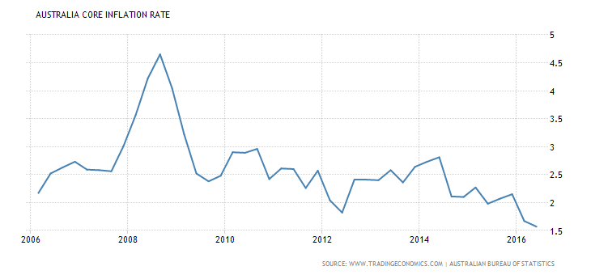
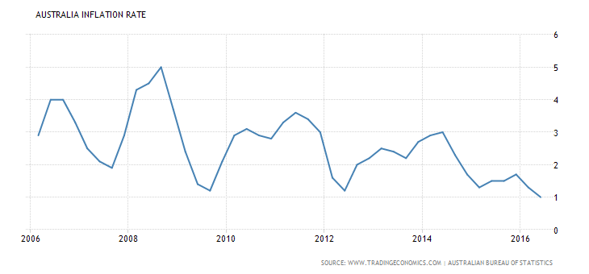

This [recent post by John Quiggin](http://johnquiggin.com/2016/08/22/abandon-inflation-targeting-while-we-still-have-time/) reminded me of my prediction of a trend towards undershooting inflation in Australia ([here](http://informationtransfereconomics.blogspot.com/2015/06/sumner-is-confused-about-australia-i-am.html) and [here](http://informationtransfereconomics.blogspot.com/2016/01/it-isnt-obvious-inflation-is-under.html)). A [commenter on this post](http://informationtransfereconomics.blogspot.com/2016/08/is-information-equilibrium-silly.html) going by Anti said unique predictions that fit empirical evidence are "the real question"; I'd say this is a unique prediction of the [information equilibrium model](http://informationtransfereconomics.blogspot.com/2015/08/information-equilibrium-as-economic.html) that fits the empirical evidence:

