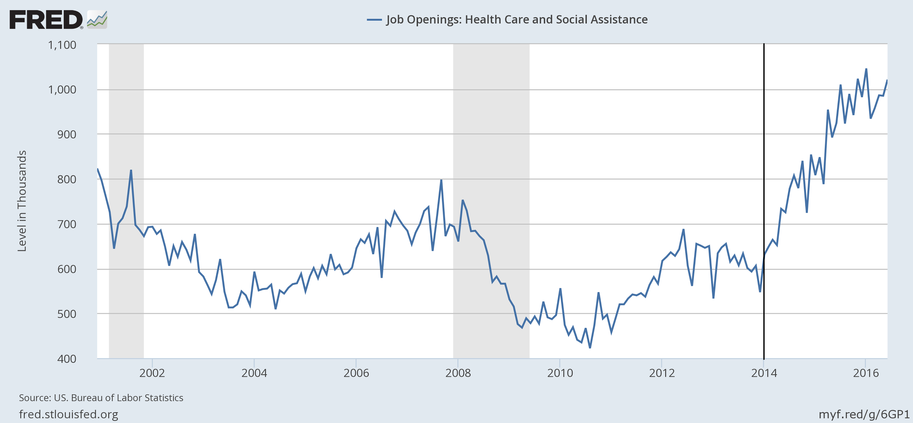

Scott Sumner repeated his unsupported claim that the expiration of unemployment insurance in 2014 decreased unemployment. It was picked up by [John Cochrane](http://johnhcochrane.blogspot.com/2016/08/the-new-voodoo.html) and [Tyler Cowen](http://marginalrevolution.com/marginalrevolution/2016/08/the-new-free-lunch-economics.html). I looked at the data [a year ago](http://informationtransfereconomics.blogspot.com/2015/06/perfect-storm-or-just-so-story.html) and showed that a sizable chunk of it could be explained by increasing job openings (and assuming a matching model) in the health care sector brought on by the ACA going into effect in 2014:

Additional jobs would be created via a Keynesian multiplier. I [tweeted about this](https://twitter.com/infotranecon/status/766408573270110208) and was asked how much higher unemployment would have been without the ACA [and estimated](https://fred.stlouisfed.org/graph/?graph_id=323131) 0.5 percentage points higher.

That estimate was loosely based on [this model of employment equilibrium](http://informationtransfereconomics.blogspot.com/2016/06/unemployment-equilibrium.html); however I thought I'd look at it a bit more rigorously. I re-ran the model fitting only to the data before 2014 and found that the impact was even larger at 1.3 percentage points:

It is true that a lot of things went into effect at the same time, but using a typical Keynesian multiplier of 1.5 accounts for about half of the boom in the total number of jobs and the biggest increase in openings was in health care. That's a pretty consistent story.
