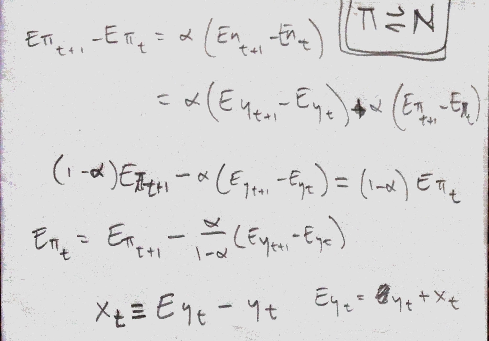

In the fourth installment, I am going to build one version of the final piece of the New Keynesian DSGE model in terms of information equilibrium: the NK Phillips curve. In the first three installments I built [(1)](http://informationtransfereconomics.blogspot.com/2016/08/dsge-part-1.html) a Taylor rule, [(2)](http://informationtransfereconomics.blogspot.com/2016/08/dsge-part-2.html) the NK IS curve, and [(3)](http://informationtransfereconomics.blogspot.com/2016/08/dsge-part-3-stochastic-interlude.html) related expected values and information equilibrium values to the stochastic piece of DSGE models. I'm not 100% happy with the result -- the stochastic piece has a deterministic component -- but then the NK DSGE model isn't very empirically accurate.

Let's start with the information equilibrium relationship between nominal output and the price level $\Pi \rightleftarrows N$ so that we can say (with information transfer index $\alpha$, and using the definition of the information equilibrium expectation operators from [here](http://informationtransfereconomics.blogspot.com/2016/08/dsge-part-3-stochastic-interlude.html))

Using the following substitutions (defining the information equilibrium value in terms of an observed value and a stochastic component, defining the output gap $x$, and defining real output)

The first equation is essentially the NK Phillips curve; the second is the "stochastic" piece. One difference from the standard result is that there is no discount factor applied to future information equilibrium inflation (the first term of the first equation). A second difference is that the stochastic piece actually contains information equilibrium real growth (the last term). In a sense, it is a biased random walk towards reducing the output gap.

Anyway, this is just one way to construct a NK Phillips curve. I'm not 100% satisfied with this derivation because of those two differences; maybe a better one will come along in a later update.

...

**Update**

[Here's the summary with links to each part](https://informationtransfereconomics.blogspot.com/2016/08/dsge-part-5-summary.html).
