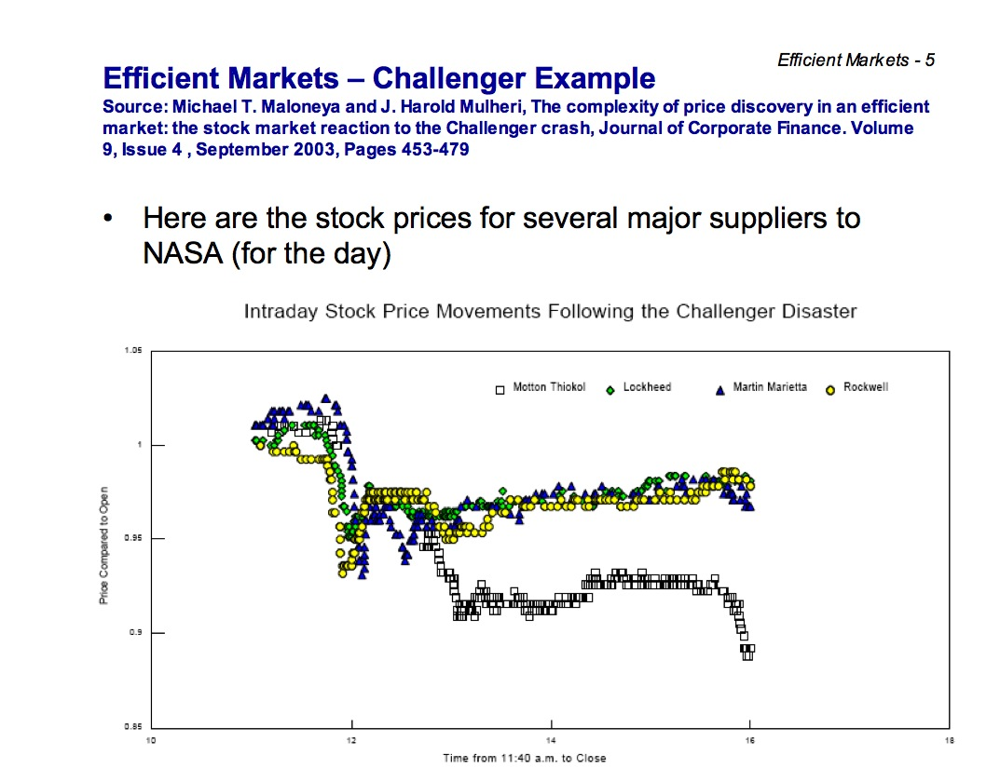
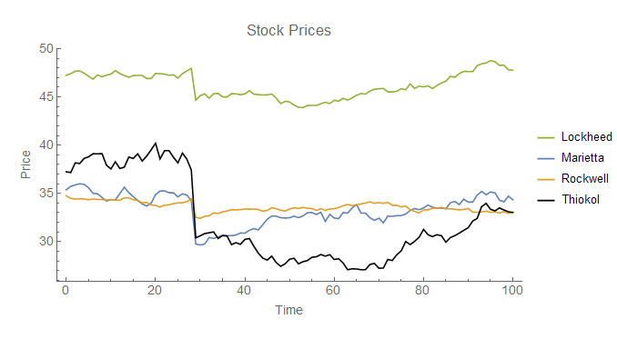
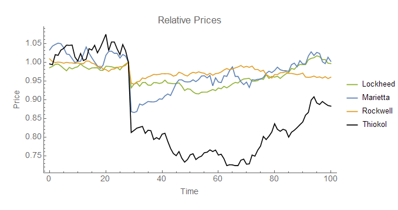
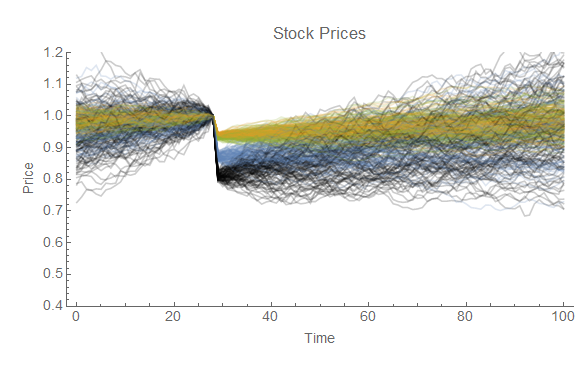
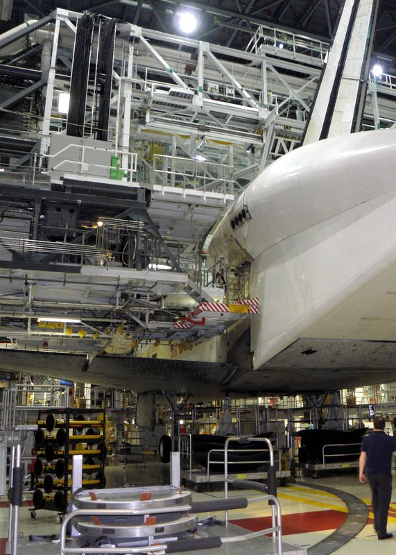
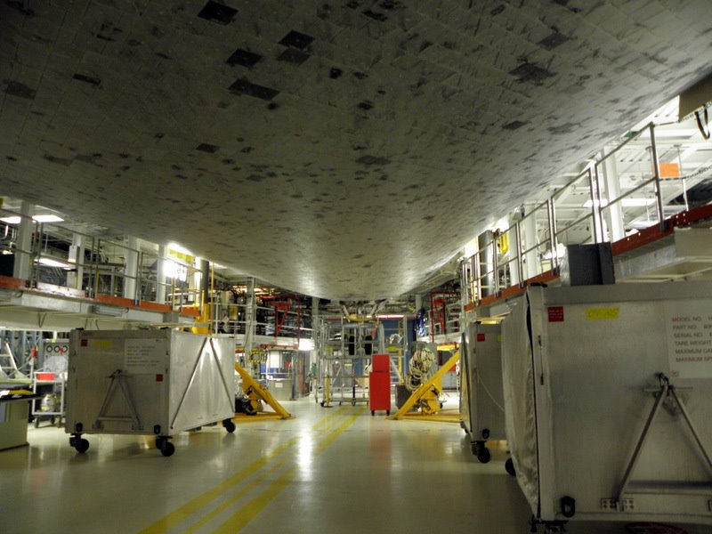

Ever the market boosters, Marginal Revolution has [a new video out](http://marginalrevolution.com/marginalrevolution/2016/08/the-efficient-markets-hypothesis.html) in its personal finance series that talks about the efficient markets hypothesis. Leave aside the fact that it might be questionable to base financial decisions on an hypothesis. I haven't watched the video, but from the still it appears to reference the _Challenger_ disaster. It's an interesting story propagated by believers in the wisdom of crowds. On the surface, the market appears to have discovered the problem was with the solid rocket boosters since Morton Thiokol's stock dropped more than the other NASA contractors involved with the shuttle program. [Here's a paper \[pdf\]](http://citeseerx.ist.psu.edu/viewdoc/download?doi=10.1.1.366.1998&rep=rep1&type=pdf) that investigates it. Now of course this could be attributable to larger exposure to NASA (Thiokol had about twice as much revenue from its shuttle program per the pdf) as well as Thiokol being a smaller, less diversified company than Lockheed, Marietta, or Rockwell at the time (see [John Quiggin here](http://crookedtimber.org/2005/07/06/crowds-and-market-caps/)). Here is a graph of stock prices from [here](http://mat.tepper.cmu.edu/blog/?p=877):

[information equilibrium model](http://informationtransfereconomics.blogspot.com/2015/04/solving-dark-matter-problem.html)

The key piece of information comes from the study referenced above. Average daily returns for the previous three months was given in Table 1: Lockheed (0.07%), Marietta (0.14%), Rockwell (0.06%) and Thiokol (0.21%). If we assume all of these companies are information equilibrium with the same underlying process _X_, these differential growth rates imply different information transfer (IT) indices. For example, the IT index _k_ \-- well, actually it's _k - 1_ since _log p ~ (k-1) log X_ -- is about three times higher for Thiokol than for Lockheed. This means that even given the same source of information, Thiokol will respond quite a bit more than Lockheed to the same shock. And some simulations bear this out; here's a typical example based on the growth and volatility in the paper cited above:

Note that the underlying process X is the same (a Wiener process with constant drift and volatility) but are different realized values. Here's a Monte Carlo with 100 throws per company:

In the information equilibrium model, the prices seem perfectly consistent with all four contractors being hit with the same information shock -- and  therefore there's no evidence the market figured out the cause within minutes of the disaster.

PS My grade school mascot was the _Challenger_ shuttle (I grew up in the suburbs of Houston).

PPS I got to take a tour of the orbiter processing facility while NASA was preparing _Discovery_, _Atlantis_, and _Endeavor_ were being prepared for the museums. Here's _Discovery_ in the OPF with its aerodynamic engine cover before being flown to Washington, DC:

