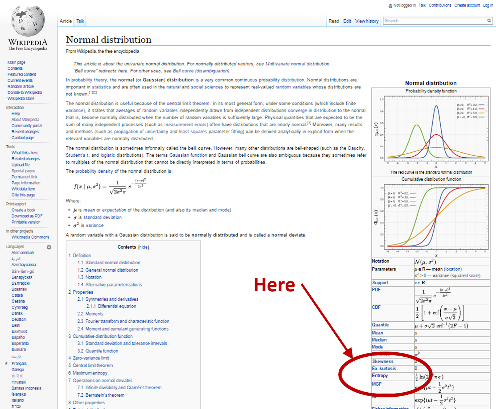

Tom Brown sent me a link to a highly critical [comment from TallDave on Scott Sumner's blog](http://www.themoneyillusion.com/?p=31901#comment-1050822) the other day. I think it contains a decent critique, but also misunderstands the project. Here is TallDave's comment:

> _I think the problem with Jason’s math is that when translated into words you get assertions like **what is called “demand” in economics is essentially a source of information that is being transmitted to the “supply”, a receiver, and the thing measuring the information transfer is what we call the “price”** which are kind of silly on their face. Modelling economics as a function of information transfer is a bit like modelling the digestive process on the basis of food’s color when it enters and exits — it just doesn’t capture enough of the process to be a useful exercise._

Emphasis in the original. It is true that naively applying the language of communications channels to economics in this way would seem like an exercise in modeling by elaborate analogy. However, the information equilibrium approach really is just a generalization of the idea of supply meeting demand. Imagine the distribution of blueberries as a function of time and space. During the spring, they are mostly distributed near the farms where they are grown. During the summer, they are distributed among many grocery stores. Much like in the Arrow-Debreu formulation of general equilibrium, we have a blueberry at a point in space at a particular time that represents a blueberry "supply event". Let's say that probability distribution _P(B)_ looks something like this:

Now a blueberry consumer has a property we call demand for blueberries. It changes in space and time as well. In the same way we have supply events, we have demand events (I have money for blueberries at the grocery store near my house at a given time today). In an ideal world, the distribution of blueberry supply events and the distribution of blueberry demand events \[call it _P(A)_\] would be identical:

These supply events and demand events together would form a joint distribution of "transaction events" where money was traded for blueberries:

This situation where the distribution of supply events and the distribution of demand events are the same is what we call information equilibrium. Information? If you check out any given Wikipedia page for a probability distribution (e.g. [the normal distribution](https://en.wikipedia.org/wiki/Normal_distribution)), you will see an entry in the box on the right-hand side for "Entropy" that links to the [information entropy](https://en.wikipedia.org/wiki/Entropy_\(information_theory\)) page.

Any probability distribution (e.g. our supply and demand distributions above) can be quantified in terms of its information entropy.

That's well and good for two identical distributions that don't change, but what happens if we infinitesimally wiggle one distribution \[_P(A)_\]? How much does the other distribution \[_P(B)_\] have to wiggle in order to maintain information equilibrium? The simplest answer to that question for uniform distributions gives us the information equilibrium condition (see e.g. [here](http://informationtransfereconomics.blogspot.com/2015/12/information-theory-101-information.html), except I used _D_ and _S_ instead of _A_ and _B_):

The information in that wiggle _δP(A)_ must have flowed (was transferred) to _P(B)_. (Note that the _P_ in the equation above is not the probability distribution, but the price which I will talk about below.) That's where the communication channel interpretation comes in. We have come complex multi-dimensional demand distribution and some multi-dimensional supply distribution with the information in the fluctuations of the demand distribution being transmitted through some channel and received by the supply distribution. (In a sense, Shannon's theory comes about from wanting the distribution of messages at one end to be identical to the distribution of messages at the other end.) This gives us the standard picture of a communication channel:

What about the price? I just defined the price in the equation above as the derivative _dA/dB_ -- this is actually an abstract price and should really be considered an exchange rate for an infinitesimal unit of _A_ for an infinitesimal unit of _B_. Does this make any sense? Yes, it does. For example, check out Irving Fisher's 1892 thesis:

The information equilibrium condition is just a minor generalization of the equation Fisher writes down relating the exchange of gallons of _A_ for bushels of _B_. But there is more -- in fact, if you define the LHS of the information equilibrium condition as the price, you can use that equation to derive supply and demand curves (see [my paper](http://arxiv.org/abs/1510.02435) or [this blog post](http://informationtransfereconomics.blogspot.com/2013/04/supply-and-demand-from-information.html)).

For more theoretical motivation, I'd also recommend you check out [my slides](http://informationtransfereconomics.blogspot.com/2016/02/slides.html) on the connection between information equilibrium and Gary Becker's paper _Irrational Behavior and Economic Theory_. For physicists, there's another theoretical motivation in terms of effective field theory ([here](http://informationtransfereconomics.blogspot.com/2014/02/i-quantity-theory-and-effective-field.html), [here](http://informationtransfereconomics.blogspot.com/2016/03/effective-information-equilibrium-theory.html)).

There is a decent critique contained in TallDave's comment, though:

> _Modelling economics as a function of information transfer is a bit like modelling the digestive process on the basis of food’s color when it enters and exits — it just doesn’t capture enough of the process to be a useful exercise._

It is definitely possible that the information in the wiggles _δP(A)_ are not received by the distribution _P(B)_ -- information is lost. It could be the case that _P(A)_ is a complex multi-dimensional distribution and _P(B)_ is ... less complex. In that case (for uniform distributions), the best we can say is that information equilibrium is a bound on the information transfer

and we have what we call non-ideal information transfer. But does information equilibrium capture enough of the process to be useful? This should primarily be an empirical question, but I'd say yes for two reasons:

-   [It works out fairly well empirically](http://informationtransfereconomics.blogspot.com/2015/09/prediction-aggregation-redux.html).
-   [It reproduces a lot of traditional economics](http://informationtransfereconomics.blogspot.com/2016/07/list-of-standard-economics-derived-from.html).

Therefore, I'd say there's really no reason to consider information equilibrium _prima facie_ "silly". If information equilibrium is silly, so is supply and demand since they are formally identical. That may well be true -- but then economics in general would be silly.
