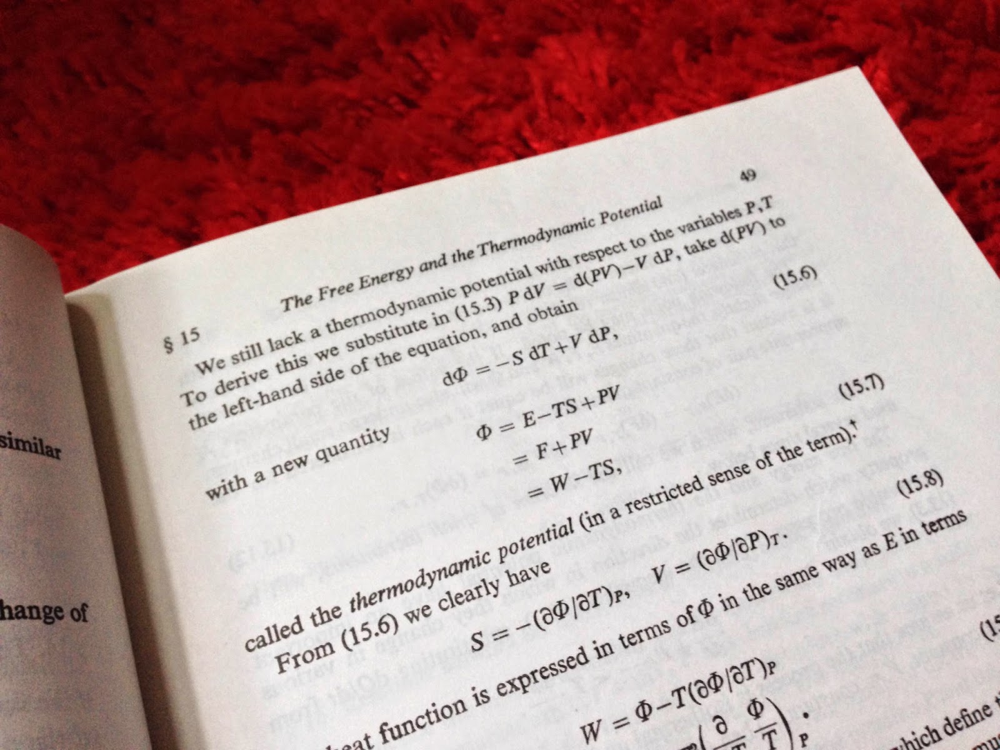

I invariably catch a cold after work trips, so I'm at home today. At least it gives me the opportunity to present something I worked out on the flight after reading [Dietrich Vollrath](https://growthecon.com/blog/Roy/) \[1\] about growth and productivity (a sign of good bloggers to me is that their posts inspire new work or a different way of understanding -- this one did both). Previously I had worked out [the partition function approach](http://informationtransfereconomics.blogspot.com/2014/06/the-macroeconomic-partition-function.html) \[2\] by what I called an elaborate analogy with thermodynamics. I'd like to present it this time as a more rigorous set of assumptions.

Let's say I have a series of markets with a single common production factor $B$ (don't worry too much about that -- it generalizes to multiple factors): $A_{i} \rightleftarrows B$ with IT indices $k_{i}$. This yields the general behavior:

If $B$ grows at some rate $\gamma$, then $A_{i}$ grows at $k_{i} \gamma$. If this continued, then the market with the highest $k_{i}$ would eventually dominate the entire economy. The partition function approach was intended to bring this closer to reality by re-imaging the economy as a ensemble of changing $k$-states, where no market stayed in a particular $k$-state long enough to dominate the economy. See [here](http://informationtransfereconomics.blogspot.com/2016/07/an-ensemble-of-labor-markets.html) \[3\] for a version this in terms of the labor market (where $k$ is instead productivity $p$ -- this was what I was thinking about reading \[1\] above). In \[3\], there is a partition function of the form

where $\beta \equiv \log (1+b)$ and $b \equiv (B - B_{ref})/B_{ref}$ or generally, some function of our factor of production $B$ (the specific form was worked out in \[2\] above and [here](http://informationtransfereconomics.blogspot.com/2016/07/economic-temperature-functions.html) \[4\]). The way to think about this is that the [Gibbs measure](https://en.wikipedia.org/wiki/Gibbs_measure) used for that partition function is the maximum entropy probability distribution where the ensemble has some fixed (constrained) value of $\langle k \rangle$. In physics, that fixed value is frequently the energy, but can also be particle number, or some other thermodynamic variable. The variable $\beta$ represents [the Lagrange multiplier](https://en.wikipedia.org/wiki/Partition_function_\(mathematics\)#The_parameter_.CE.B2) of the constrained problem. In physics, this Lagrange multiplier is the temperature.

In economics, we should therefore see this partition function being built from the maximum entropy distribution of an ensemble of markets where the macroeconomy has some well-defined ensemble average growth rate relative to the growth rate of the factor of production. That is to say the growth rate of the collection of markets (i.e. the macroeconomy) $\{ A_{i}\}$ is $\gamma \langle k \rangle $ where the angle brackets indicate ensemble average. This is not to say it never changes or our measure in terms of GDP is a good measure of it, just that "the growth rate of the economy" is something we can reasonably talk about. Using the IT model, it also means the price level growth (i.e. inflation) is similarly well-defined -- again, not necessarily our measure, just that it exists -- since it goes as $\gamma \langle k - 1 \rangle $.

Economists have tried to capture this general concept in terms of equilibrium balanced (or steady state) growth (e.g. [here](https://en.wikipedia.org/wiki/Balanced-growth_equilibrium), [here](https://en.wikipedia.org/wiki/Ramsey%E2%80%93Cass%E2%80%93Koopmans_model), or [here and links therein](http://informationtransfereconomics.blogspot.com/2016/09/the-kaldor-facts.html)). The tendency, however, has been  to assert everything must grow at the same rate, else one piece of the economy dominate in the long run as mentioned above. If we look at the physics analogy, this would be like asserting every atom in an ideal gas would have to have the same energy in order for the system as a whole to have a well-defined energy (that the macro system is in an energy eigenstate). Steve Keen made this invalid argument in a lecture awhile ago (see [here](http://evonomics.com/economists-prove-that-capitalism-are-unecessary/), and [I discussed here](http://informationtransfereconomics.blogspot.com/2016/02/attainable-definitions-of-equilibrium.html) how this definition of equilibrium doesn't represent reality -- sort of like defining swans as "beings from Neptune", and then complaining ornithologists are full of it because there aren't any swans).

While individual markets might be in a "growth eigenstate" of some factor of production, the macroeconomy as a whole isn't (and doesn't have to be).

\[A good analogy here is that previously economists viewed economic growth as a [laser](https://en.wikipedia.org/wiki/Laser) (photons in the same energy eigenstate, markets in the same growth state), but the present view is as a flashlight ([blackbody thermal radiation](https://en.wikipedia.org/wiki/Black-body_radiation), markets in an ensemble of growth states).\]

\*  \*  \*

There are a few additional things we can glean from this way of looking at the macroeconomy. First, the Gibbs measure as a probability distribution says that the likelihood of occupying a high $k$ state is lower for higher $k$ and decreases with increasing factors of production. This is a more rigorous way of putting my statement that as economies grow, there are more configurations where it is made up of many low growth markets than a few high growth markets so it is more likely to be found in the former configuration. This could be [what is behind e.g. secular stagnation](http://informationtransfereconomics.blogspot.com/2014/09/the-great-stagnation-information.html) -- i.e. no reason for lower growth, just greater likelihood.

Second, the (maximum entropy) [partition function approach is easily extendable](https://en.wikipedia.org/wiki/Partition_function_\(mathematics\)) to multiple factors of production (Lagrange multipliers) and constrained macro observables. In physics, you end up with "potentials" like the [Gibbs free energy](https://en.wikipedia.org/wiki/Gibbs_free_energy) or [Helmholtz free energy](https://en.wikipedia.org/wiki/Helmholtz_free_energy) depending on how you look at the problem. [I already started down this path](http://informationtransfereconomics.blogspot.com/2015/04/economic-potentials-or-how-to-define.html), but another take-away is that just like in physics you might have different macroeconomic models ("economic potentials") depending on how you look at the problem (e.g. what constraints you set, or which macro observables are well-defined).

Third, those potentials are made up of "emergent" concepts in physics like entropy, temperature, and pressure (and [entropic forces](https://en.wikipedia.org/wiki/Entropic_force) for each term in the potential) that have no microscopic description. In economics, the various entropic forces -- described in terms of supply and demand -- arising from the terms in the potentials may not have a valid description in terms of individual agents. I've already considered [sticky wages (and prices) to be an example](http://informationtransfereconomics.blogspot.com/2014/10/wage-stickiness-is-entropic-force.html) (not observed individually). Additionally some of the variables themselves are emergent. Temperature makes no sense for an atom. An atom has various kinds of energy (rotational, center of mass kinetic, molecular bond potential) that contribute to understanding temperature. Likewise, maybe "money" makes no sense for an individual agent. Maybe an agent has various kinds of assets (checking accounts, currency, and treasury bonds) that contribute to understanding "money". This would also apply to inflation (i.e. it doesn't exist at the individual agent level) -- as noted above, in the IT model a well-defined growth rate of the macroeconomy implies a well defined inflation rate.

\*  \*  \*

Previously I had used the partition function approach using money as the factor of production (and information transfer indices as the nominal growth states) in \[2\] above and using labor as the factor of production (where information transfer indices represent labor productivity) in \[3\] above. These two models see falling growth and falling productivity over time, respectively. This post makes the specific assumptions going into the model more explicit -- a maximum entropy distribution of the factor of production (money or labor) among the growth states (growth or productivity states) with the assumption that the macroeconomic state has a well-defined growth rate.
