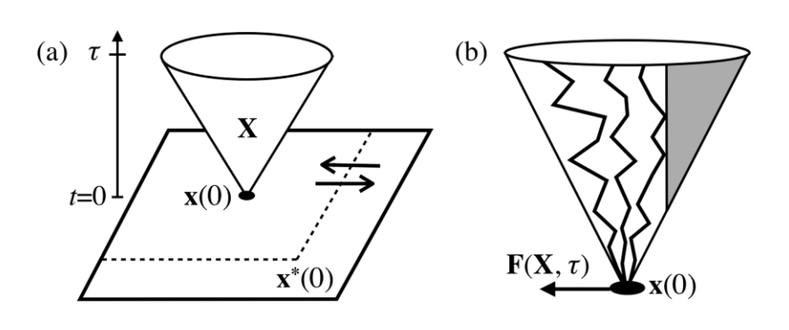
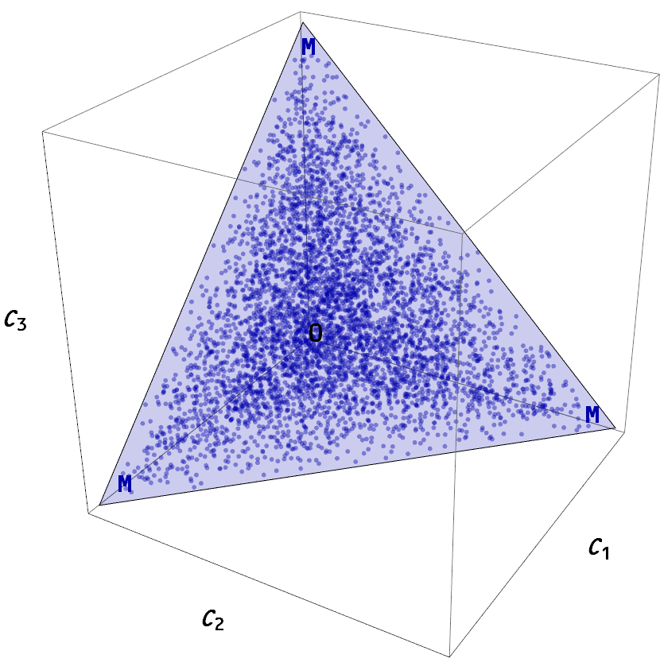
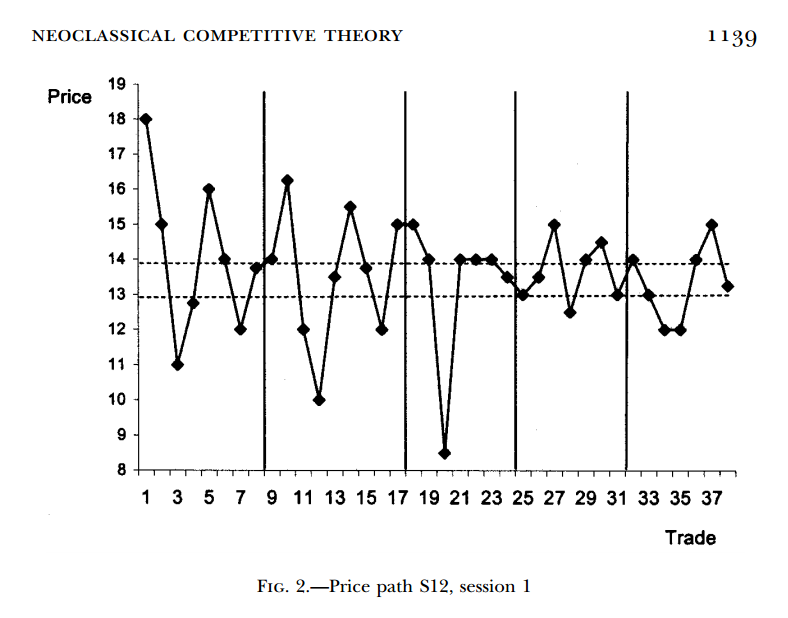

> _Recent advances in fields ranging from cosmology to computer science have hinted at a possible deep connection between intelligence and entropy maximization, but no formal physical relationship between them has yet been established. Here, we explicitly propose a first step toward such a relationship in the form of a causal generalization of entropic forces that we find can cause two defining behaviors of the human "cognitive niche" — tool use and social cooperation — to spontaneously emerge in simple physical systems. Our results suggest a potentially general thermodynamic model of adaptive behavior as a nonequilibrium process in open systems._

That's the abstract to _[Causal entropic forces](http://www.alexwg.org/publications/PhysRevLett_110-168702.pdf)_ \[pdf\] (2013) by Wissner-Gross and Freer (WGF) appearing _Physical Review Letters_. Adding causality to the description of entropic forces (entropy maximizing forces) creates systems of mindless atoms that can perform tasks that look like the actions of intelligent agents. I have previously speculated that entropy maximization can lead to emergent rational (i.e. "intelligent") economic agents and [organized several posts for a future draft paper](http://informationtransfereconomics.blogspot.com/2015/10/utility-maximization-and-entropy.html).

I suggest you read the paper, but there are a few points made in it that I'd like to emphasize. First, WGF point out entropic forces are the results of restrictions on the state space:

> _... an environmentally imposed excluded path-space volume ... breaks translational symmetry, resulting in a causal entropic force ... directed away from the excluded volume._

 This isn't specific to 'causal' entropic forces (plain entropic forces have this same underlying reason -- something has to exclude state space volume \[or more generally make it less likely\] in order for you to have an entropy gradient in a specific direction). [When I speculated economic forces are entropic forces](http://informationtransfereconomics.blogspot.com/2015/10/economics-as-and-versus-social-science.html) dependent on the properties of the state space, that is what I had in mind. Budget constraints are constraints on the economic state space (or in e.g. Gary Becker's 1962 paper _Irrational Behavior and Economic Theory_, the opportunity set).

Second, WGF's causal entropic forces don't really require strict causality, just a tendency not to immediately undo a state change. The reluctance of economic agents to undo exchanges was identified by [Foley and Smith](http://www.santafe.edu/research/working-papers/abstract/2fbd6ed49c037a8407ab7dbb423ad02d/) as one of the differences between thermodynamics and economics. We could also potentially [interpret the endowment effect as a manifestation of causal entropy](http://informationtransfereconomics.blogspot.com/2015/10/is-endowment-effect-rational.html).

Third, causal entropic forces acting on macroeconomic states would behave like a restorative force (rather than simply wandering around the state space if all states are equally likely). Measures like [unemployment would generally return to some level](http://informationtransfereconomics.blogspot.com/2016/06/unemployment-equilibrium.html) determined by the state space. We'd likely find the economy near the point expected given the least informative prior, which for a high dimensional system is near the surface and in the center of the budget constraint hyperplane, not just over a long period of time, but regularly -- [even after displacement from equilibrium](http://informationtransfereconomics.blogspot.com/2015/10/when-is-intertemporal-budget-constraint.html).

This is a bit of a subtle point. If we place the economy in some state at time t where all states are equally likely, that point represents a local entropy maximum just as much as say the centroid of a high dimensional opportunity set bounded by a budget constraint hyperplane:

However, causal entropic forces will make our state evolve towards the centroid (which is near the center of the budget constraint hyperplane of a high dimensional opportunity set) over time, instead of randomly moving through the state space (so that only on average it is near the center of the hyperplane). In a sense, this is the difference between a random walk and a random walk with drift.

Fourth, [there was one aspect of List (2004)](http://informationtransfereconomics.blogspot.com/2016/04/list-2004-field-experiments-with-random.html) I wasn't able to reproduce with purely random transactions (entropic forces). Over time, the standard deviation of the market price fell monotonically:

As mentioned above, causal entropic forces would act like a restoring force pushing the price towards the "equilibrium" (i.e. the information equilibrium), damping deviations from it, over time.

I would also like to point out that WGF's paper is a tremendous blow to those who think humans as rational utility maximizers (or even boundedly rational, or adaptive agents) are a prerequisite for economic theory. Whatever puzzle you might think is too hard for random particles to solve, causal entropic forces are something you will have to consider.

**Update 24 April 2017:** [In a subsequent post](http://informationtransfereconomics.blogspot.com/2016/09/supply-and-demand-as-causal-entropic.html), I used causal entropy to simulate a demand curve:

