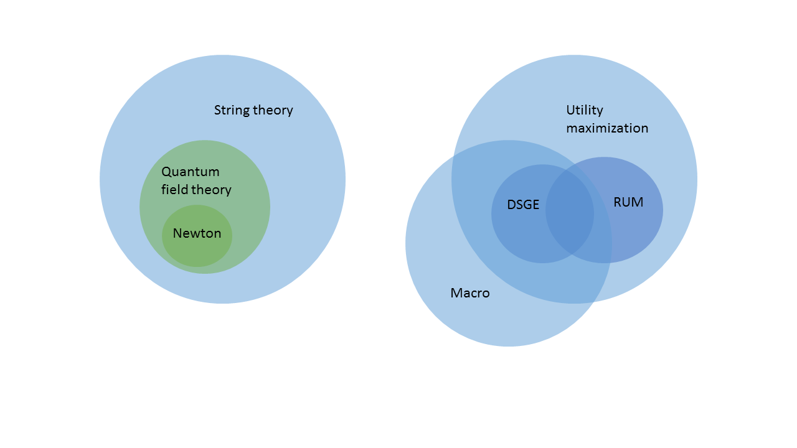
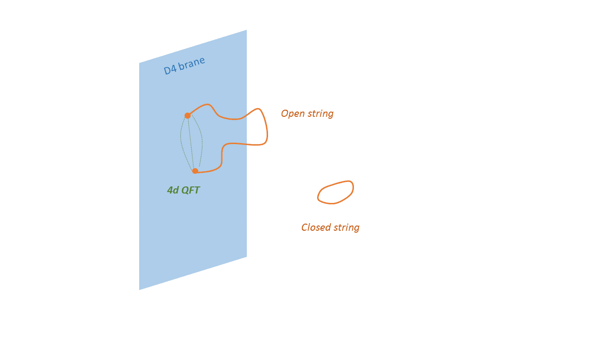

Paul Romer has taken another swipe at economics \[[pdf](https://www.law.yale.edu/system/files/area/workshop/leo/leo16_romer.pdf)\] -- this time at macroeconomics. His previous discussion of mathiness was directed at growth economics, and I wrote about it several times (e.g. [here](http://informationtransfereconomics.blogspot.com/2015/05/prescott-and-lucas-arent-romers-problem.html)). In his latest, Romer compares macroeconomics to string theory (in a bad way). I'm not sure he quite understands what string theory is (in a way that reminds me of [his misunderstanding the Bohr model](http://informationtransfereconomics.blogspot.com/2015/05/frameworks-and-bohr-model-analogy.html)) so I don't think his analogy supports his argument.

> **Update + 2 hours:** I am not addressing Romer's problems with macro, with which I largely agree! As I mentioned in the PS below, there is a forthcoming post on that. This post is just about the macroeconomics-string theory analogy (or really any physics analogy) that should be retired. Macroeconomics is its own thing and really not like physics in any way. [Even the analogy with thermodynamics fails](http://informationtransfereconomics.blogspot.com/2016/09/the-economic-state-space-mini-seminar.html) because the economic version doesn't have a second law. Economics is a very different complex system.

> **Update 15 September 2016:** I have a [second post](http://informationtransfereconomics.blogspot.com/2016/09/macro-is-not-like-string-theory-part-ii.html) that has more description of how I personally viewed string theory when I was in academic physics. The post below is mostly about technical failures of the analogy. The linked post is more about the sociological failures of the analogy.

> **Update 16 September 2016:** [Here's another way](http://informationtransfereconomics.blogspot.com/2016/09/macro-is-not-like-string-theory-part.html) to look at the Venn diagram below in terms of equations. 

Saying macro is like string theory isn't new; [here is a really good post](http://noahpinionblog.blogspot.com/2012/03/scientific-failures-particle-physics-vs.html) by Noah Smith from 2012. Heck, [even I wrote about it in my first month of blogging](http://informationtransfereconomics.blogspot.com/2013/04/the-philosophical-motivations.html):

> _Second, and on a more personal level (and speaking of string theory), from the outside, the whole DSGE model discussion reminds me of how String Theory is seen in physics: awesome models, awesome mathematics, little connection to experiment, pretty much intractable except with various simplifying assumptions, and kind of a big deal for a limited reason (DSGE has microfoundations and can look like an economy, string theory has something that looks like what we think quantum gravity should look like)._

Over the course of learning more about macro however, I have to say these comparisons are completely off base. Smith lays down one of the reasons in his post:

> _For one thing, physics is suffering from being too good. ... In macro, on the other hand, we basically have no theories that work well ..._

First, let me say that both Smith and Romer cite Lee Smolin on the subject. This is a bit like citing John Cochrane or Robert Lucas on Keynesian economics. Smolin develops and advocates a "competing" theory of quantum gravity (loop quantum gravity). I have to say that this is the Smolin of 2006 (when his book came out); at one time, he seemed amenable to the idea that loops and stings are different representations of the same thing. Not sure what the change was -- possibly just frustration with the limited uptake of loops (which may yet win out in the end). I personally just see loops as part of the general philosophy in physics that every theory could be an effective theory -- an easier version of some other theory under some limited scope -- as long as they have the same symmetries. For example, with the AdS/CFT correspondence, we could look at the (hard to calculate) strongly coupled regime of an approximately conformal theory like QCD as a perturbative (i.e. easy to calculate) supergravity on AdS₅.

This leads to my main objection that is probably best represented by comparing two Venn diagrams:

Noah's point about working well is illustrated above by coloring the experimentally validated theories green. However the main point is that string theory is an extension of those experimentally validated theories. String theories contain the experimentally verified quantum field theories (there may be QFTs that aren't part of the standard model that aren't describable as a limit of string theory, but SU(3), SU(2), and U(1) all can be). This is one of the major rationales for string theory! Topological genus expansion of string amplitudes looks suggestively like the loop expansion of Feynman diagrams:

The theory of open string ends (on branes) will look like a (lower dimensional) quantum field theory:

This is the heart of the AdS/CFT correspondence above: the 2d brane (really 4d) is the boundary of the 3d (really 5d) volume (the "bulk") where the string/supergravity theory applies. String theory contains quantum field theories and quantum field theories are the basis of the successful standard model.

Now if DSGE macro was like string theory, it would be untestable in the domain it is supposed to address (at least realistically) and would contain some other fantastically successful theory as a limit. We'd have to live in a world where you couldn't measure GDP or inflation to test DSGE models, but DSGE described individual human economic behavior to many decimal places. Obviously this isn't true.

Additionally, the utility maximization framework (and its rational counterpart RUM) is not where a lot of the empirical success of economics is. Behavioral economics tells us that humans are not often rational. The macro theories that appear to have given the best understanding of the world after 2008 have come from the area of macro outside the utility maximizing circle (e.g. IS-LM).

Another way I think the string-macro analogy goes wrong is that string theory is supposed to be a more fundamental theory. Physics uses its successful macroscopic theories (general relativity, lower energy quantum theories) to extend to a higher energy and shorter length scale microscopic theory. Macroeconomics is less fundamental and larger scale than microeconomics as it supposedly emerges from it. This macro-micro inversion in the analogy distorts the focus of the failure. The fruitlessness of string theory is focused on string theory. However the fruitlessness of macro is focused on DSGE or RBCT, not on utility maximization or the failure of microeconomics to produce reasonable aggregated results. [Smith quotes a microeconomist](http://noahpinionblog.blogspot.com/2016/05/whats-difference-between-macro-and.html) illustrating this:

> _The economics profession is not in disrepute. Macroeconomics is in disrepute. The micro stuff that people like myself and most of us do has contributed tremendously and continues to contribute._

But the DSGE models are purportedly based on that microeconomics! That the microeconomics fails to aggregate into a plausible macro theory means there is something wrong with the microeconomics. A root cause analysis of the fruitlessness of DSGE macro points to micro. Non-microfounded models like IS-LM or econometric (e.g. VAR) models aren't in the same boat as DSGE macro. In contrast, the root cause of the fruitlessness of string theory is the lack of experiments turning up results for string theory to explain. But that can't propagate back into questioning quantum field theory in the same way macro failures must result from some micro failure.

Going back to the Venn diagram above, an issue inside the string theory circle does not imply an issue in the QFT circle. However an issue inside the DSGE circle does imply an error in every circle DSGE is embedded.

Romer also uses Smolin's charge that strings are like a religion or politics as opposed to science. I don't really buy it, but if strings are a religion, may all religions be like it! String theory makes no claims about things that are feasibly testable and in the areas where it is testable it says the same things as well established science. Imagine if Christians only made claims about stuff that happens near the Planck scale! The thing is that if DSGE macro is "religious", then its fundamental tenets (microeconomics and the utility maximizing approach) are the source of its doctrine. That is to say "religion" infects all of economics. Singling out on macro is like blaming Presbyterians for all of the ridiculous claims of monotheism.

\[Also: macroeconomics loves to make claims about (out of scope) individual human behavior while shrugging off the scope where it is testable with "all models are wrong" -- yet another example of problematic inversion involved in the string-macro analogy.\]

As a final note, let me say that a lot of the public view of string theory (and therefore economists' view) seems to be stuck in the 1990s. Even Smolin's book, which came out in 2006 seems to negate the progress. The string theory of the early 90s is very different from the string theory of today. Much like how T-duality was a major advance, "[holographic duality](https://en.wikipedia.org/wiki/AdS/CFT_correspondence)" will probably be seen as a major advance. We may never have experiments that probe the string scale, but I'm pretty sure that we will eventually construct a string theory that contains the entire standard model. Just because we haven't found it yet doesn't mean it doesn't exist. I imagine that theory will have several different descriptions (even an [entropic one](https://en.wikipedia.org/wiki/Entropic_gravity)).
