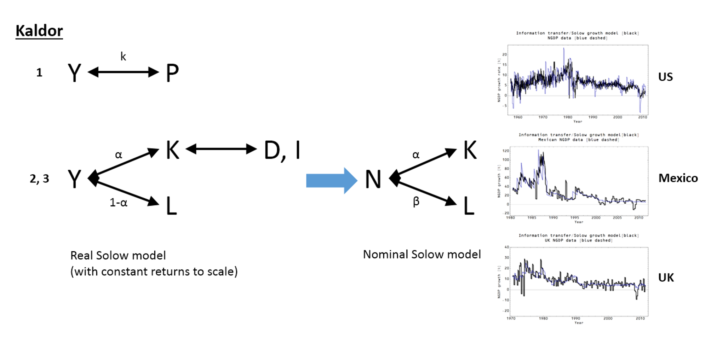

Dietrich Vollrath has a great pair of posts [\[1\]](https://growthecon.com/blog/BGP-Empirics/), [\[2\]](https://growthecon.com/blog/BGP/) on the "balanced growth path" (BGP) framework of growth economics. Here's Vollrath

> _BGP is really just a name for a set of conditions related to several major pieces of economic data:_
>
> _
>
> 1.  _The growth rate of output per worker is constant over time_
> 2.  _The rate of return on capital is constant over time_
> 3.  _The share of output paid to capital is constant over time_
>
> _These three conditions are part of the the “Kaldor Facts” established in by Nicolas Kaldor in 1957._
>
> _

How would you capture these "stylized facts" as information equilibrium relationships? Fairly simply as [the Solow model](http://informationtransfereconomics.blogspot.com/2015/05/the-rest-of-solow-model.html) (relating real output _Y_, capital _K_, labor L, depreciation _D_, and investment _I_) alongside an additional information equilibrium (IE) relationship between real output Y and population _P_. In the Solow model, constant returns to scale are assumed so that the IT index for the IE relationships between output and capital and output and labor are _α_ and _1-α_, respectively. The relationship between _Y_ and _P_ captures the first stylized fact, and the Solow model captures the second and third ones. This is shown in diagram form in the following graphic:

As Vollrath mentions in \[1\], there are some questions as to whether the stylized facts represent the data. While the first works reasonably well, the second and third are less successful. Vollrath claims you probably wouldn't reject any of the hypotheses. However, I think the worse failure of the second and third facts can be directly related to the finding that the IE version of the Solow model (the "nominal" Solow model, which tells us to use nominal quantities like nominal output and doesn't have constant returns to scale) [works really well empirically](http://informationtransfereconomics.blogspot.com/2015/05/the-uk-another-case-of-productivity.html) (shown in the diagram above for the US, UK, and Mexico). In fact, this is the basis of a really good empirical model of output, labor, capital, and inflation (so both real and nominal output) I called "[the quantity theory of labor and capital](http://informationtransfereconomics.blogspot.com/2016/03/a-quantity-theory-of-labor-and-capital.html)".

The main point, however, is that we can capture the original Kaldor facts as a concise set of information equilibrium relationships.
