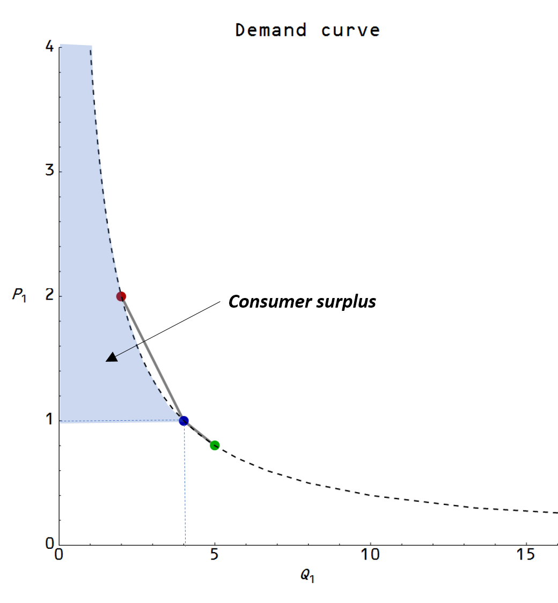

There was some press regarding an economic working paper produced by one half of _Freakonomics_ and a couple economists at Uber about ... Uber's surge pricing. This gets into some really gray areas in the center of the Venn diagram of journalism, advertising, and science. I will leave that alone for now. Anyway, [here is the story on _Freakonomics_](http://freakonomics.com/podcast/uber-economists-dream/).

First I did want to quote Steven Levitt:

> _And I thought for the first time, “what really is a demand curve?” And I thought to really bring it to life, I think I have to find one, I have to show one to the students. And I looked around, and I realized that nobody ever had really actually estimated a demand curve. Obviously, we know what they are. We know how to put them on a board, but I literally could not find a good example where we could put it in a box in our textbook to say, “This is what a demand curve really looks like in the real world,” because someone went out and found it._ 

> _... we looked and looked and in the end we didn’t really have a very good example._

[That's what I found](http://informationtransfereconomics.blogspot.com/2015/01/is-demand-curve-shaped-by-human.html)**Update:**[there have been estimates of demand curves](http://jaysonlusk.com/blog/2016/9/10/real-world-demand-curves)

Anyway the Freakonomics self-interview continues to present the results of the Uber study. In the study, they attempt to figure out the [consumer surplus](https://en.wikipedia.org/wiki/Economic_surplus#Consumer_surplus) Uber customers derive by essentially computing a demand curve. Levitt tells us one interpretation of consumer surplus:

> _It’s the extra happiness/utility/joy/willingness-to-pay that a consumer derives from being able to purchase a good at a given price._

That assumes the demand curve derives from a utility maximization problem, though. However you can derive the same demand curve from [an entropy maximization problem](http://informationtransfereconomics.blogspot.com/2015/03/utility-in-information-equilibrium-model.html) (as economist [Gary Becker does](http://informationtransfereconomics.blogspot.com/2015/10/gary-beckers-emergent-rational-agents.html) in his paper on random "irrational" agents), in which case it is just related to the size of part of the economic state space. And the demand curve just arises from properties of the state space, not the actions of agents in it. Gary Becker and most economists call the economic state space an "opportunity set".

The entropy explanation makes it easier to understand [why capuchin monkeys also respond to markets with the same demand curves as intelligent humans](http://informationtransfereconomics.blogspot.com/2015/11/monkeys-and-markets.html): it has nothing to do with the monkeys or the humans, but rather the opportunity set. And it makes sense of why an aspect of human behavior can be encompassed by a simple mathematical law: it's because that law isn't a result of human behavior, but rather a result of an abstract mathematical object (the opportunity set).

It's a nice coincidence that the Freakonomics interview also references the capuchin monkey study.

Gary Becker's argument was that random "irrational" agents (capuchin monkeys) would potentially be found anywhere in the opportunity set defined here as a budget constraint (_P1 Q1 + P2 Q2 < B_) and two goods: _Q1_ \= Uber rides and _Q2_ = Jell-O (in honor of the monkey study). We'll take it to be the average location (which also would be the result of [a causal entropic force](http://informationtransfereconomics.blogspot.com/2016/09/causal-entropic-forces-as-economic.html)) in the center of the triangle bounded by the budget constraint. That's the first graph. If you change the price of one good, that changes the budget constraint line (second graph) and those changes sweep out a demand curve (third graph). Once you have a demand curve and a "normal" equilibrium price, you can find the consumer surplus (the blue shaded area in the fourth graph).

And there we have a demand curve and consumer surplus from random, irrational agents.

**Epilog**

I originally learned of the capuchin monkey study from my father, who was always learning new things, and who I took as a role model for being curious about the world. He passed away suddenly earlier this year; I will miss him terribly.
