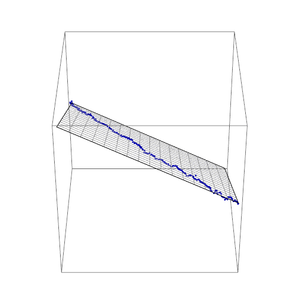

_log r = a log N – a log M – b_

where _N_ in nominal output (NGDP), _M_ is the monetary base minus reserves, and _a_ ~ 2.8 and _b_ ~ 11.1 (pictured above). This formula [represents a plane](https://en.wikipedia.org/wiki/Plane_\(geometry\)#Point-normal_form_and_general_form_of_the_equation_of_a_plane) in _{log N, log M, log r}_ space. If we wrote it in terms of _{x, y, z}_, we'd have

_z = a x –  a y – b_

And we can see that the data points fall on that plane if we plot it in 3D (_z_ being _log r_, while _x_ and _y_ are _log N_ and _log M_):

**Update + 4 hours**

I thought it might be interesting to "de-noise" the interest rate in a manner analogous to [Takens' theorem](https://en.wikipedia.org/wiki/Takens%27_theorem) (see [my post here](http://informationtransfereconomics.blogspot.com/2016/10/i-am-not-sure-steve-keen-understands.html)). The basic idea is that the plane above is the low-dimensional subspace to which the data should be constrained. This means that deviations normal to that plane can be subtracted as "noise":

The constrained data is blue, the actual data is green. This results in the time series (same color scheme):

The data is typically within 16 basis points (two standard deviations or 95%) of the de-noised data.
