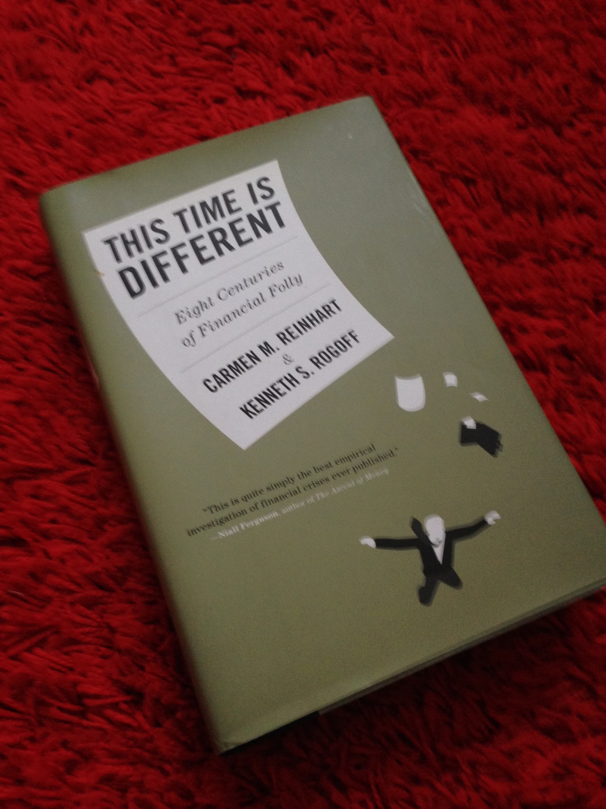

> **Update 30 October 2016:** George H. Blackford [responds](http://informationtransfereconomics.blogspot.com/2016/10/economist-shouldnt-be-used-as-source.html?showComment=1477848710618#c1215256805349601260) in comments below (and [here](http://www.rweconomics.com/DearJason.htm)). I agree with his point that the lack of consensus on dark energy in physics is trivial (i.e. it has no effect on humans) compared with the real world consequences of a lack of consensus on economic policy. Additionally, a distinction should be drawn between Milton Friedman's "as if" methodology itself and how it is perceived in economics (e.g. [Noah Smith seems to](http://noahpinionblog.blogspot.com/2016/06/the-pool-player-analogy-is-silly.html) exhibit the perception, disagreeing with it \[I responded to this [here](http://informationtransfereconomics.blogspot.com/2016/06/macroeconomists-are-weird-about-theory.html)\]). I will follow up with more after taking some time to digest George's comments.

> **Update 1 November 2016:** We have blogging sign! [The response has posted](http://informationtransfereconomics.blogspot.com/2016/11/economics-physics-and-data-response-to.html).

...

Ugh.

> 1/ Economist writing this should probably learn about science before talking about it. "As if" = "effective theory".[https://t.co/xIv0antibu](https://t.co/xIv0antibu) [https://t.co/Bk78JlQXCA](https://t.co/Bk78JlQXCA)
>
> — Jason Smith (@infotranecon) [October 28, 2016](https://twitter.com/infotranecon/status/792076905193148416)

Here we go again ([here](http://informationtransfereconomics.blogspot.com/2016/06/macroeconomists-are-weird-about-theory.html), [here](http://informationtransfereconomics.blogspot.com/2016/04/please-stop-talking-about-how-science.html)). The author of [this terrible article](http://evonomics.com/economists-stop-defending-milton-friedmans-pseudo-science/) is George Blackford, who has a Phd in economics. Since economics is _oh so_ scientific in its approach, we should of course consult an economist on how to be scientific. Blackford takes a dim view of Friedman's "as if" approach:

> _Economists Should Stop Defending Milton Friedman’s Pseudo-science_ 

> _On the pseudo-scientific nature of Friedman’s “as if” methodology_

> _... Friedman poses \[the billiard player\] analogy in the midst of a convoluted argument by which he attempts to show that a scientific theory (hypothesis or formula) cannot be tested by testing the realism of its assumptions. All that matters is the accuracy of a theory’s predictions, not whether or not its assumptions are true._ 

Let me borrow from [Wikipedia](https://en.wikipedia.org/wiki/Effective_theory):

> **_Effective theory_** 

> _In science, an effective theory is a [scientific theory](https://en.wikipedia.org/wiki/Scientific_theory) which proposes to describe a certain set of [observations](https://en.wikipedia.org/wiki/Experiment), but explicitly without the claim or implication that the mechanism employed in the theory has a direct counterpart in the actual causes of the observed phenomena to which the theory is fitted. I.e. the theory proposes to model a certain **effect**, without proposing to adequately model any of the **causes** which contribute to the effect. ..._

> _In a certain sense, [quantum field theory](https://en.wikipedia.org/wiki/Quantum_field_theory), and any other currently known physical theory, could be described as "effective", as in being the "low energy limit" of an as-yet unknown "[Theory of Everything](https://en.wikipedia.org/wiki/Theory_of_Everything)"._

The extra underlining is mine. The way physicists understand all of physics today is as an effective theory. Planets move according to Einstein's general relativity **_as if_** spacetime was a kind of 4-dimensional rubber sheet bent by energy. In fact, gravity might well be [a fictitious entropic force](https://en.wikipedia.org/wiki/Entropic_gravity) based on information at the horizon. Or it could be [strings](https://en.wikipedia.org/wiki/String_theory). But for most purposes, it behaves **_as if_** it is a rubber sheet.

So what Blackford considers to be pseudo-science is in fact precisely science. That's a pretty bad starting point, but it keeps getting funnier every time I read it ...

> _Now it seemed quite clear to me back in 1967, and it still seems quite clear to me today, that it is the purview of engineering, not science, to catalog the circumstances under which a theory works and does not work and to estimates the errors in the predictions of theories along with the cost involved in using one approach or another._

I busted out laughing when I read this. Funny story. One of the people on my committee at [my thesis](http://inspirehep.net/record/690305) defense asked me exactly this question about the chiral quark soliton model -- where does it work, and where does it fail. Little did I know that Blackford had figured out back in 1967 that this kind of question should have been reserved for an engineering graduate student, not a theoretical physicist. [I've been using Noah Smith's words](http://informationtransfereconomics.blogspot.com/2015/10/we-built-this-theory-on-scope-conditions.html) for this: [defining "scope conditions"](http://informationtransfereconomics.blogspot.com/2016/06/macroeconomists-are-weird-about-theory.html).

I also work as an engineer, and this is not what engineers do either. Engineers design and build systems using existing science. Sometimes they find limits or new things when they do.

Blackford continues to demonstrate his naivete about science:

> _The fundamental paradigm of economics that emerged from this methodology not only failed to \[anticipate\] the Crash of 2008 and its devastating effects, it has proved incapable of producing a consensus within the discipline as to the nature and cause of the economic stagnation we find ourselves in the midst of today._

In order to tell whether or not the global financial crisis could be anticipated by the correct economic theory, you would in fact have to have that correct economic theory in hand. As it goes, modern economics generally says the timing of recessions, like say, the timing of earthquakes, is random. Therefore the failure to anticipate the crisis is not evidence against the theory. In fact, it is actually the ability to anticipate the crisis that would be evidence against it! \[However, [this does not however confirm the theory](http://informationtransfereconomics.blogspot.com/2015/03/predicting-unpredictability.html). Just because you can't predict crises, doesn't mean no one can predict crises.\]

Currently physicists are incapable of producing a consensus within the discipline as to the nature of [dark energy](https://en.wikipedia.org/wiki/Dark_energy). Does this mean the fundamental paradigm of physics is flawed? No, it just means you don't understand everything yet.

I called this naive view of science "[wikipedia science](http://informationtransfereconomics.blogspot.com/2016/04/so-is-science-science.html)". Everything is supposed to have a consensus answer already. This is how science that is taught in grade school works, but not how science as practiced by scientists works.

Some other funny bits ...

> _Newton’s second law **assumes** that force is equal to mass times acceleration._

It does not. It defines force as the rate of change of momentum.

> _If it could have been shown that any of the **assumptions** on which the derivation of the Newtonian understanding of this law depend were demonstrably false, the Newtonian understanding of this law would most certainly not have been accepted, at least **not by physicists**._

I like the idea of physicists existing at the time of Newton. Reading his journal articles and writing comments in response. But they were called natural philosophers (physic had more to do with medicine at the time), and there really wasn't a codified scientific method at the time. People had accepted hundreds of things that were demonstrably false at the time -- and "physicists" understood Galileo's bodies falling at the same rate without air resistance despite no experiment being done until hundreds of years later.

I also assume _c = ∞_ (or more technically _v/c << 1_) all the time. It is demonstrably false (for hundreds of years). Basically, I take Galilean invariance to be an effective description of Lorentz invariance. The most accurate theory in the universe (quantum field theory) assumes spacetime isn't curved (even though it is).

>  _... all of the major advances in the physical sciences that have come about since the time of Galileo were accomplished as a result of 1) Galileo rejecting the **unrealistic** assumptions of Aristotle, 2) Newton rejecting the **unrealistic** assumptions of Galileo, and 3) Einstein rejecting the **unrealistic** assumptions of Newton_

The assumptions weren't rejected because they were unrealistic. They were rejected because the theory was wrong and a new theory was put forward that was more empirically accurate.

I also know some biologists and chemists that would probably object to saying this about "all of the major advances in the physical sciences".

\[**Update 31 August 2017:** I also want to say that this is also just totally false. None of Newton's assumptions were rejected by Einstein. Einstein just added an assumption that the speed of light is constant in all frames of reference. Additionally, Newton didn't reject anything Galileo wrote as far as I am aware.\]

> _... mainstream economists justified on the basis of an economic theory that **assumes** speculative bubbles cannot exist ..._

This is not an assumption, but a consequence of the assumptions (that agents are rational), and in fact a consequence of one particular economic theory. There is lots of research in this area. For example, here is my copy of mainstream economists [Carmen Reinhart and Kenneth Rogoff's book](https://www.economist.com/media/pdf/this-time-is-different-reinhart-e.pdf) \[pdf\]:

[I gave it a kick and said "I refute it thus"](https://en.wikipedia.org/wiki/Argumentum_ad_lapidem).

This is also pretty funny:

> _Friedman is quite wrong in his assertion that there is a “thin line . . . which distinguishes the ‘crackpot’ from the scientist.” That line is not thin. It is the clear, bright line that exists between those who accept arguments based on circular reasoning and false assumptions as meaningful and those who do not._

There may be a bright line, but given the things he's said, I'm not sure Blackford knows where it is. He should definitely not be the one guiding us.

...

To be continued ...

... And here we go:

> _Friedman argues that the relevance of a theory cannot be judged by the realism of its assumptions so long as it is also argued that it is **as if** its assumptions were true. Aside from the fact that this argument makes absolutely no sense at all as a foundation for scientific inquiry, it begs the question: Why should mainstream economists be taken seriously if their theories and, hence, their arguments are based on false assumptions?_

Now it is true that saying a theory is an effective theory are not a defense against investigating the assumptions. "False" (according to understanding at the time) assumptions leading to a correct understanding or empirical success are a really good source of new discoveries. For example, according to all known science at the time, discrete, quantized photons were in contradiction to the enormously successful Maxwell's theory of continuous electromagnetic fields. However Planck used this "false" hypothesis (at the time) and was able to describe blackbody radiation. The logical reconciliation of Maxwell and Planck's hypothesis did not come until fifty years later with quantum electrodynamics.

Basically, there is no way to tell whether "false" assumptions we have today are really "false" in the eventual theory. Rational agents are "false" empirically based on experiments with real humans. _Homo economicus_ is very different from _Homo sapiens_. However, it may well be that [_Homo economicus_ is emergent](http://informationtransfereconomics.blogspot.com/2015/09/the-emergent-representative-agent-1.html). So saying the assumption of rational agents is false might be correct for the micro theory, but is wrong for the meso- theory and macro- theory.

Also, I can't stand this new understanding of the phrase "begs the question". That's just my opinion.

> _Is it any wonder that this \[economic\] paradigm ignores the relevance of the essential role of cooperative action through democratic **government**_

I'm pretty sure that government spending is discussed as part of mainstream economics. Let me check. [Yep \[pdf\].](https://www.brookings.edu/wp-content/uploads/1998/06/1998b_bpea_krugman_dominquez_rogoff.pdf) Is this supposed to be some kind of other role? Has Blackford come up with an economic theory that is more empirically accurate than mainstream economics that fits his assumption of the primacy of government (that differs from mainstream theories where government actions matter)? If he hasn't (and he hasn't) then Blackford is being seriously hypocritical. He is committing the exact same crime (assuming an unrealistic role of government for which there is no empirical evidence) he accuses Friedman of (assuming an unrealistic role of rational agents for which there is no empirical evidence).

> _To the casual observer it would appear that as a result of the policies supported by mainstream economists over the past fifty years ... eventually led to the Crash of 2008_

Point of fact: there have been fewer recessions in the US in the past 50 years (7) than in the prior 50 years (11). The past 50 years included the so-called "[Great Moderation](https://en.wikipedia.org/wiki/Great_Moderation)", and the recessions of 1966-2016 were also **_milder_** than those of 1916-1966 (which included the Great Depression). Is Blackford going to use a single data point as evidence for the failure of mainstream economics? Apparently, yes. And here he is trying to lecture people about what is "scientific"!

> _... the fundamental paradigm of economics that has emerged from these accomplishments is incapable of providing a consensus within the discipline of economics as to the nature and cause of the economic stagnation we find ourselves in the midst of today. To make matters worse, the kind of explanation of this stagnation given above cannot even be examined within the context of this fundamental paradigm let alone understood within this context since the effects of accumulating debt or of changes in the distribution of income are **assumed** to be irrelevant within this paradigm._

Just because it hasn't done so yet doesn't mean it is incapable. Again, physicists have no consensus about what dark energy is. This doesn't mean physics is incapable of coming up with one.

And you can look at economic stagnation in terms of the mainstream paradigm (and [even with a neoclassical slant](https://en.wikipedia.org/wiki/The_Great_Stagnation) that Blackford continues to conflate with mainstream economics). And there have been studies of accumulating debt and income distribution. It's just hard to see any real effect in the data. And again we have an example of assumptions made because Blackford thinks they should be included, but doesn't provide us with a more empirically accurate theory based on their inclusion.

There is a big difference between mainstream economics refusing to acknowledge things that are important and mainstream economics ignoring you because those so-called important things don't seem to have a measurable effect or lead to a more accurate theory.

\* \* \*

I'd like to take a moment and say that while unrealistic assumptions are may definitely be a soft spot in a theory, so is including things in the theory because you think they are important rather than because they have been demonstrated to improve the theory.

In the 1800s, it was considered realistic to include aether -- because waves obviously have to propagate in some medium, right? The thing is, sometimes it's hard to tell which of your assumptions are aether and which are the invariance of the speed of light ahead of time. Without comparing to the empirical data, you really don't know what's realistic and what's not.

What if both _H. sapiens_ and _H. economicus_ in economic theories led to the same theoretical outcome? Unrealistic assumptions about photons lead to the Einstein solid [which is quite close to the better Debye model](https://en.wikipedia.org/wiki/Debye_model#Debye_versus_Einstein) (nice discussion at the link). The existence of such results renders the unrealistic assumptions charge useless on its own. We really only know if certain assumptions lead to empirically valid outcomes. If more realistic assumptions lead to better comparisons with data, then unrealistic assumptions are a problem. However, at that point you already have a better theory! The real argument shouldn't be about the assumptions of the old theory -- just show that the new theory is better.

And that is one of the major problems I see with alternative approaches to economics.

New approaches tend to criticize the old approach in some way (not exhaustive, not orthogonal):

-   Stock-flow consistent approaches criticize unrealistic accounting of the details of the stocks and flows and says that mainstream economics ignores e.g. [agents' desired ratio of wealth to income](https://mainlymacro.blogspot.com/2016/09/stock-flow-consistent-models-response.html)
-   [Steve Keen's nonlinear approach](http://informationtransfereconomics.blogspot.com/2016/10/keen-chaos-and-equilibrium.html) criticizes the linearity of e.g. DSGE models
-   [Post-Keynesians](http://informationtransfereconomics.blogspot.com/2016/03/post-keynesian-blues.html) say the mainstream ignores Minksy on credit cycles or what Keynes really said
-   Institutionalists tell us that the mainstream ignores institutions
-   The information transfer framework says that mainstream economics has [misunderstood the price mechanism](http://informationtransfereconomics.blogspot.com/2015/03/the-price-system-as-communication.html) and made the error of [assuming too much about economic agents](http://informationtransfereconomics.blogspot.com/2014/08/against-human-centric-macroeconomics.html)

However, each of these, except for the last one, has failed to lead to a more empirically accurate theory. Or even one that is equally accurate! There are complaints about being ignored -- and really it makes some sense when the mainstream theories aren't very empirically accurate either. However, alternative approaches to economics will continue to be ignored until they show that they are better than mainstream theory in some quantifiable way. Usually, that is through more accurate theories. Einstein was allowed to dislodge Newton because Einstein's theory made predictions that were more accurate than Newtonian physics. It wasn't because Einstein criticized how "mainstream physicists" approached mechanics with "unrealistic assumptions". Einstein's assumptions (constant speed of light, no preferred reference frame) were considered unrealistic! The results (length contraction, time dilation, energy-mass equivalence) were considered even more unrealistic!

Blackford wants us to be scientific. Let me give a positive example. I think information transfer economics is a good example of being scientific. I probably fail sometimes, but I strive to apply my training as a theoretical physicist.\\

1.  [Clearly state your assumptions](http://informationtransfereconomics.blogspot.com/2013/04/the-information-transfer-model.html)
2.  [Show how your theory connects to mainstream economic theory](http://informationtransfereconomics.blogspot.com/2016/07/list-of-standard-economics-derived-from.html)
3.  [Compare your theory to the empirical data and make predictions](http://informationtransfereconomics.blogspot.com/2015/09/prediction-aggregation-redux.html)
4.  [Show how your theory is better than mainstream](http://informationtransfereconomics.blogspot.com/2016/10/forecasting-it-versus-all-comers.html)

It's not very complicated!

And there we have the second major problem I see with alternative approaches. I feel that in the same way some progressives can't bring themselves to vote for Hillary Clinton because it might taint the purity of their progressivism, heterodox economist can't seem to say how their theories connect to mainstream economics. Don't be afraid of this! It's a great way to show your theory is consistent with lots of the empirical tests in the literature.

This is part of [Sean Carroll's great crackpot (alternative science) checklist](http://www.preposterousuniverse.com/blog/2007/06/19/the-alternative-science-respectability-checklist/).

> **1\. Acquire basic competency in whatever field of science your discovery belongs to.**
>
>
>
> ******2\. Understand, and make a good-faith effort to confront, the fundamental objections to your claims within established science.******
>
>
>
> ********3\. Present your discovery in a way that is _complete_, _transparent_, and _unambiguous_.********

Understanding the connections to existing theory is critical to #1 and #2.

And if your theory doesn't have outputs that can be compared to data -- guess what, it's philosophy, and it can safely be ignored.
