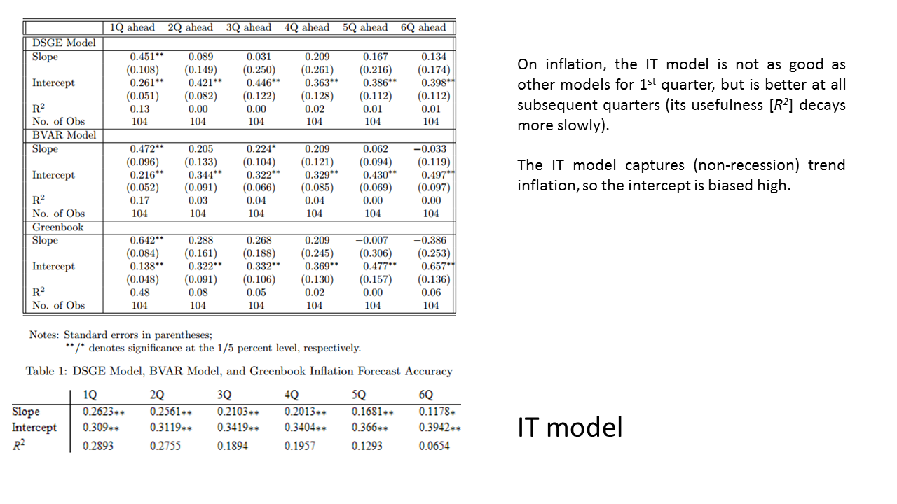
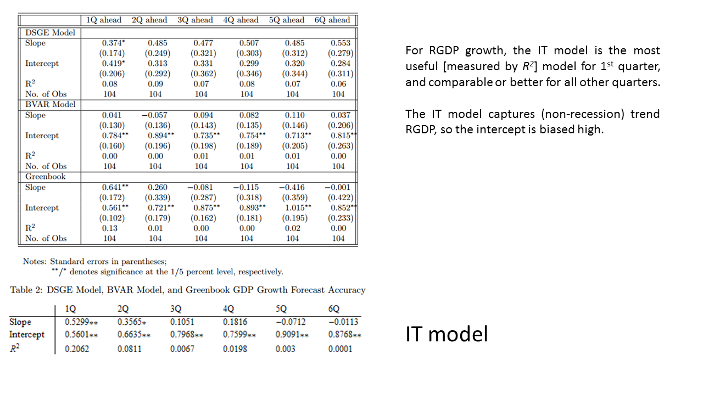

I was reading Simon Wren-Lewis's [recent post](https://mainlymacro.blogspot.com/2016/10/ricardian-equivalence-benchmark-models.html), which took me to [another one of his posts](https://mainlymacro.blogspot.co.uk/2013/05/data-theory-and-central-bank-models.html), which then linked to [Noah Smith's May 2013 post](http://noahpinionblog.blogspot.co.uk/2013/05/what-can-you-do-with-dsge-model.html) on how poor DSGE models are at forecasting. Noah cites a paper by [Edge and Gurkaynak (2011) \[pdf\]](http://www.federalreserve.gov/pubs/feds/2011/201111/201111pap.pdf) that gave some quantitative results comparing three different models (well, two models and a judgement call). Noah presents their conclusion:

> _But as Rochelle Edge and Refet Gurkaynak show in their seminal 2010 paper, even the best DSGE models have very low forecasting power._

Since this gave a relatively simple procedure (regressing forecasts with actual results), I thought I'd subject the IT model (the information equilibrium monetary model \[1\]) to an apples-to-apples comparison with the three models. The data is from the time period 1992 to 2006, and the models are the Smets-Wouters model (the best in class DSGE model), a Bayesian Vector Autoregression (BVAR), and the Fed "greenbook" forecast (i.e. the "judgement call" of the Fed).

Apples-to-apples is a relative term here for a couple reasons. First is the number of parameters. The DSGE model has 36 (17 of which are in the ARMA process for the stochastic inputs) and the BVAR model would have over 200 (7 variables with 4 lags). The greenbook "model" doesn't really have parameters per se (or possibly the individual forecasts from the FOMC are based on different models with different numbers of parameters). The IT model has 9, 4 of which are in the two [AR(1)](https://en.wikipedia.org/wiki/Autoregressive_model) processes. It is vastly simpler \[1\].

The second reason is that the IT model's forecasting sweet spot is in [the 5-15 year time frame](http://informationtransfereconomics.blogspot.com/2014/07/inflation-prediction-errors.html). The IT model [is about the long run trends](http://informationtransfereconomics.blogspot.com/2014/01/what-is-and-isnt-explained-by.html). Edge and Gurkaynak are looking at the 1-6 quarter time frame -- i.e. the short term fluctuations.

However, despite the fact that it shouldn't hold up against these other forecasts of short run fluctuations, the scrappy IT model -- if I was to add a stochastic component to the interest rate (which I will show in a subsequent post \[_Ed. actually below_\]) -- is pretty much top dog in the average case. The DSGE model does a bit better than the IT model on RGDP growth further out, but is the worst at inflation. The Greenbook forecast does better at Q1 inflation, but that performance falls off rather quickly.

Note that even if the slope or intercept are off, a good _R²_ indicates that the forecast could be adjusted with a linear transformation (much like many of us turn our oven to e.g. 360 °F instead of 350 °F to adjust for a constant bias of 10 °F) -- meaning the model is still useful.

Anyway, here are the table summaries of the performance for inflation, RGDP growth, and interest rates:

_Ed. this final one is updated with the one appearing at the bottom of this post._

I also collected the _R²_ values for stoplight charts for inflation and RGDP growth \[_Ed. plus the new interest rate graph from the update_\]:

Here is what that _R² = 0.21_ result looks like for RGDP growth for 1 quarter out

This is still a work in progress, but the simplest form of the IT model holds up against the best in class Smets-Wouters DSGE model. The IT model neglects the short run variation of the interest rate \[_Ed. update now includes_\] as well as the [nominal shocks described by the labor supply](http://informationtransfereconomics.blogspot.com/2015/08/employment-doesnt-depend-of-inflation.html). Anyway, I plan to update the interest rate model \[_Ed. added and updated_\] as well as do this comparison using the [quantity theory of labor and capital](http://informationtransfereconomics.blogspot.com/2016/03/a-quantity-theory-of-labor-and-capital.html) IT model.

...

**Update + 40 min**

Here is that interest rate model comparison adding in an ARIMA process:

And the stoplight chart (added it above as well):

I do want to add that the FOMC Greenbook forecast is a bit unfair here -- because the FOMC sets the interest rates. They should be able to forecast the interest rate they set slightly more often than quarterly out 1Q no problem, right?

...

**Footnotes**

\[1\] The IT model I used here is

_(d/dt) log NGDP = AR(1)_
_(d/dt) log MB = AR(1)_

_log r = c log NGDP/MB + b_

_log P = (k\[NGDP, MB\] - 1) log MB/m0 + log k\[NGDP, MB\] + log p0_
_k\[NGDP, MB\] = log(NGDP/c0)/log(MB/c0)_

The parameters are _c0_, _p0_, _m0_, _c_, and _b_ while two _AR(1)_ processes have two parameters each for a total of nine. In a future post, I will add a third AR process to the interest rate model \[_Ed. added and updated_\].
