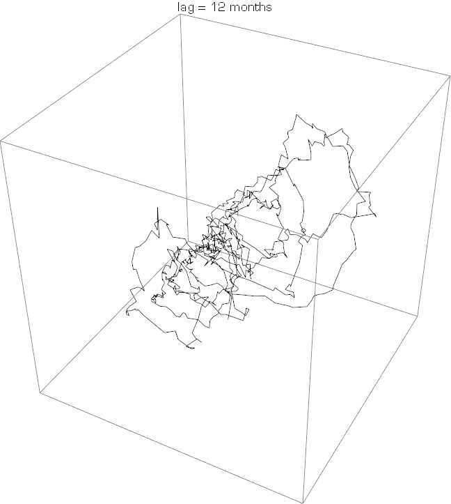
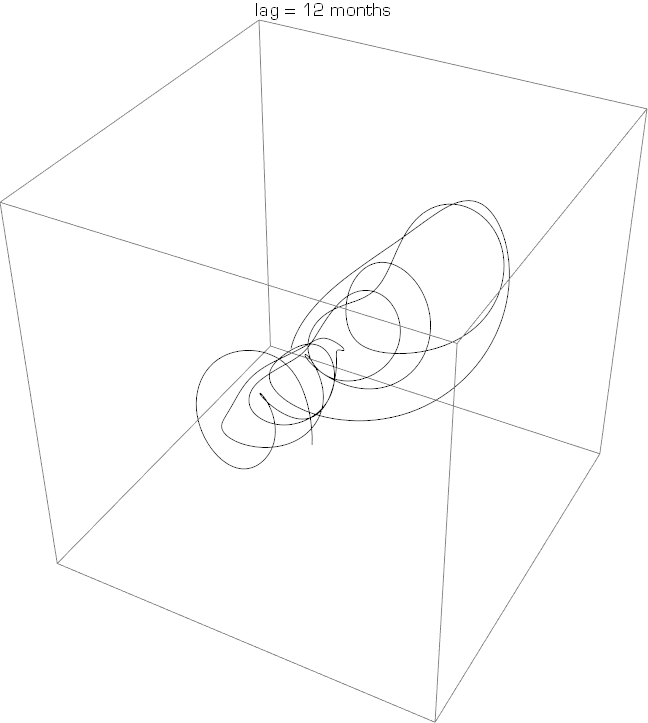

So the simple argument against Steve Keen's Forbes piece is that there is insufficient data to tell the difference between a nonlinear model and a linear model with stochastic shocks. Keen claims that this paper from Kocherlakota is somehow a response to Roger Farmer's simple argument:

> Thank you again Narayana for saving me effort of tedious rejoinder Remarkable refusal by others to consider fundamental failings of paradigm [https://t.co/arN6luCE3K](https://t.co/arN6luCE3K)
>
> — Steve Keen (@ProfSteveKeen) [October 7, 2016](https://twitter.com/ProfSteveKeen/status/784518483262537728)

Ironically, I think it is Keen who is showing remarkable refusal to consider fundamental failings of **_his_** paradigm.

Keen's Forbes piece is also not about the failings of the mainstream DSGE paradigm (I have a discussion of the piece [here](http://informationtransfereconomics.blogspot.com/2016/10/keen-chaos-and-equilibrium.html)). He simply asserts it has failings in the first couple paragraphs and then continues on to the Lorenz attractor. Actually, his main argument seems to be that general equilibrium is "no longer necessary" and that nonlinear dynamics has arisen to act as a new starting point in the sense that the use of slide rules is "no longer necessary" because we have computers now.

If this is his argument, then he should accept that [machine learning](http://siepr.stanford.edu/highlights/susan-athey-how-economists-can-use-machine-learning-improve-policy) and big data have arisen in the 21st century and can act as a new starting point. In fact, Keen's argument for his paradigm would be like if I started using the fact that information theory was developed in the 20th century and has many uses across a variety of scientific disciplines as the only motivation for using the information transfer framework. \[Actually, information theory is [is useful in understanding chaotic systems](https://en.wikipedia.org/wiki/Lyapunov_exponent#Significance_of_the_Lyapunov_spectrum) (which can also be connected to neuroscience, see [here](http://informationtransfereconomics.blogspot.com/2016/07/information-equilibrium-in-neuroscience.html) or [here](http://informationtransfereconomics.blogspot.com/2016/05/lyapunov-exponents-and-information.html)), and is [useful \[pdf\]](http://homepage.sns.it/marmi/lezioni/DSITS_4.pdf) in empirical application of Takens theorem as I discuss below.\]

**Kocherlakota's paper**

Kocherlakota's paper constructs a case where a worse fit to existing data can potentially give better policy advice:

> _This paper uses an example to show that a model that fits the available data perfectly may provide worse answers to policy questions than an alternative, imperfectly fitting model. ... \[the author\] urges the use of priors that are obtained from explicit auxiliary information, not from the desire to obtain identification._
>
> _..._
>
> _In this paper, I demonstrate that the principle of fit does not always work. I construct a simple example economy that I treat as if it were the true world. In this economy, I consider an investigator who wants to answer a policy question of interest and estimates two models to do so. I show that model 1, which has a perfect fit to the available data, may actually provide worse answers than model 2, which has an imperfect fit._

But it is important to remember where the motivating information for this worse fitting model is coming from -- microeconomics: 

> _There is an important lesson for the analysis of monetary policy. Simply adding shocks to models in order to make them fit the data better should not improve our confidence in those models’ predictions for the impact of policy changes. Instead, we need to find ways to improve our information about the models’ key parameters (for example, the costs and the frequency of price adjustments). It is possible that this improved information may come from estimation of model parameters using macroeconomic data. However, as we have seen, this kind of estimation is only useful if we have reliable a priori evidence about the shock processes. My own belief is that this kind of a priori evidence is unlikely to be available. **Then, auxiliary data sources, such as the microeconometric evidence set forth by Bils and Klenow (2004), will serve as our best source of reliable information about the key parameters in monetary models.**_

Emphasis mine. Kocherlakota wants the evidence to come from microeconomics. [As I said in my piece](http://informationtransfereconomics.blogspot.com/2016/10/keen-chaos-and-equilibrium.html):

> _Basically, while there isn't enough data to assert the macroeconomy is a complex nonlinear system, if Keen were to develop a convincing microfoundation for his nonlinear models that get some aspects of human behavior correct \[ed. i.e. "microeconometric evidence"\], that would go a long way towards making a convincing case._

Kocherlakota is saying the **exact opposite** thing that Keen says in his Forbes piece:

> _The obvious implication for economists is that macroeconomics is not applied microeconomics. So what is it, and how can economists do it, if they can’t start from microfoundations? It’s macroeconomics, and it can be built right from the core definitions of macroeconomics itself._

While I have no problem with this idea, I do have a problem with Keen claiming Kocherlakota's paper is any kind of rejoinder defending Keen's approach from Farmer's blog post -- that you can't tell the difference between nonlinear dynamics and stochastic linear dynamics.

But the elephant in the room here isn't that we're comparing between Kocherlakota's model that kind of fits the existing data and his other model that fits the existing data better. In fact, DSGE models are actually quite good at describing existing data \[e.g. [pdf](https://www.newyorkfed.org/medialibrary/media/research/staff_reports/sr618.pdf)\]  -- they are just poor forecasters. However Keen's models do not remotely look like the data at all. Take [this paper](http://www.economics-ejournal.org/economics/discussionpapers/2010-2/file) \[pdf\] for instance. It says real growth looks like this:

As far as I can tell, those are years, so that over twenty years the data should look like that. But real growth data looks like this:

And Keen's paper is called "Solving the Paradox of Monetary Profits"; however, if your theoretical model looks nothing like the data, then I'm not sure how you can assert you are solving anything. And if your model looks nothing like the data, I'm not sure how a paper that has two models where one perfectly fits the data and the second fits a little worse is relevant to your argument.

This is the part I am most troubled by. The main problem with economics is that it doesn't reject models, or it creates models that are too complex to be rejected. In both cases, it is theory ignoring the empirical data. Keen's attempted break with mainstream economics **makes exactly the same mistakes**. People call it a heterodox approach, but when it comes to the data Keen is just another orthodox economist.

**Takens theorem**

Ian Wright made a great contribution to this conversation by citing [Takens theorem](https://en.wikipedia.org/wiki/Takens%27_theorem):

> [@ProfSteveKeen](https://twitter.com/ProfSteveKeen) Takens' theorem might be relevant to your spat with Farmer; e.g.[https://t.co/HckCQj4sLW](https://t.co/HckCQj4sLW)
>
> — Ian Wright (@ianpaulwright) [October 7, 2016](https://twitter.com/ianpaulwright/status/784412710914158592)

[good description on YouTube](https://www.youtube.com/watch?v=6i57udsPKms)

Taken's theorem can be used to capture important properties of a nonlinear (chaotic) system by letting us use lagged data to visualize the low dimensional subspace. You can e.g. create a "shadow manifold" of the original low-dimensional subspace by looking at data at different times. For example, if unemployment was part of a nonlinear dynamical system then unemployment at times _t - n τ_ (for some _τ_)can be used to construct a shadow S of the original manifold:

_S = {U(t), U(t - τ), U(t - 2 τ), U(t - 3 τ), ...}_

One interesting application is that you can use this to de-noise data coming in from nonlinear dynamical systems because assuming you are going to be close to the the low-dimensional (shadow) subspace lets you filter out high dimensional noise so that if the observed _U\*(t + τ)_ is off of the manifold, you can take _U\*(t + τ) =_ _U'(t + τ) + n_ where _U'(t + τ)_ is the closest point on the manifold (that you've found from earlier observations). It's kind of like measuring the distance to the moon and using knowledge of the moon's orbit to remove the noise in your measurement.

Keen's models (e.g. from the paper linked above) have these limit cycles:

So does Takens theorem tell us anything from the data? Well, I looked at [unemployment](https://fred.stlouisfed.org/series/UNRATE) (the most likely candidate in my view to exhibit this behavior with regard to its lags). However I tried many different values of _τ_ from a year to 10 years and did not see any sign of a low dimensional subspace of 3 dimensions:

It's true that you might have to go to higher dimensions to see something, but that's exactly the issue Farmer points out -- in higher dimensions, you need more and more data to definitively say there is a low dimensional subspace. As it is, there is not a short enough limit cycle to show up in the post-war data, and won't be for a many more years (at this rate, it looks like hundreds of years of data would be needed).

Regardless, Keen should be able to show some kind of limit cycle behavior in the data -- you'd imagine that he'd definitely advertise it if he had a good graph. The fact that he doesn't means it probably doesn't exist.

**Summary**

We are still left with a major argument against Keen's framework that he hasn't addressed: there is insufficient data available to definitively select it over another one, and there won't be sufficient data for years to come.

That said, there are still things Keen could do to motivate acceptance of his framework:

1.  Show that it fits empirical data (just basic curve fitting)
2.  Show that empirical data is not inconsistent with nonlinear dynamical systems (via Takens theorem)
3.  Show that microeconomics (theory or data) leads to his models

He is not doing any of these things. In fact:

1.  He never shows theoretical curves going though data
2.  He probably hadn't thought of using Takens theorem
3.  He thinks microeconomics is unnecessary

It is not "others", but rather Keen who's demonstrating "remarkable refusal ... to consider failings of the paradigm" (I'll not that lots of economists have considered the failings of the DSGE paradigm). This lacks what [Paul Romer called Feynman integrity](https://paulromer.net/feynman-integrity/), which I will leave up to Feynman himself to describe:

> _It’s a kind of scientific integrity, a principle of scientific thought that corresponds to a kind of utter honesty–a kind of leaning over backwards. For example, if you’re doing an experiment, you should report everything that you think might make it invalid–not only what you think is right about it: other causes that could possibly explain your results; and things you thought of that you’ve eliminated by some other experiment, and how they worked–to make sure the other fellow can tell they have been eliminated._ 

> _Details that could throw doubt on your interpretation must be given, if you know them. You must do the best you can–if you know anything at all wrong, or possibly wrong–to explain it. If you make a theory, for example, and advertise it, or put it out, then you must also put down all the facts that disagree with it, as well as those that agree with it. There is also a more subtle problem. When you have put a lot of ideas together to make an elaborate theory, you want to make sure, when explaining what it fits, that those things it fits are not just the things that gave you the idea for the theory; but that the finished theory makes something else come out right, in addition._
