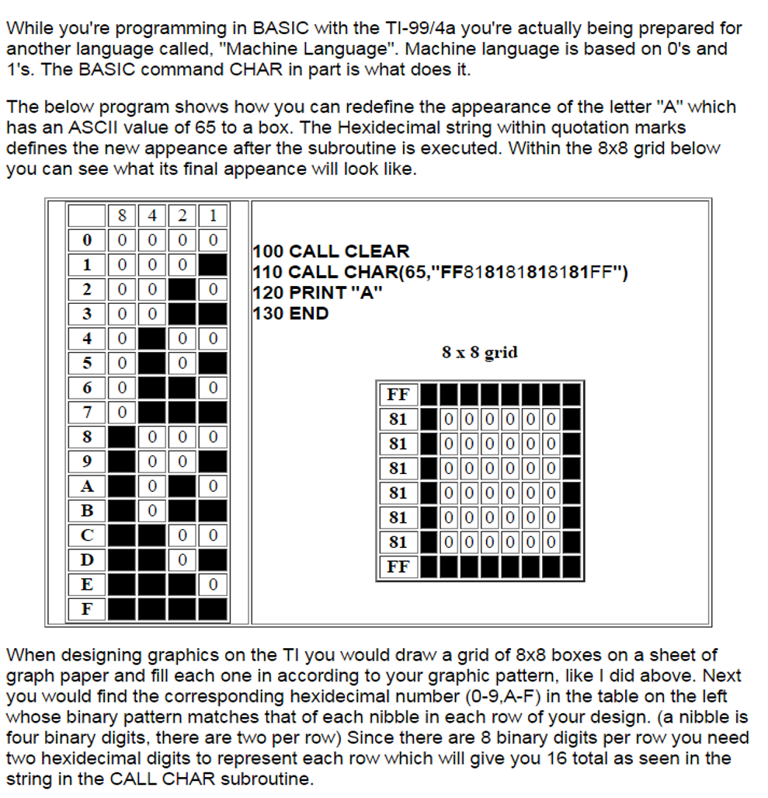
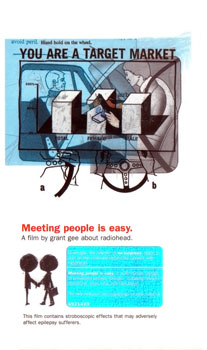

Ok, this is entirely self-indulgent. I mentioned in a sentence at the bottom of the [previous post](http://informationtransfereconomics.blogspot.com/2016/10/should-i-use-math-or-just-assume.html) where I got the [favicon](https://en.wikipedia.org/wiki/Favicon) for the blog, but the ultimate source is my old [TI-99 4A computer](https://en.wikipedia.org/wiki/Texas_Instruments_TI-99/4A) and the CALL CHAR instruction in [TI BASIC](https://en.wikipedia.org/wiki/TI_BASIC_\(TI_99/4A\)). When I was a kid (about 8 or 9), this was the first time I connected data, numbers, and distributions of objects (e.g. black squares) (from [here](http://www.theforbiddenknowledge.com/99er/)):

This entered into one of my early drawings (using [penultimate](https://itunes.apple.com/us/app/penultimate/id354098826?mt=8)) when I was thinking about information transfer (in this case, aggregate demand for money) to convey information flowing; the favicon is inside that red dashed box:

which I later used [here](http://informationtransfereconomics.blogspot.com/2014/06/money-unit-of-information-and-medium-of.html). This was then used in a description of supply and demand as an allocation problem [here](http://informationtransfereconomics.blogspot.com/2015/05/the-economic-allocation-problem.html) and put into this figure of supply and demand "events" meeting as transaction "events":

Anyway, this gives a sense of the process I described in the previous post about one's vague intuitions and mental visualizations becoming more concrete for other people by using mathematics.

PS The people in the drawing above are a combination of [XKCD](https://xkcd.com/239/) and the people shaking hands on the cover of Radiohead's _Meeting People is Easy_:

