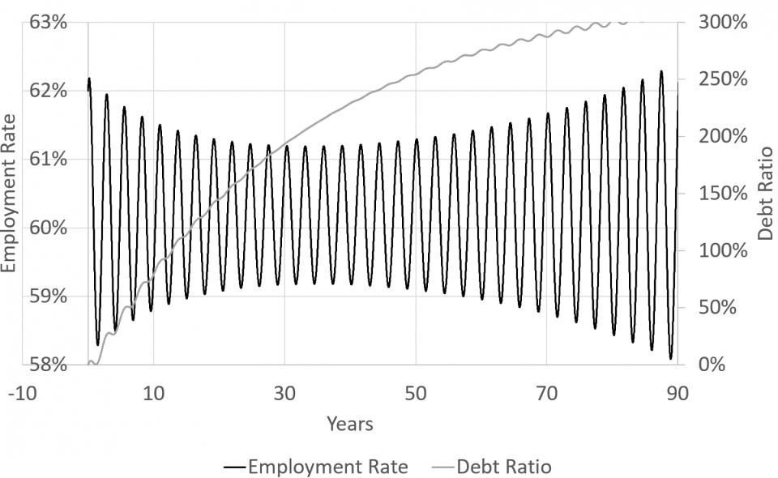
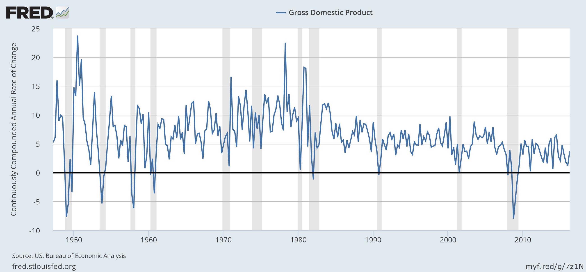

A brief back and forth on Twitter about [Roger Farmer's very concise and critical response](http://www.rogerfarmer.com/rogerfarmerblog/2016/10/4/nho932exasra0c2a2amkvdmovcy9rz) to Steve Keen quickly [degenerated into squabbling](https://twitter.com/farmerrf/status/783726461458972674) among Keen, Noah Smith, and David Andolfatto. Here is the crux of Farmer's critique:

> _... are economic systems \[described by chaotic nonlinear dynamics\]? The answer is: we have no way of knowing given current data limitations. Physicists can generate potentially infinite amounts of data by experiment. Macroeconomists have a few hundred data points at most. ... Where does that leave non-linear theory and chaos theory in economics? Is the economic world chaotic? Perhaps. But there is currently not enough data to tell a low dimensional chaotic system apart from a linear model hit by random shocks. Until we have better data, Occam’s razor argues for the linear stochastic model._

Actually, as a physicist, I would say that even if the economy was a complex nonlinear chaotic system, linear stochastic models would still be its effective theory description. Regardless of what the quantum theory of gravity is, general relativity -- and even Newton's universal law of gravitation -- is still its long-distance effective theory.

Anyway, this prompted me to write something about Steve Keen's article in Forbes. Keen suffers from a problem that all public economists seem to suffer: asserting matters of opinion as matters of fact, and ongoing research programs as well-established frameworks. This will be made clear as we progress. Let's begin, shall we?

**Equilibrium, but what kind?**

I propose to ban the discussion of 'equilibrium' in economics unless it is accompanied by an adjective describing it. Olivier Blanchard says that "Macroeconomics is about general equilibrium ... ". General equilibrium (which doesn't violate my new rule) is the idea that there is a price vector that eliminates excess supply and excess demand -- and that an economy in general equilibrium has neither. As Keen notes, this has been expanded from referring to excess supply and demand at one point in time to an intertemporal version that sees e.g. the market for blueberries in spring of next year as a separate market from currently available blueberries.

This idea encapsulates two hundred years of economic wisdom. It passes cursory inspection as not to be entirely false. If I go to the grocery store, it is not overflowing with blueberries -- or if it is, they are on sale. I [frequently like to post this graph](http://informationtransfereconomics.blogspot.com/2014/07/in-defense-of-equilibrium.html) as a joke:

It's _1-U_ where _U_ is the unemployment rate. General equilibrium tells us there should be no excess supply of labor, i.e. that _1 - U_ ≈ 1. Presently _1 - U_ = 0.951. This physicist would say that's a jolly good first order approximation! Even at the height of a worst recessions in the US, _1 - U_ ~ 0.8 to 0.9. And this holds over multiple time periods. [Another way of looking at unemployment equilibrium](http://informationtransfereconomics.blogspot.com/2016/06/unemployment-equilibrium.html) is as a dynamic equilibrium where _dU/dt_ is constant over long periods of time punctuated by recessions.

The information equilibrium framework couches this idea of general equilibrium in terms of the information content of events drawn from the probability distributions of supply and demand -- but notes that it appears to hold only approximately in empirical data.

However, Keen wants to throw this out and assert (without evidence) "\[m\]acroeconomics is about complexity". I am of the opinion that [asserting complexity in macroeconomics](http://informationtransfereconomics.blogspot.com/2016/04/its-complicated-alternative-approaches.html) is the equivalent of Krugman's "very serious people" asserting whatever conventional wisdom they're asserting. Heads nod, and chins are stroked. Yes, complexity is important. ([But what kind?](http://informationtransfereconomics.blogspot.com/2016/03/goldilocks-complexity.html)) Keen says:

> _In the mid-20th century, other modelling disciplines developed the concept of “complex systems”, along with the mathematical and computing techniques needed to handle them. These developments led them to the realisation that these systems were normally **never** in **equilibrium** — but they were nonetheless **general** models of their relevant fields. ... Economics needs to embrace the reality that, even more so than the weather, the economy is a complex system, and it is **never** in equilibrium._

Emphasis in the original. There is no evidence that this approach actually captures economic phenomena, and in graphs later in the article Keen shows things that look nothing like an actual economy (which Noah Smith points out in the Twitter conversation linked above, saying "This oscillatory employment picture hardly matches anything in the actual economy" and "This picture also fails to match reality pretty starkly" with accompanying graphs). And even if it was the case that these graphs looked even remotely like a real economy, Keen's use of 'equilibrium' in the previous quote is completely wrong.

David Andolfatto asks of Keen's use of the word equilibrium: "Reading the first page of Keen's reply to \[Blanchard\], it seems he's confusing 'equilibrium' with 'a state of rest?'" to which Farmer replies "I'll let \[Keen\] answer that. I suspect he does understand that equilibria can be non-stationary". Keen does kind of reply by referring to "dynamic equilibrium", but in his article he does use it to mean 'state of rest', or at least a stationary point -- which he points out as the center points in the [Lorenz model](https://en.wikipedia.org/wiki/Lorenz_system). This is where I started pulling out my hair.

Global weather is a system that isn't in global thermodynamic equilibrium at maximum entropy. Full stop. That's what is meant by "never in equilibrium". The Earth is differentially heated and has two different fluids (air and water) that can move this heat around. However, it is in [local thermodynamic equilibrium](https://en.wikipedia.org/wiki/Thermodynamic_equilibrium#Local_and_global_equilibrium) -- because otherwise the idea that it will be 60 °F in Seattle today would not make any sense. And to a good approximation, it is **always** in local thermodynamic equilibrium. And if any of you have ever been outside on a nice day, you can see that the weather can be in local thermodynamic equilibrium over a fairly wide area. There are some places where the wind seems to blow constantly, but it's only because the Earth is so big and we are so small that the tiny pressure imbalances can knock houses down. \[And generally, the Earth's atmosphere well described by a mechanical pressure equilibrium.\] But we only say the Earth's weather is not in global thermodynamic equilibrium because we developed a concept of thermodynamic equilibrium that is relevant to the microfoundations of the weather system, i.e. physics.

Let me illustrate these points using a weather example. Here is the barometric pressure for Seattle for 2016 so far:

You can actually see the complex emergent structures (high/low pressure systems) passing through with a quasi-cyclic frequency as well as the "great moderation" that is summer in the Pacific Northwest. But we only know this because we've studied weather from thousands of weather stations all over the Earth and we understand the basic physics (thermodynamics) involved.

Now pretend that this is the only data we have \[1\]. One city with approximately hourly measurements over part of a year -- about 8000 data points. And we don't have a well-established theory of physics underlying it all. Can we really tell the difference between the complex nonlinear system of pressure systems and seasons (including the entire theory of physics that entails) ... and a pressure equilibrium of about 1013 mbar subjected to stochastic shocks? No, and that is Farmer's point. My joke graph in this case looks like this:

\[The three lines are the average pressure at sea level, alongside the maximum and minimum pressures ever measured.\]

**\[Update 11 Oct 2016\]** I hope it wasn't lost because I wasn't explicit with what I meant by confounding the nonlinear dynamics of pressure systems and the linear stochastic view. In one case, if you view the Earth as a nonlinear dynamical system (which you should), you can see high and low pressure systems in the pressure time series data being generated and moved by differential heating, coriolis forces, etc. Seattle can be affected by Canadian highs and Pacific lows coming from various directions (at various speeds).

However, if you only have data from Seattle, then a lot of the information about speed and direction of a particular pressure system is lost. Two "shocks" that are farther apart and different amplitudes because the low pressure system moved slower and passed to the south will be exactly equivalent to two shocks with random timing and amplitude (e.g. [an AR process](https://en.wikipedia.org/wiki/Autoregressive_model#Graphs_of_AR.28p.29_processes)). **\[end update\]**

**Whither microeconomics?**

There is one piece of Keen's article that I half agree with. He quotes physicist Philip Anderson:

> _As \[Philip Anderson\] put it “Psychology is not applied biology, nor is biology applied chemistry”. The obvious implication for economists is that macroeconomics is not applied microeconomics._

I completely agree that we should not assume that macroeconomics cannot be studied as a field unto itself, separate from microeconomics, as the microfoundations purists would have us believe. But I also don't believe that this means we should assume macroeconomics is completely independent of microeconomics. In fact, I think Keen should pay more attention to microfoundations. The understanding of weather systems Keen points to as an example to be followed critically depends on understanding the underlying physics (the microfoundations) -- and given the physics, even with the paucity of data in the weather example above, we could accept the complex nonlinear system explanation.

Basically, while there isn't enough data to assert the macroeconomy is a complex nonlinear system, if Keen were to develop a convincing microfoundation for his nonlinear models that get some aspects of human behavior correct, that would go a long way towards making a convincing case. Keen wants to have it both ways: to be unhindered by the constraints of microfoundations and to have insufficient data to reject his models.

**Chaos!**

_I didn't even use the word 'chaos'!_

_Steve, you used 'complexity' ... by which we took be nonlinear dynamics. Don't split hairs._

Keen's article also contained several paragraphs with references to [the most famous chaotic system](https://en.wikipedia.org/wiki/Lorenz_system) resulting from a simple system of differential equations.

**Three-equation Monte**

Keen:

> _Let me illustrate this with a macroeconomic model which in essence is even simpler than Lorenz’s, since it can be derived from three macroeconomic definitions that no macroeconomist can dispute:_
>
> -   _The employment rate is the ratio of the number of people with a job to the total population;_
>
> -   _The wages share of output is the total wage bill divided by GDP; and_
>
> -   _The private debt ratio is the ratio of private debt to GDP_

Yes, those are three definitions. Keen continues:

> _Differentiate those three definitions with respect to time. That generates the following three statements ... which, like the definitions themselves, have to be accepted by all macroeconomists simply because they are true by definition:_
>
> -   _The employment rate will rise if economic growth exceeds the sum of population and labour productivity growth;_
>
> -   _The wages share of output will rise if wages rise faster than labour productivity; and_
>
> -   _The debt ratio will rise if debt grows faster than GDP_

You mean differentiation and sneaking in the concept of labor productivity.

**Bravery**

In the end, Keen thinks macroeconomics is complex, calls general equilibrium primitive, and makes a case for a research program based on nonlinear dynamics. He presents the first two opinions as facts. As Farmer points out, there is insufficient data to say macroeconomic cycles (of which there have only been a dozen or so in the post-war period from which there is quality data) are the result of nonlinear dynamics or a linear model subject to shocks -- therefore declaring the cycles to be evidence of nonlinear dynamics is an opinion.

His case for nonlinear dynamics as a framework (no doubt using his [Minksy software](https://en.wikipedia.org/wiki/Minsky_\(economic_simulator\))) is not convincing (to me, but that is just my opinion). If it was just being presented as a research program, that would be fine. But it isn't:

> _This is not a complete model either of course ... But it is a lot closer to reality than DSGE models were before the crisis, and much more realistic than they can ever hope to be in the future, because they cling to a false modelling choice that forces equilibrium onto a manifestly non-equilibrium system._

> _So the road to a better, more realistic macroeconomics begins with a step away from the equilibrium and micro-foundations pillars on which it has to date been constructed. Will economists be brave enough to take that step? Only time will tell._

The thing is that this statement comes right after this graph \[2\]:

Closer to reality? More realistic than DSGE models? More realistic macroeconomics? Here's a DSGE forecast of inflation for 2014 to 2019 (red):

You would have to be brave to abandon that DSGE model for Keen's graph!

...

**Update 6 October 2016**

Narayana Kocherlakota [follows up with a piece](https://sites.google.com/site/kocherlakota009/10-5-16) that is more lenient with regard to Farmer's point about it being difficult to distinguish between nonlinear models and linear ones with stochastic shocks (he makes a few other points as well and his piece is well worth reading). I did like his description of the process for how the mainstream stays the mainstream:

1.  _Mainstream consists of a class of models C._
2.  _Someone proposes new class of models C’.  It is clear to most that the answers to many questions of interest will be different if C’ is true rather than C._
3.  _It’s argued (usually by a theorist!) that we can’t readily distinguish C’ from C using existing data._
4.  _One response to (3) is: let’s figure out, and undertake, a class of (possibly very expensive!) experiments that would allow us to distinguish C’ from C.  I don’t know much about the hard sciences but this response seems common there._ 
5.  _The standard approach to (3) in macro is: let’s abandon C’ and keep C.  Since (3) is a common issue, C tends to remain the mainstream._

The best argument in favor of Keen's proposed C' comes from a place of fairness because C (the DSGE paradigm) isn't really preferred by the data either. We can give the horses a try after all the King's men have had a go.

However in all sciences it should be the power to explain the data that is the ultimate arbiter. The issue is not just that Keen's C' will be indistinguishable from C given the existing data, but that his C' does not appear to explain any existing data that I've seen. If it was such a good model you'd think there'd be some theoretical curves going through some data that are easy to find on the internet, but there aren't any. [The only one I've come up with is my own graph!](https://www.google.com/search?q=keen+model+data) Happy to be corrected.

Additionally, Kocherlakota seems to suggest that there could be data we could obtain now to distinguish C from C'. However the issue is that we need hundreds of years of data to nail down a difference between nonlinear cycles and linear models with stochastic shocks without established microfoundations (with established microfoundations, you wouldn't need as much data).

I should emphasize that I have no problem with anyone studying any given C' -- maybe there will be a breakthrough. I actually think Keen's nonlinear equations could be used to constrain DSGE models (i.e. a specific DSGE model is a perturbative expansion of the nonlinear theory near a particular point in the "dynamic equilibrium"). It is possible that Keen's C' could establish relationships between the different coefficients in models in C that could be rejected given the data. But his attitude is one of disdain, so I doubt he'll try to write out a linear approximation to his model in DSGE form \[3\].

But we should always consider whether model explains the empirical data first.

**Footnotes:**

\[1\] Actually, this is not a bad proxy! Look at US NGDP growth data:

\[2\] Also note the time scale in this graph: 100 years. We don't have 100 years of decent data yet.

\[3\]  Note that I go out of my way to connect to mainstream economic theory: [here](http://informationtransfereconomics.blogspot.com/2016/07/list-of-standard-economics-derived-from.html) or [here for DSGE specifically](http://informationtransfereconomics.blogspot.com/2016/08/dsge-part-5-summary.html). That's the burden you have bringing something from outside the mainstream. Keen doesn't seem to want to do the dirty work of showing how his models compare and contrast to DSGE theoretically. As an aside, this seems to be a common failure of outside the mainstream approaches -- no one wants to do the work of learning the mainstream because their approach is oh so much better and we can't dirty it by bringing it to the level of the mainstream. [Sean Carroll has a good summary](http://www.preposterousuniverse.com/blog/2007/06/19/the-alternative-science-respectability-checklist/) of this approach you should take. My point here is his point #2.
