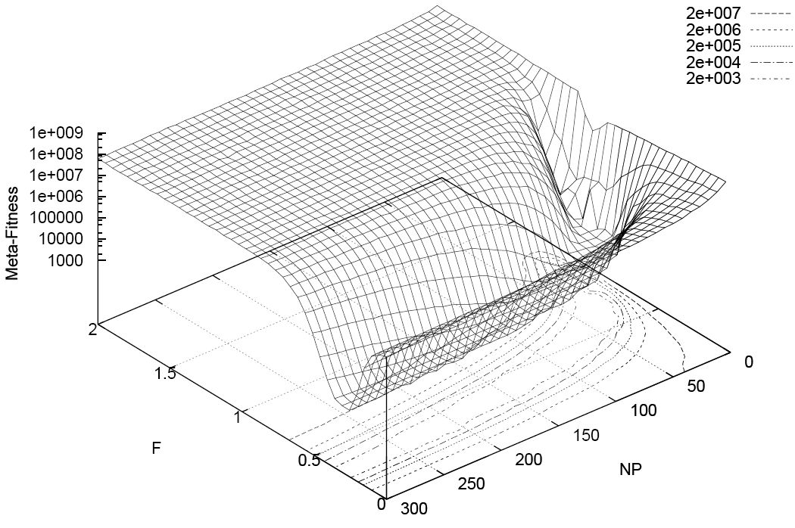

[Arnold Kling](http://www.arnoldkling.com/blog/second-thoughts-on-this-years-economics-nobel-prize/) apparently doesn't think math is necessary (H/T [Noah Smith](https://twitter.com/Noahpinion/status/785839175195095045)):

> _Think of \[recent Nobel winners Hart and Holmstrom's\] work as consisting of three steps._
>
>
>
> __1\. Identifying some real-world complexities that affect how businesses operate. ...__
>
> _
>
> _2\. Construct a mathematical optimization model that incorporates such complexities._
>
> _3\. Offer insights into designing appropriate compensation systems, including when to outsource an activity altogether._
>
> _..._
>
> _In my view, step 2 is unnecessary._
>
> _

Tell us what you really think:

> _But I do not think in terms of mathematical optimization. Instead, I think in terms of a dynamic process of trial and error. A manager tries an approach to compensation. As long as it seems to work, it persists._ 

So exploring the compensation strategy space by trial and error, a manager determines if a given strategy meets his or her objective. Or another way, by randomly sampling the compensation domain and evaluating some objective function, the manager arrives at an optimal solution. Of course. That is not thinking in terms of mathematical optimization at all. It is completely different! [Wait](https://en.wikipedia.org/wiki/Differential_evolution) (wikipedia):

> _In [evolutionary computation](https://en.wikipedia.org/wiki/Evolutionary_computation), differential evolution (DE) is a method that [optimizes](https://en.wikipedia.org/wiki/Optimization_\(mathematics\)) a problem by [iteratively](https://en.wikipedia.org/wiki/Iterative_method) trying to improve a [candidate solution](https://en.wikipedia.org/wiki/Candidate_solution) with regard to a given measure of quality. Such methods are commonly known as [metaheuristics](https://en.wikipedia.org/wiki/Metaheuristic) as they make few or no assumptions about the problem being optimized and can search very large spaces of candidate solutions. However, metaheuristics such as DE do not guarantee an optimal solution is ever found._

Joking aside, it's the last sentence that the math is good for. Like many optimization methods, there is no guarantee that an optimal solution can be found. Does Kling's "dynamic process of trial and error" converge to any solution? You can't just 'reckon' the location of the optimum and the path to it that can be discovered by agents. Sure, you can give the intuition of that process, but an explicit example using mathematical optimization gives me confidence in your eyeballed solution and assumed convergence.

**\[update + 30 min\]** The real function of math isn't to arrive at your intuition for a problem. It can for people who's minds work that way, but I generally visualize things in a way not entirely unlike Kling -- usually in pictures that only eventually become more rigorous like [here](http://informationtransfereconomics.blogspot.com/2015/03/supply-and-demand-as-entropy.html) or [here](http://informationtransfereconomics.blogspot.com/2016/08/is-information-equilibrium-silly.html) or [here](http://informationtransfereconomics.blogspot.com/2015/05/the-economic-allocation-problem.html) (that last one is behind the sketch I turned into the favicon for this blog). The real function of math is to convince others who can't see your mental process (instead of Kling's manager, I saw a person exploring a diagram like the one at the top of this post), and to make sure your imagination dots the _i_'s and crosses the _t_'s (e.g. convergence or existence).
