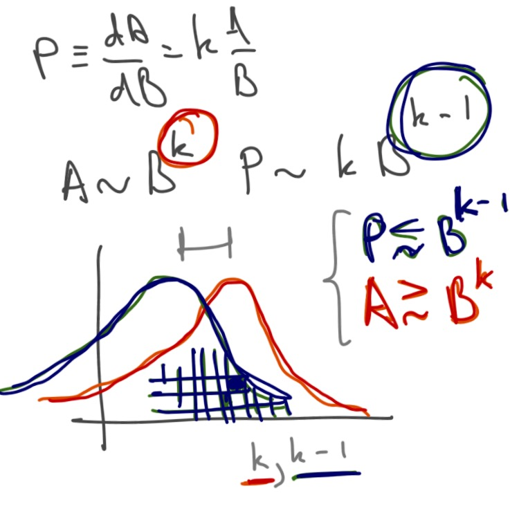

On my flight back home last night, I started to try and understand [David Glasner's post about sticky prices](https://uneasymoney.com/2016/09/28/price-stickiness-is-a-symptom-not-a-cause/) in terms of information equilibrium. Here's a long quote

> _All the theory of general equilibrium tells us is that if all trading takes place at the equilibrium set of prices, the economy will be in equilibrium as long as the underlying “fundamentals” of the economy do not change. But in a decentralized economy, no one knows what the equilibrium prices are, and the equilibrium price in each market depends in principle on what the equilibrium prices are in every other market. So unless the price in every market is an equilibrium price, none of the markets is necessarily in equilibrium._ 

> _Now it may well be that if all prices are close to equilibrium, the small changes will keep moving the economy closer and closer to equilibrium, so that the adjustment process will converge. But that is just conjecture, there is no proof showing the conditions under which a simple rule that says raise the price in any market with an excess demand and decrease the price in any market with an excess supply will in fact lead to the convergence of the whole system to equilibrium. Even in a Walrasian tatonnement system, in which no trading at disequilibrium prices is allowed, there is no proof that the adjustment process will eventually lead to the discovery of the equilibrium price vector._ _If trading at disequilibrium prices is allowed, tatonnement is hopeless._

>
>
> __So the real problem is not that prices are sticky but that trading takes place at disequilibrium prices and there is no mechanism by which to discover what the equilibrium prices are. Modern macroeconomics solves this problem, in its characteristic fashion, by assuming it away ...__

Let me try and describe this in terms of [information transfer](http://informationtransfereconomics.blogspot.com/2016/09/basic-definitions-in-information.html) (definitions for various terms at link). Let's start with a simplistic information equilibrium relationship between _A_ and _B_ that we will promote to an [ensemble of markets](http://informationtransfereconomics.blogspot.com/2016/09/balanced-growth-maximum-entropy-and.html) with common factor of production _B_ and different information transfer indices _k_.

The _A_ growth states _k_ are directly related to price (_P_) growth (change) states with _k - 1_. These distributions represent an ensemble of markets (see [here](http://informationtransfereconomics.blogspot.com/2016/09/the-economic-state-space-mini-seminar.html) for a summary of this idea). In general, no individual market (individual squares in a histogram) is required to be in information equilibrium (we can have non-ideal information transfer), so the price may fall anywhere below the ideal (information equilibrium) price. As I said, each box in the histogram is an individual market (as the number of markets approach infinity, the histogram approaches the distribution). Each market can be represented by a supply and demand diagram (partial equilibrium) with either an equilibrium price (at the intersection of the supply and demand curves) or a disequilibrium price (non-ideal information transfer) that falls below the curves.

Let's simplify a bit and talk about only 4 markets, with 3 trading at disequilibrium prices. I drew the partial equilibrium view inside each box in the histogram (each box is a market, and the macroeconomy is a distribution of boxes):

We can see that partial equilibrium analysis can fail in the markets trading at disequilibrium prices:

Additionally, there may be correlations between markets and the entire distribution (histogram of _k-1_ states) represents a macroeconomic general equilibrium. You could think of the Walrasian auctioneer as establishing the distribution of these boxes. They could be correlated by e.g. common factors of production or coordination by government. Let's color-code the correlated markets:

This is the picture I was describing [here with regard to national income accounting identities](http://informationtransfereconomics.blogspot.com/2016/03/does-saving-make-sense.html) where I said that _A = G + Y + P_ (output _A_ is green markets plus yellow markets plus purple markets) can be thought of as "causal" if the components like _G_ represent correlated markets (say, the financial sector).

Now the boxes will move around inside the (macro) distribution, so while a market might be in one _k-1_ state at one time, it can move to another _k-1_ state later. The average _k-1_ price growth state (that sets inflation) can be relatively constant over short periods of time (but seems [to generally decline](http://informationtransfereconomics.blogspot.com/2016/07/an-ensemble-of-labor-markets.html)). However, as long as a market stays in one particular state, the ideal price will grow at the rate _(k-1) β_ where _β_ is the growth rate of the common factor of production _B_. The observed price will fall below this value (shown in the green market below) or be closer to ideal (purple market).

In terms of the information transfer model, we can see these boxes as containing ideal gases where the ideal (purple) box is in a maximum entropy state while the green box has agent correlations (say, a panic):

I've previous said that we should try to understand sticky prices not as individual prices being rigid, but rather as the [resistance of the entire distribution to change](http://informationtransfereconomics.blogspot.com/2015/04/micro-stickiness-versus-macro-stickiness.html).

Now that we have this picture, let's create a dictionary matching Glasner's quote with the language of information transfer ...

> **General equilibrium**: Each market in information equilibrium and a stable distribution of markets 

> **Tatonnement**: The process of moving toward the entropy maximum. Importantly there are two of these -- the entropy maximum represented by information equilibrium in each market (think [Gary Becker's irrational agents](https://blogger.googleusercontent.com/img/b/R29vZ2xl/AVvXsEgimjJjh52FrLsz-vogfqOM-zpgbEsfOkseRut4xqeUpCjT-cLImIYD8ISXbExXJrSPcdTyPzoYJYLx1-BmKylxKSu7XFA26bHkmgbxMiYch8qbwAYA8ULj5o-eU6nJ-Onv64RHuLgGM_4/s1600/Slide4.PNG)), but also the [entropy maximum in the ensemble of markets](http://informationtransfereconomics.blogspot.com/2016/09/balanced-growth-maximum-entropy-and.html) (partition function). 

> **Equilibrium price**: Information equilibrium price _p_ 

> **Disequilibrium price**: Non-ideal information transfer price _p\* < p_ 

> **Equilibrium price vector**: The set of all equilibrium prices for each market in each _k-1_ state 

> **Excess demand/supply**: the demand/supply (probability) distribution in an individual market doesn't match the (probability) distribution of supply/demand

Glasner's complaint is that we don't know if tatonnement will let us reach general equilibrium and we don't know that every market is even at its equilibrium price, much less that raising a price in a market with excess demand or lowering it in a market with excess supply leads to that general equilibrium.

In the information transfer picture, this is a valid complaint. We could easily have non-ideal information transfer in each market and therefore even if the macro distribution of markets was a (stable) maximum entropy distribution, there is no guarantee that would represent a general equilibrium. The case above with 4 boxes shows such a case -- only 1 of the markets is in information equilibrium:

However we have also connected the process of moving toward equilibrium in each individual market with the same process of moving toward the macro equilibrium: both are entropy maximizing processes. And entropy maximizing process in the individual markets will match up the supply and demand distributions (i.e. achieve information equilibrium). Additionally, the macro equilibrium (the distribution of price states) becomes a necessary but not sufficient condition for the entire system (and therefore _a fortiori_ the individual markets) to be in information equilibrium -- a step towards Glasner's macrofoundations of micro.

In a sense, we have turned the resolution of Glasner's complaint into an assumption that agents do not stay in a stable correlated state in a large fraction of markets (either independently in each market, or even correlated across markets) for extended periods of time. One way to picture it is as Keynes' animal spirits:

> _Even apart from the instability due to speculation, there is the instability due to the characteristic of human nature that a large proportion of our positive activities depend on spontaneous optimism rather than mathematical expectations, whether moral or hedonistic or economic. Most, probably, of our decisions to do something positive, the full consequences of which will be drawn out over many days to come, can only be taken as the result of animal spirits—a spontaneous urge to action rather than inaction, and not as the outcome of a weighted average of quantitative benefits multiplied by quantitative probabilities._

That is to say animal spirits will drive humans from a stable correlation to explore the state space, becoming uncorrelated and maximizing entropy in the process. A box of crickets released in one corner of a room will lead to a state with a near-uniform distribution of crickets.

Basically, we assume [information equilibrium is a good approximation most of the time](http://informationtransfereconomics.blogspot.com/2015/05/information-equilibrium-as-economic.html). However, we then test that assumption [using data](http://informationtransfereconomics.blogspot.com/2015/09/prediction-aggregation-redux.html). The assumption is justified because the theory that results from it is empirically accurate (to a given level of accuracy).

It is necessary to understand, however, this assumption breaks down in recessions where as a group our desires to move to less risky assets (financial crisis) or our outlook becomes uniformly pessimistic (via interest rate signals from the Fed or forecasts).
