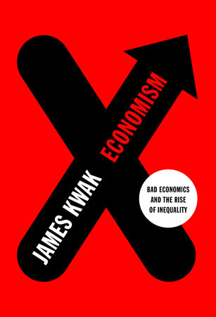

There was [a paper from NBER](http://www.nber.org/papers/w22784) that [Noah Smith tweeted](https://twitter.com/Noahpinion/status/793698992005652481) last night that showed that log-linearization wasn't really a big deal in a nonlinear New Keynesian DSGE model. Since this was essentially an explicit example of where a [common complaint about economics and Taylor series approximations wasn't really valid](http://informationtransfereconomics.blogspot.com/2016/09/on-using-taylor-expansions-in-economics.html), I was inspired to construct a (potentially growing) list of complaints about economics when it comes to science and mathematics based on my many posts on the subject.

In constructing this list, I found that several of these posts are in the top 5 most viewed posts (namely, #1, #3, and #5) making me realize that I am probably mostly seen out in the econoblogosphere as a physicist critiquing various approaches to economics rather than as the crackpot developer of the [information transfer framework](http://informationtransfereconomics.blogspot.com/2016/02/slides.html). This may bode well for [my forthcoming book](http://informationtransfereconomics.blogspot.com/2016/09/a-random-physicist-takes-on-economics.html) which is more critique than information theory. 

**Update 4 November 2016:** I want to emphasize that this is a list of complaints about economic methodology with emphasis on scientific method and mathematics. It is not supposed to be a list of effects economics includes/excludes or complaints about specific models. They might appear as examples (e.g. I mention DSGE below), but are not the primary complaint. It is primarily intended as a corrective to many complaints in the econoblogosphere that "economics is unscientific because of _X_" written by a scientist, where the _X_'s are the top line complaints below.

**Update 13 March 2017:** I am adding some popular books critiquing economics where they might fall with the complaints below.

We'll start with the invalid complaints ...

_**\* \* \***_

**Not so valid complaints about economics**

> _"Economics keeps only the linear terms of Taylor approximations"_

As mentioned above, [I wrote an entire post on this](http://informationtransfereconomics.blogspot.com/2016/09/on-using-taylor-expansions-in-economics.html). Keeping linear terms in Taylor series is usually fine, so this doesn't work as a general criticism. It could potentially work against a specific model.

> _"Economics ignores nonlinear models"_

Part of this is captured in the post on Taylor approximations and the new NBER article. However, I also [wrote a post](http://informationtransfereconomics.blogspot.com/2016/10/keen-chaos-and-equilibrium.html) (that is now the 5th most viewed post on my blog, with [follow-up](http://informationtransfereconomics.blogspot.com/2016/10/i-am-not-sure-steve-keen-understands.html)) addressing one of the better empirical arguments against using nonlinear models. [As Roger Farmer's beautifully concise post](http://www.rogerfarmer.com/rogerfarmerblog/2016/10/4/nho932exasra0c2a2amkvdmovcy9rz) puts it, without hundreds of years of data we can't meaningfully tell the difference between a nonlinear model and a linear model with stochastic shocks.

> _"Economics makes unrealistic assumptions"_

In science, unrealistic assumptions are made all the time. What matters is the end result of those assumptions. This is how physics operates all the time and it is called "[effective theory](https://en.wikipedia.org/wiki/Effective_theory)", and "[effective field theory](https://en.wikipedia.org/wiki/Effective_field_theory)" (what Weinberg called [phenomenological Lagrangians](https://inspirehep.net/record/133288?ln=en)) is a formalization of the idea for advanced theoretical physics.

I wrote two posts ([here](http://informationtransfereconomics.blogspot.com/2016/10/economist-shouldnt-be-used-as-source.html), [here](http://informationtransfereconomics.blogspot.com/2016/11/economics-physics-and-data-response-to.html)) about this subject in response to someone making this claim.

> _"Economics has too much math"_

My background is in physics, but I've been studying economics and finance for over 10 years. My experience is that the level of math being applied is generally appropriate to the problem at hand. Some aspects of economics appropriately aren't very mathematical. [Development economics](https://en.wikipedia.org/wiki/Development_economics) comes to mind.

However, this complaint tends to be made about macroeconomics and the study of the business cycle. These are two things that we would not even know exist without mathematics. For example, no single person can see all the output or all the employed and unemployed people at once. This data must be compiled, which generates numerical quantities. Additionally, prices are numerical. How does one deal with the rise and fall of interest rates without mathematics?

I've written three posts ([here](http://informationtransfereconomics.blogspot.com/2015/11/math-up.html), [here](http://informationtransfereconomics.blogspot.com/2016/04/the-mathematics-is-not-issue-here-dude.html), and [here](http://informationtransfereconomics.blogspot.com/2016/04/math-utility-maximization.html)) on this in which I've tried to understand this charge -- what is it really trying to say? There seem to be many different reasons that range from genuinely feeling left out of a field that has an important effect on people's lives to avoiding testing one's theory against empirical data.

_Added 5pm PT._ There is a possibly valid version of this in that a lot of economics is written too mathematically; I address this below.

> _Mathiness_

[Paul Romer made his big debut](https://paulromer.net/mathiness/) in the econoblogosphere with a paper on what he called "mathiness": the lack of technical rigor (Romer used the words 'tight links') in mathematical arguments in economics.

I read through his paper and his specific claims make no economic sense from the standpoint of dealing with the reality of economic systems. [It's now my 3rd most-viewed post](http://informationtransfereconomics.blogspot.com/2015/05/the-irony-of-paul-romers-mathiness.html). I think Romer has touched on something, however, and the issue is really about domains of validity (scope), scales, and limits (see below).

_Added 5pm PT._ Some people have different interpretations of what "mathiness" is ([Romer himself felt misunderstood](http://informationtransfereconomics.blogspot.com/2015/05/paul-romer-feels-misunderstood.html) on this subject \[also, [Romer's response to my post](https://paulromer.net/valid-criticism-of-things-ive-written-about-mathiness/)\]). Some people consider "mathiness" to be writing economics with overly formal mathematical symbols, which I address below.

> _"Macro is like string theory (in a bad way)"_

Paul Romer's second big splash was with a [devastating critique of macroeconomics](https://paulromer.net/the-trouble-with-macro/). Many of the critiques are valid. However, he uses an analogy with string theory to say macro is unscientific that [really misunderstands string theory](http://informationtransfereconomics.blogspot.com/2016/09/macro-is-not-like-string-theory.html).

_**\* \* \***_

**Complaints that depend on framing**

> _"Economics is bad at forecasting"_

This really depends on a lot of factors. Long run or short run? Does the theory actually say the result is forecastable?

DSGE models are designed to forecast over the short run, [but appear to be unable to do so](http://informationtransfereconomics.blogspot.com/2016/10/forecasting-it-versus-dsge.html) -- or do so worse than simple stochastic models. That's a valid complaint!

> _"Economics can't predict recessions"_

Following the complaint about forecasting, we look specifically at recessions. Are recessions random, or are they predictable?

Science can't predict earthquakes, but can predict where earthquakes might occur and levels of strain building up in faults.

Some economic theories predict recessions to be quasi-periodic. But much like the problem with validating the forecasting abilities of presidential election models, we don't have a lot of recessions to work with in the time series. Even a model that predicted the past 3 or 4 recessions (meaning it would have had to have been built in the 80s) could have done so out of luck (although if it matched the severity and duration of those 4 recessions, that might be a real thing).

One should probably hold judgement until we have some evidence that recessions are predictable.

> _"Economics is unscientific"_

Which aspect?

This is not a binary condition, but rather a continuum. String theory in physics could be considered unscientific in the sense that it has little connection to data. However, it's a very scientific extension of standard quantum field theory (you could call it the _quantum field theory of strings_ instead of string theory, and in fact that is [the title of a string theory book](https://www.amazon.com/Quantum-Particles-Strings-Frontiers-Physics/dp/0201360799)). So something can really be unscientific in one way, but scientific in another.

As I wrote about [here](http://informationtransfereconomics.blogspot.com/2016/11/economics-physics-and-data-response-to.html), some aspects of economics appear unscientific (to me) while other aspects don't.

> _"Economics is not empirical"_

Again, this depends on what you are talking about. [VAR models](https://en.wikipedia.org/wiki/Vector_autoregression) are entirely based on empirical data. Sometimes DSGE models aren't compared to data. Sometimes [they are](http://informationtransfereconomics.blogspot.com/2016/04/update-to-2014-it-model-inflation.html).

> _"Economic quantities are phlogiston"_

_Added 4 Nov 2016._ I remembered this one from [Paul Romer's paper](https://paulromer.net/the-trouble-with-macro/), but I think [Matthew Yglesias was the source](http://www.slate.com/blogs/moneybox/2014/02/19/technology_isn_t_growth_mysteries_of_the_solow_residual.html) of my own usage with regard to total factor productivity. [Phlogiston](https://en.wikipedia.org/wiki/Phlogiston_theory) was originally thought to be the substance contained by combustible materials that made them burn. You can see the obvious circularity in the definition.

Economics introduces many different quantities when describing economic data. Utility, total factor productivity, technology shocks. Some are unmeasurable (utility). Some of these are dangerously close to phlogiston (TFP).

However, introducing new and possibly unmeasurable quantities has long been a part of science. Sometimes they end up being phlogiston. Sometimes they end up being momentum ("quantity of motion" per Newton). It may be true that utility is unobservable. However the [quantum wave function](https://en.wikipedia.org/wiki/Wave_function) is also unobservable.

Therefore, this should be considered on a case by case basis. It is hard to say whether TFP or utility will end up being useful quantities. I personally don't think so, but I also can't rule it out.

**_\* \* \*_**

**Valid complaints**

> _The identification problem_

I think [Paul Romer did a delightful job](https://paulromer.net/the-trouble-with-macro/) explaining the [identification problem](https://en.wikipedia.org/wiki/Parameter_identification_problem). Basically the idea is that any system with _m_ equations in _m_ unknowns will have way too many parameters. Expectations and nonlinear models make this worse.

> _"Economics does not appear to treat limits properly"_

In looking at Romer's mathiness complaint (above), [I realized that the way that economists treat limits](http://informationtransfereconomics.blogspot.com/2015/11/on-limits.html) (taking variables to zero or infinity) is, in a word, sloppy. This can lead to some serious problems such as producing contradictory results or nonsense. The issue can be related to [dimensional analysis](https://en.wikipedia.org/wiki/Dimensional_analysis) and understanding the [scales of the theory](http://informationtransfereconomics.blogspot.com/2015/12/by-magic-number-nick-rowe-means-scale.html) (Romer [cedes that he](http://informationtransfereconomics.blogspot.com/2016/10/what-should-we-expect-from-economic.html) -- and therefore likely other economists -- ignore scaling).

The basic idea is that 1) 0 and infinity are effectively related by _1/∞ ~ 0_, and 2) both zero and infinity are dimensionless (have no units). This means you can never take the limit as time _t_ goes to infinity _t → ∞_ because one has units (time has units of seconds, quarters, or generic time periods). The same goes for _t → 0_.

Therefore, if you ever want to take limits, you need to understand what your fundamental time scale _t₀_ (with units of seconds, etc) is so that you can take the limit _t/t₀ → ∞_. In physics, we tend to write this as _t/t₀ >> 1_ (the double greater than signs read as "much greater").

The practical result of this is that there are a ridiculous number of undefined (or implicitly defined) time scales like _t₀_ hiding in economic theory.

Romer's mathiness complaint ends up being wrong because he didn't realize that his double limit makes zero sense because he effectively takes both _t → ∞_ and _t₀ → ∞_ in different orders and (as would be expected) ends up with nonsense.

Now you don't have to actually take the limits in order to have these implicit scales in your model. To my chagrin, [I pointed this out about stock-flow consistent models](http://informationtransfereconomics.blogspot.com/2016/03/more-like-stock-flow-in-consistent.html) (what is by far my #1 most-viewed post), and received a barrage of comments saying that I didn't understand what I was talking about from people suffering from the [Dunning-Kruger effect](https://en.wikipedia.org/wiki/Dunning%E2%80%93Kruger_effect).

> _"Economics does not deal with domains of validity (scope)"_

Every theory, every model, has a range of inputs over which it is valid. In physics, we call it [domain of validity](http://informationtransfereconomics.blogspot.com/2015/10/we-built-this-theory-on-scope-conditions.html) (e.g. Sean Carroll uses the term [here](http://www.preposterousuniverse.com/blog/2005/09/19/theories-laws-facts/) and [here](http://www.preposterousuniverse.com/blog/2008/02/18/telekinesis-and-quantum-field-theory/)), but Noah Smith appears to think we call it scope conditions (which I think is actually a sociology term). Regardless of what you call it, [economics doesn't address it much](http://informationtransfereconomics.blogspot.com/2016/06/macroeconomists-are-weird-about-theory.html). Noah says: "I have not seen economists spend much time thinking about domains of applicability (what physicists usually call 'scope conditions'). But it's an important topic to think about."

It is. It is very important. It is closely linked to the scales and limits mentioned above.

Newtonian physics for example is valid for speeds _v_ where _v/c << 1_ (the scope) where _c_ is the speed of light (the scale \[1\]). When _v ~ c_, then Einstein's theory of relativity becomes important.

Because economic theories have implicit scales floating around, and does't take limits properly, one ends up with a confused mess when one tries to understand the scope of any particular model or formula. For example, I looked at the [present value formula](http://informationtransfereconomics.blogspot.com/2016/07/scopes-and-scales-present-value-formula.html) (more accounting than economics) in this light.

In a more interesting example, utility maximizing rational agents clearly fail when you have _N = 1_ agent as shown by many experiments. However, they appear to be a [decent approximation](http://informationtransfereconomics.blogspot.com/2016/04/list-2004-field-experiments-with-random.html) when _N ~ 20_ agents in at least one experiment. As [Gary Becker showed](http://informationtransfereconomics.blogspot.com/2015/10/gary-beckers-emergent-rational-agents.html), you get the same results from an ensemble of irrational agents as you do from a single rational agent. I made the case that rational agents with many of the properties economists assume (but do not appear to be true of individual agents) [could emerge in systems with a large number of agents](http://informationtransfereconomics.blogspot.com/2015/09/the-emergent-representative-agent-1.html).

What if there was a group scale of _N₀_ people (say, 100) \[2\] which told us that when _N/N₀ >> 1_ we can assume rational utility maximizing agents? This would make sense of the failure of individual (_N = 1_) human behavior to appear rational. The rational agent model is out of scope for individual humans.

I am not saying that is definitely true; it is just a possible resolution. It's also a possible resolution that would be clearer to understand if economics treated scopes and scales more rigorously.

Books:

Dani Rodrik's _Economics Rules_ (although I don't necessarily [agree with the solution](http://informationtransfereconomics.blogspot.com/2015/09/whats-wrong-with-dani-rodriks-view-of.html))

> _"Economics is written too mathematically"_

_Added 5pm PT._ I think some people see this as "mathiness" or "physics envy", but the following snippet (flagged by [Duncan Black](http://www.eschatonblog.com/2014/02/life-among-econ.html), himself an economist) is a not-uncommon paragraph from an academic economics paper:

I wrote about this [here](http://informationtransfereconomics.blogspot.com/2015/05/im-not-sure-noah-smith-understands.html). I think writing papers in this style obscures more than it illuminates. As I wrote at the link: "There is quite literally no reason for an economist to refer to the real numbers as _ℝ_ or even refer to real numbers at all. To say _x ϵ ℝ+_ is pretentiousness compared to _x > 0_." Overall, this is a superficial complaint; the mathematics underlying the terse symbols is usually relevant. It could just be written in simpler, less symbolic language. It really is just an academic culture of writing papers like this (something that "looks like an economics paper").

> _"Economics accepts stories too easily"_

_Added 5 Nov 2016._ This is probably more a human failing than one specific to economics, but macroeconomic theories are used to produce narratives that are proffered with a certainty that far exceeds their empirical success at describing macroeconomies. [I've compiled a list here](http://informationtransfereconomics.blogspot.com/2016/11/a-list-of-usupported-narratives-in.html).

I'm not endorsing the rest of his book or ideas, but Nassim Nicholas Taleb writes about this calling it [the narrative fallacy](https://en.wikipedia.org/wiki/The_Black_Swan_\(Taleb_book\)#The_narrative_fallacy).

Science is primarily as a defense against fooling yourself ([Feynman](http://calteches.library.caltech.edu/51/2/CargoCult.htm)), and narratives constructed by your [left brain interpreter](https://en.wikipedia.org/wiki/Left_brain_interpreter) are a very seductive way to fail. Data first, story later.

Books:

James Kwak's _Economism_ (although [he makes the distinction](https://economism.net/economism-and-economics-a5bb9ca4bc3c#.um16tz2ai) that what he calls "economism" isn't really economics)

...

**Footnotes:**

\[1\] For those interested, _c_ comes from the Latin for "quickness": _celeritas_

\[2\] For example in physics, when the number of "agents" (atoms) _N >> Nₐ_ (Avogadro's number ~ 10²³), chemistry and thermodynamics are the valid effective theories of Newtonian and quantum mechanics -- that differ from them quite extensively. Maybe something like this happens in macroeconomics?
