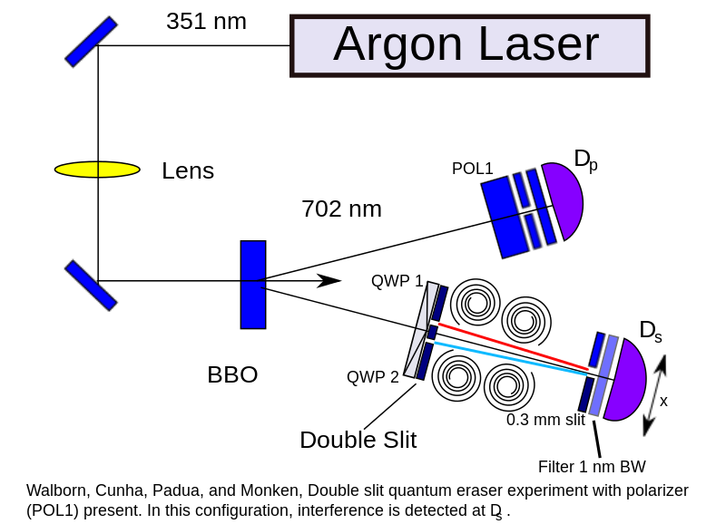

I've at times enjoyed philosophy, but generally things like Newcomb's problem ([which was linked to](https://www.theguardian.com/science/alexs-adventures-in-numberland/2016/nov/28/newcombs-problem-divides-philosophers-which-side-are-you-on) at Marginal Revolution today) makes me roll my eyes. There are two basic questions with this thought experiment: are we ceding the infallibility of the predictor and the potential lack of causality in the prediction or not? They turn out to be linked by causality.

There's a lot of persuasion in the problem that the predictor is infallible, but the problem doesn't come out and say so. Is the predictor an [oracle](https://en.wikipedia.org/wiki/Oracle_machine) in the computer science sense? There's really no reason to continue this discussion if we don't have an answer to this.

David Edmonds says "You cannot influence a decision made in the past by a decision made in the present!" At a fundamental level, the [quantum eraser](https://en.wikipedia.org/wiki/Quantum_eraser_experiment) basically says that what Edmonds statement is generally wrong as stated (you just can't send a signal/communicate by influencing a past decision with a present decision). The way out of that is that we're dealing with a macroscopic system in the ordinary world, but in the ordinary world there's no such thing as an oracle. The Stanford Encyclopedia of Philosophy has [more to say](http://plato.stanford.edu/entries/causation-backwards/).

However, I think this problem is illustrative of a paradox with expectations in economics, so let's reformulate it.

Firm X (which determines most of the economy) can decide to cut output if it expects less aggregate demand. Normal output is 100 units, cut back is 50.

However, there's also a central bank. The central bank's forecasts have always been right. However, if the central bank forecasts that firm X will keep output the same, they will cut back on aggregate demand (raising interest rates, making firm X lose money). And if the central bank forecasts firm X will cut back on output, they'll boost aggregate demand. The boost/cut is +/-50 units.

Predicted choice  |  Actual choice  |  Payout

B (+1M)              B                 1M
B (+1M)              A+B               1M 1k
A+B (0)              B                 0
A+B (0)              A+B               1k

Predicted choice  |  Actual choice  |  Payout

Cut back +50  (r-)   Cut back (50)      100
cut back +50  (r-)   Keep same (100)    150
Keep same -50 (r+)   Cut back (50)        0
Keep same -50 (r+)   Keep same (100)     50

This might sound familiar: it's [Scott Sumner's retro-causal Fed policy](http://econlog.econlib.org/archives/2014/03/did_the_rate_in.html). An expected future rate hike yields lower expected output (expected avg = 25). And assuming the Fed is infallible (predicted = actual, i.e. rational/model-consistent expectations), the optimal choice is to cut back output (take box B). However, assuming the Fed is fallible (not rational expectations), the optimal choice is to keep output the same (expected result = 100). Basically, this is Edmonds answer above: take both boxes. When a model assumption (rational expectations) reproduces philosophical paradoxes, it's probably time to re-examine it.

The question at hand is whether rational expectations can move information from the future into the present. [I've discussed this in more detail](http://informationtransfereconomics.blogspot.com/2016/04/neo-fisherism-and-causality.html) before in the context of so-called "neo-Fisherism". The rational expectations "operator", much like the oracle/predictor "operator", acts on a future (expected/predicted) state and moves information (sends a signal) into the present. In general such an operator -- were this information genuine (i.e. the predictor is infallible) -- violates causality. In quantum physics, there are cases where it appears on the surface that there might be causality violation (such as the quantum eraser above), but in every case no communication can occur (usually meaning [locality](https://en.wikipedia.org/wiki/Principle_of_locality) is violated, but not causality).

So the question really is are we suspending causality and superluminal communication? If that is the premise of Newcomb's paradox or rational expectations, then there is nothing wrong with someone who can exactly predict the future (they're probably getting the information from the future) or future actions causing present conditions. If we're not, then the obvious choice is to assume that even rational expectations or infallible predictors can be wrong and take both boxes.

This so-called "philosophical paradox" should explicitly say whether we are suspending causality in our thought experiment instead of being mealy-mouthed about it.
