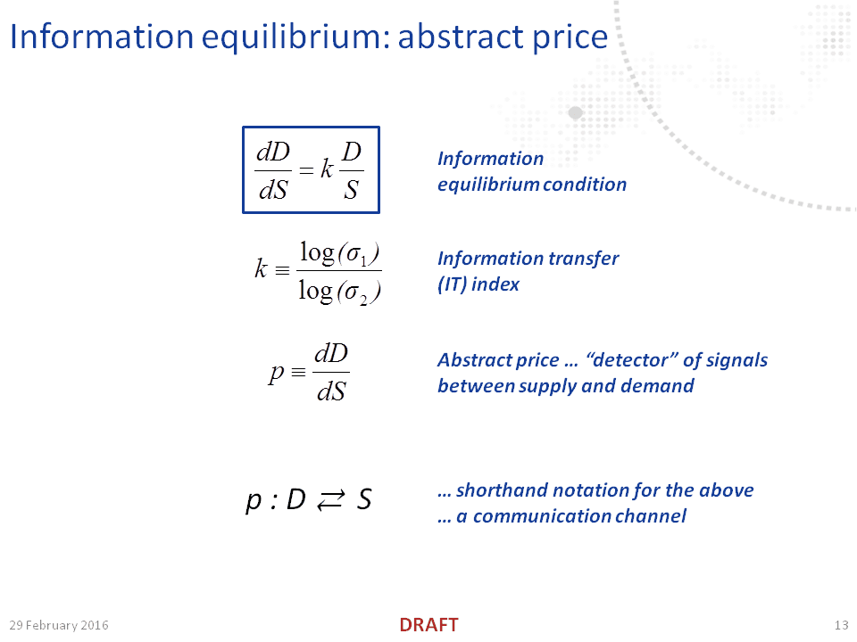
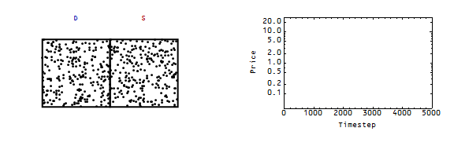

Apart from my [quibble with his use of the subjunctive](http://informationtransfereconomics.blogspot.com/2016/11/nobody-would-have-predicted.html) in [his piece](https://www.bloomberg.com/view/articles/2016-11-09/econ-101-might-be-wrong-about-supply-and-demand), I also don't think that Noah Smith's argument that (aggregate) supply and demand are indistinguishable is a useful frame. Coupled, yes, but not indistinguishable.

Coupled?

That's a physics term that might not be widely known; it's used from [quantum field theory](https://en.wikipedia.org/wiki/Minimal_coupling) to [classical mechanics](http://webpages.ursinus.edu/lriley/courses/p212/lectures/node5.html) to describe _X_ and _Y_ when _X_ becomes a function of _Y_ i.e. _X = X(Y)_ or a term like _X · Y_ is added to a Lagrangian (so that the equations of motion for _X_ depend on _Y_ when the partial derivative _∂/∂X_ is taken).

Noah describes several models in his post. Instead of supply, they are written in terms of productivity (where shocks are considered supply shocks). The first one couples expected future supply (productivity) to present demand:

> _Paul Beaudry and Franck Portier ... theorized that a recession could happen because people realize that a productivity slowdown could be coming in the future. Anticipating lower productivity tomorrow, companies would reduce investment, lay off workers and cut output. ... Traditionally, we think of random changes in productivity as supply shocks, because they affect how much companies are able to produce. But in the short term, the cutbacks in investment and hiring in Beaudry and Portier’s model would look at lot like a demand shock._

We could write in this model that present demand depends on future expected supply, coupling them:

_Dt = f(Et St+1)_

In the subsequent models, flagging demand today lowers supply (productivity) tomorrow:

> _productivity growth goes down after demand takes a hit, and that this can cause recessions to last years longer than they otherwise would_

We could write this as future supply depending on present demand:

_St+1 = f(Dt)_

I think Noah's bigger point however is not that supply and demand are indistinguishable, but rather that supply and demand aren't related by the partial equilibrium supply and demand curves except under very specific conditions (scope). For example, the shocks might have to be small, be unanticipated, or happen quickly. The cases above concern times where shocks are anticipated or not small (e.g. high unemployment lasts long enough for it to degrade skills).

I think [the information equilibrium framework](http://econpapers.repec.org/RePEc:arx:papers:1510.02435) is a useful corrective to this because it explicitly defines the scope where the partial equilibrium analysis is correct: when supply or demand adjusts slowly with respect to the other. I find it hard to believe that economists don't think of supply and demand curves this way, but Noah's article and [Dierdre McCloskey's review of Picketty's book](http://informationtransfereconomics.blogspot.com/2015/06/economics-really-needs-framework.html) are evidence that this is not normal.

In any case, the information equilibrium framework looks at supply and demand as generally strongly coupled via the information equilibrium condition:

You can solve the differential equation with two different scope conditions (supply adjusts faster than demand, demand adjusts faster than supply) yielding supply and demand curves:

There is of course the general solution where they move together (are strongly coupled). [In this post](http://informationtransfereconomics.blogspot.com/2015/03/supply-and-demand-as-entropy.html), I show in simulations the various regimes of the supply and demand diagram; however, every simulation is done where general equilibrium holds (as an expected value) so even though I apply a demand shock or a supply shock, both supply and demand move together. Here is one animation from that post (a positive demand shock, with demand moving faster than supply adjusts):

In each case, supply and demand are distinguishable concepts (they represent [different probability distributions](http://informationtransfereconomics.blogspot.com/2016/08/is-information-equilibrium-silly.html)) -- it's just the market price strongly couples them (_p = k D/S_). It's true that in perfect equilibrium, there is no real distinction between the two. We have _I(D) = I(S)_ (information revealed by supply events is equal to information revealed by demand events when they meet in a transaction event), so there's no real difference between _I(D)_ and _I(S)_. However, much like how there's no difference between the probability distribution of quantum events in the [double slit experiment](https://en.wikipedia.org/wiki/Double-slit_experiment) and the (squared) wavefunction, the wavefunction is still necessary to understand and solve the [Schrodinger equation](https://en.wikipedia.org/wiki/Schr%C3%B6dinger_equation).
