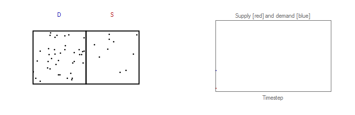
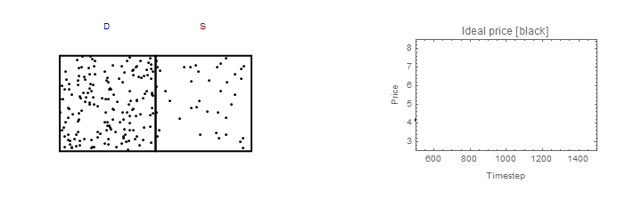
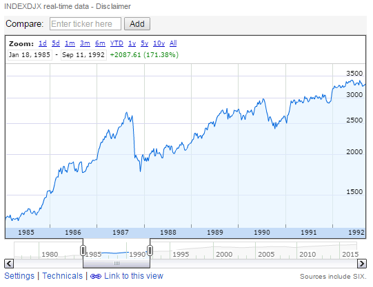
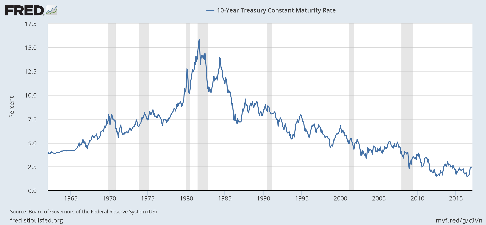

Yesterday I watched the NOVA episode [_Mind Over Money_](http://www.pbs.org/wgbh/nova/body/mind-over-money.html) because that is the kind of thing that I do on the weekend (at least when my wife is off with her friends). It's sort of presented as a back and forth between the Fama camp and the Shiller camp and is generally entertaining (or might make you shout at the screen). I had actually seen it before (when it originally aired in 2010), but the appearances by John Cochrane and Gary Becker had new meanings for me (per [here](http://informationtransfereconomics.blogspot.com/2015/05/the-basic-asset-pricing-equation-as.html) and [here](http://informationtransfereconomics.blogspot.com/2016/01/draft-paper-for-talk-this-summer.html)).

Anyway, [bubbles](https://en.wikipedia.org/wiki/Economic_bubble) are mentioned, and I was wondering how they might be understood in terms of the information transfer framework. I really do think that e.g. [Scott Sumner](http://econlog.econlib.org/archives/2015/08/why_bubbles_are.html) or [Eugene Fama](http://review.chicagobooth.edu/economics/2016/video/are-markets-efficient) have a point when they say the idea of a bubble is hard to define. Some assets go up fast and stay up. Others go up, and then collapse. Given what we colloquially think of as a bubble, you can never really identify it unambiguously until it has "popped". Housing in Arizona and Florida were bubbles; housing in San Francisco wasn't -- or at least might not be because it could still "pop", but that's the point. We don't know in real time. A lot of bubble detecting is done with 20/20 hindsight, which may be good history but is bad science.

With that as a prologue, I think I have a good definition of an asset price bubble in the information transfer framework: _**a surge in demand that outpaces supply followed by non-ideal information transfer**_. I did some simulations (following [here](http://informationtransfereconomics.blogspot.com/2016/04/simulations-with-supply-demand-and.html)) and here is the effect of an increase of demand that is faster than the growth of supply in a system with IT index _k = 1.3_

You can see the price launch up until the growth in demand stops outpacing the growth in supply. It then falls slowly afterwards until it eventually rejoins the original path. That's the idea price _p\*_, however. One could easily imagine that as soon as the price reaches its zenith, there'd be a [panic, correlation](http://informationtransfereconomics.blogspot.com/2014/10/coordination-costs-money-causes.html) among asset sellers, and [non-ideal information transfer](http://informationtransfereconomics.blogspot.com/2016/09/basic-definitions-in-information.html). We'd have _I(D) > I(S)_ and _p < p\*_. Therefore the path would look more like the gray path rather than the dashed black path:

The precipitous fall in price after a bubble defined this way "pops" is due to panic and not fundamentals.

...

**Update**

Here is the 1987 crash:

...

**Update 29 November 2016**

[Noah Smith on bubbles](http://noahpinionblog.blogspot.com/2012/01/why-do-bubbles-happen.html).

...

**Update 17 February 2017**

And here's an example of a non-bubble (surge in demand outstripping supply that isn't followed by serious non-ideal information transfer, but rather a slow decline back to "equilibrium"):

