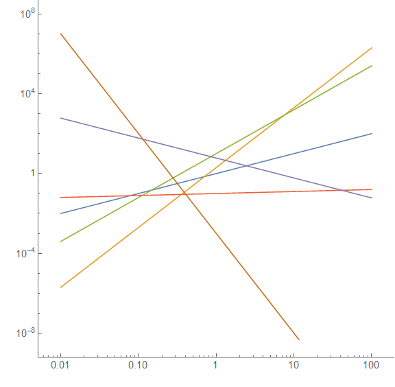

As we saw before, the information equilibrium condition [is invariant under the transformation](http://informationtransfereconomics.blogspot.com/2016/10/invariance-under-inversion.html):

> _log A → γ log A + a_
>
>
>
> __log B → γ log B + b__

And if the coefficient of the _log X_ terms aren't equal, it's equivalent to a change in the information transfer index (and therefore not necessarily consequential in terms of observables).

One interesting thing is that this invariance eliminates [most other terms in an effective information equilibrium theory expansion](http://informationtransfereconomics.blogspot.com/2016/03/effective-information-equilibrium-theory.html), in particular the constant term.

As for the meaning of the invariance, I re-wrote the transformation suggestively in terms of logarithms. Basically, the invariance is an [affine log-linear transformation](https://en.wikipedia.org/wiki/Affine_transformation) ([affine group](https://en.wikipedia.org/wiki/Affine_group)). We'd visualize it as rotations and translations of our original variable in log-log space (blue line is _log X = log Y_, the others are _γ log X + a = log Y_):

