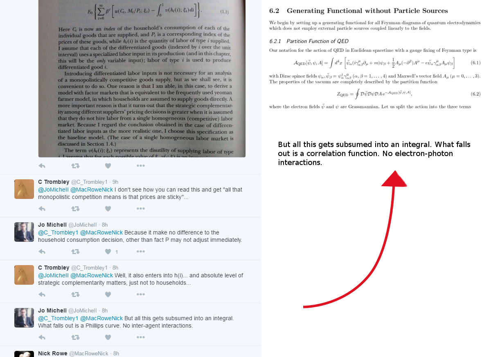
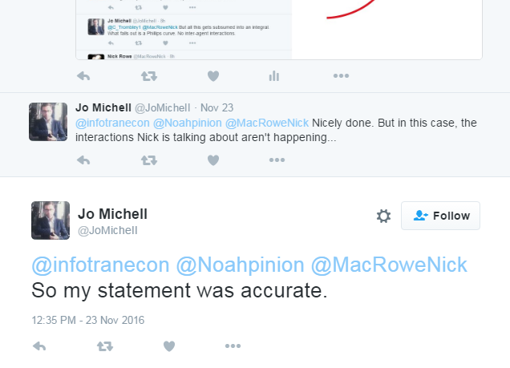
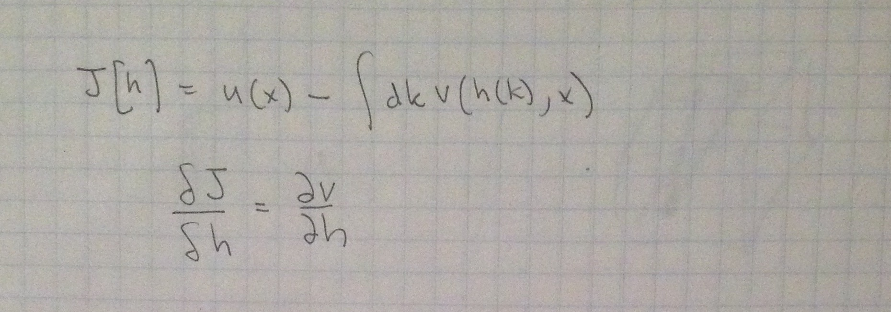
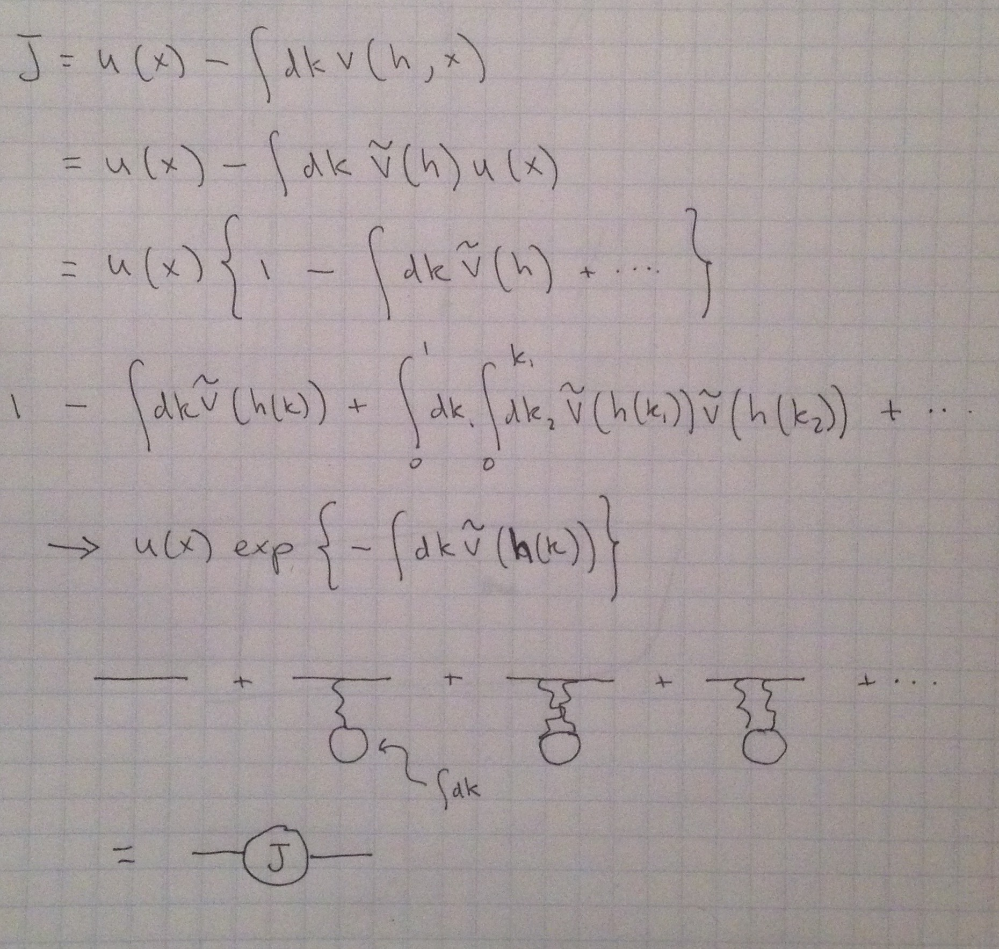

[This Twitter thread](https://twitter.com/Noahpinion/status/801495191416930304) was/is pretty entertaining. However, there is a good lesson here about "subsuming things into an integral" (which I've put in a snarky way):

Just because you integrate out/integrate over some variable it doesn't mean it isn't doing anything.

**_\*  \*  \*_**

**Update 24 November 2016**

[Jo Michell replied to my snark](https://twitter.com/JoMicheII/status/801524499812413440):

However, this isn't true. The objective function, shown at the top of the original graphic above, is best thought of as an interaction between and individual agent and a mean field of labor. The easiest way to see this is that despite being inside an integral, the "equation of motion" ([functional derivative](https://en.wikipedia.org/wiki/Functional_derivative)) is non-trivial (simplifying the objective function a bit for clarity, dropping time, _x = ξ_ \[, _C_, _M_, etc and other variables\], and _k = i_ \[because that's what I wrote for some reason\]):

This means that there is are particular values of _h(k)_, supplied labor of type _k_, that will result from a given disutility functional _v\[h(k), x\]_. This means that individual utility will depend on the disutility of the "labor field" _h_, and the "labor field" will impact the individual utility. Actually, re-writing this functional allows us to put this in a form that explicitly shows it is just the leading order term of an interaction with a mean field potential _ṽ\[h(k)\]_ like a ([Wick rotated](https://en.wikipedia.org/wiki/Wick_rotation)) [Dyson series](https://en.wikipedia.org/wiki/Dyson_series) in physics:

In the original text in the graphic above, Woodford refers to the inclusion of _v\[h(k)\]_:

> _"I ... have written (1.1) **as if** the representative household simultaneously supplies **all** of the types of labor."_

The second emphasis is Woodford's, but the first is mine: this is an example of ["as if" being effective field theory](http://informationtransfereconomics.blogspot.com/2016/10/economist-shouldnt-be-used-as-source.html) in action. We have an "effective representative agent" that actually includes interaction with the entire labor market (to first order).

This is identical to, for example, the mass of an electron in the Higgs field. The _J_ propagator in the graphic above is formally equivalent to the [self-energy](https://en.wikipedia.org/wiki/Self-energy) of a massless electron interacting with the Higgs field resulting in an electron mass. When we write down an electron mass, we're not assuming it has no interaction with the Higgs field. We are using an effective field theory where all of the interactions with the Higgs field has been integrated out leaving an effective mass term in the Lagrangian.

**_\*  \*  \*_**

**Update 29 November 2016**

Jo Michell has [replied again](https://twitter.com/JoMicheII/status/803752981518749696) (and Pedro Serôdio has chimed in). I added a couple of blurbs above (about the variable _x_ just representing other variables). However, I'd like to show more how there is a real interaction here. First, let me LaTeX this up a bit ... our objective function (that we maximize) is:

$$ 
J[u, h] = u(x) - \int dk \; v[h(k), x] 
$$

I showed above that \[1\]

$$ 
\frac{\delta J[u, h]}{\delta h} = \frac{\partial v}{\partial h} 
$$

We also have

$$ 
\begin{align} 
\frac{\delta J[u, h]}{\delta u} &amp; = 1 - \int dk \; \frac{\partial v[h, x]}{\partial u} - \frac{d}{dx} \frac{\partial}{\partial u'} \int dk \; v[h, x]\\ 
&amp; = 1 - \int dk \left[ \frac{\partial v[h, x]}{\partial u} - \frac{d}{dx} \frac{\partial v[h, x]}{\partial u'} \right] 
\end{align} 
$$

Now if $\partial v/\partial u \equiv 0$ and $\partial v/\partial u' \equiv 0$ (i.e. $v$ does not depend on $u$), then we are stuck with

$$ 
\frac{\delta J[u, h]}{\delta u} = 1 
$$

and therefore we aren't at an optimum of our objective function (the Euler-Lagrange equation isn't zero). However, the functional form $v = \alpha \; \tilde{v[h] \; u(x)}$ is a simple ansatz that tells us that $\partial v/\partial u = 1$ and the integral gives 1 (hence $\alpha = 1$) and we have

$$ 
\frac{\delta J[u, h]}{\delta u} = 0 
$$

And we have the basic $J$ term in the "propagator" as shown in the handwritten Dyson series (with "Feynman diagrams") above.

Now it is true -- as Jo Michell points out -- that basically this sums up into a coefficient $\zeta$ in the Philips curve. It's not too different (abstractly) from the vertex correction in the [anomalous magnetic moment](https://en.wikipedia.org/wiki/Anomalous_magnetic_dipole_moment) adding up to a factor of $\alpha/2\pi$. Our truncated mean field calculation above simply shifts utility by a bit, while integrating out all the virtual photons simply shifts $g$ by a bit.

Michell describes this state as lacking "serious heterogeneity or strategic interaction", and I guess it isn't serious if by "serious" you mean "beyond leading order" where **_fluctuations_** in heterogeneity start to matter (e.g. a recession hits manufacturing jobs harder than service sector jobs). However any average state of heterogeneity (labor market configuration) is going to be (at leading order in this model) simply a "mean field" -- a constant background.

Now none of this means the model is right or that this is even a good approach. I'm just saying that lacking heterogeneity and interactions is very different from keeping only the leading order effects of heterogeneity and interactions.

You'd actually want to compare this theory to data to see what we'd want to do next. If it doesn't get that right (as reasonable given a leading order theory), the solution is **_definitely not_** to go to higher order corrections in the Dyson series, but rather to scrap it and try something different \[2\].

**Footnotes**

\[1\] For example, $v[h]$ could be an entropy functional for input distributions $h$, thus a maximum entropy configuration might optimize this equation of motion.

\[2\] In my experience with macro models, the leading order theory is terrible at describing data so going forward with heterogeneity/strategic fluctuations (higher order) is not good methodology. Better to scrap it and try something different based on different empirical regularities. [This one](http://informationtransfereconomics.blogspot.com/2016/10/dynamic-unemployment-equilibrium-and.html), maybe?
