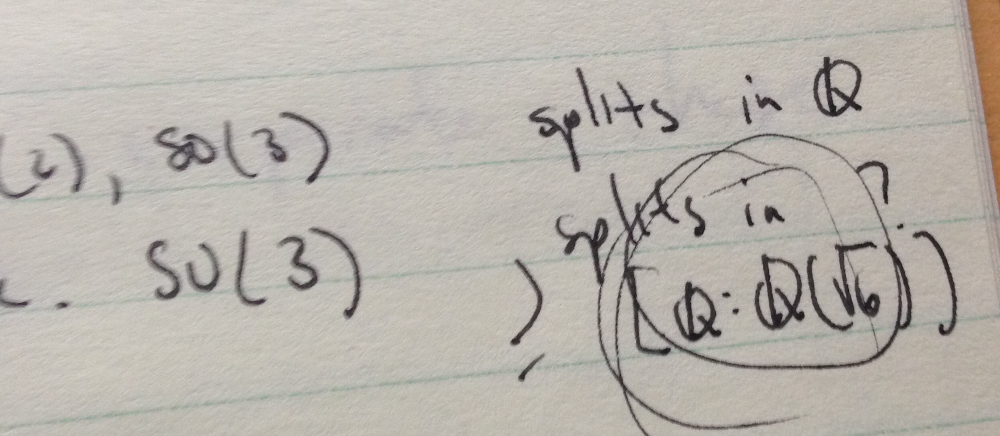

I remember [noticing this](https://www.wired.com/2016/11/physicists-uncover-strange-numbers-particle-collisions/) in quantum field theory class (which I took in 2000, so five years after the original paper in 1995, so I wasn't breaking any new ground), and once posited that the various coefficients arising from amplitudes could be related with Galois theory. At the time I was considerably skeptical, but did jot a note (pictured above) that I found after the article jogged my memory \[1\]. I was so skeptical I would later go on to say that there were no real-world applications of Galois theory [in this post](http://informationtransfereconomics.blogspot.com/2015/05/leeches-rant.html).

I think I spoke too soon; here is a quote from the article:

> _\[Francis\] Brown is looking to prove that there’s a kind of mathematical group—a Galois group—acting on the set of periods that come from Feynman diagrams. “The answer seems to be yes in every single case that’s ever been computed,” he said, but proof that the relationship holds categorically is still in the distance. “If it were true that there were a group acting on the numbers coming from physics, that means you’re finding a huge class of symmetries,” Brown said. “If that’s true, then the next step is to ask why there’s this big symmetry group and what possible physics meaning could it have.”_

Anyway, the main point is to keep an open mind. That's why I look at the abstract mathematical properties of information equilibrium every once in awhile (e.g. [here](http://informationtransfereconomics.blogspot.com/2015/05/resolving-cambridge-capital-controvery.html), [here](http://informationtransfereconomics.blogspot.com/2016/10/invariance-under-inversion.html), [here](http://informationtransfereconomics.blogspot.com/2016/11/information-equilibrium-and-log-linear.html), [here](http://informationtransfereconomics.blogspot.com/2015/03/information-equilibrium-is-equivalence.html), [here](http://informationtransfereconomics.blogspot.com/2015/05/the-mathematical-properties-of.html)), as well as argue against keeping math out of economics (e.g. [here](http://informationtransfereconomics.blogspot.com/2016/04/the-mathematics-is-not-issue-here-dude.html) and [here](http://informationtransfereconomics.blogspot.com/2016/04/math-utility-maximization.html)).

**Footnotes**

\[1\] The way I was approaching it was pretty much entirely wrong (focusing on the structure constants of the Lie algebras like SU(3)).
