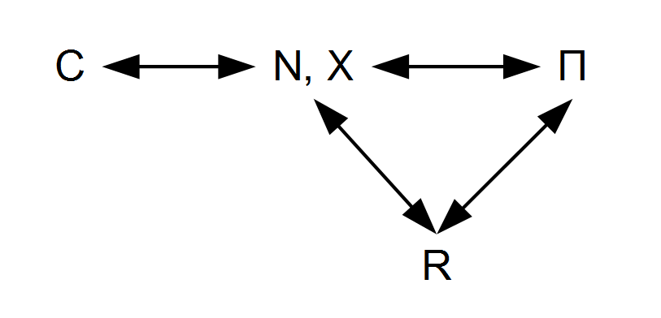

Nick Rowe [wrote up a post](http://worthwhile.typepad.com/worthwhile_canadian_initi/2016/11/my-cunning-plan-to-reform-new-keynesian-macro.html) about how to minimally put money into a New Keynesian (NK) model. I thought I'd try to understand it in the context of my information equilibrium (IE) NK DSGE model summarized [here](http://informationtransfereconomics.blogspot.com/2016/08/dsge-part-5-summary.html).

First off, you can always [insert money into any](http://informationtransfereconomics.blogspot.com/2015/05/money-defined-as-information-mediation.html) information equilibrium relationship so that _A ⇄ B_ becomes _A ⇄ M ⇄ B_. In a sense, adding money is generally trivial (it's a consequence of the [chain rule](https://en.wikipedia.org/wiki/Chain_rule) and _M/M = 1_, and more generally, the consequence of [scale invariance](http://informationtransfereconomics.blogspot.com/2016/10/invariance-under-inversion.html)). And in the case of the IE NK model, it doesn't add any additional explanatory power. So here is the original network diagram of IE relationships in the IE NK model side by side with Nick Rowe's addition of money _M_ between the relationships with the output gap _X_:

Let me define some of the other symbols here: _N_ is nominal output, _R_ is the nominal interest rate, _Π_ is the price level, and _C_ is consumption. The upper half of the loop is "the Phillips curve", the lower half is "the Taylor rule". The bit out the the side is "the IS curve", and finally there is an "Euler equation" (maximum entropy condition) relating consumption and the interest rate (blue dashed). The terms _μ_ and _ν_ are the stochastic innovation terms. I only point these out because _μ_ is special, as I discuss below.

After first inserting the money demand piece (i.e. _X ⇄ M_), Nick points out an issue he has with the NK model centering around the Euler equation:

> _There is a continuum of equilibria, with anything from 0% to 100% unemployment being an equilibrium ... This result follows immediately from the Consumption-Euler equation. ... The real interest rate only pins down the expected growth rate of consumption, not the level of consumption._

> _..._ 

> _\[NK\] simply assumes, with zero justification for this additional (hidden) assumption, that agents in the model expect an automatic tendency towards full employment._

Nick says that the NK model places the return to equilibrium in the consumption side by assuming the system goes to zero output gap _X(t)_ for long times _r t >> 1_. In his monetary version, he inserts money into the relationships and resorts to the "hot potato effect" to essentially say the output gap closes as extra money becomes uniformly distributed among agents. [This effect is an entropic force in IE models](http://informationtransfereconomics.blogspot.com/2015/07/updated-graphics-for-entropic-hot.html). However, to me this just seems to be replacing one model assumption -- _X(t) ~ 0_ for _r t >> 1_ -- with another -- the hot potato effect.

The fact that the Euler equation doesn't set the level is true in the IE NK model because it is a relationship between consumption in two periods, and therefore has a scale invariance (see [here for the equation](http://informationtransfereconomics.blogspot.com/2016/08/dsge-part-2.html)). However, the tendency to close the output gap is actually [derived from information equilibrium](http://informationtransfereconomics.blogspot.com/2016/08/dsge-part-4.html) (one of the stochastic innovation terms _μ_ is biased towards closing the output gap). It's still an entropic force (all IE relationships are sources of entropic forces), but it appears in the Phillips curve segment because of the relationship between nominal output and the output gap. The overall content is not very different from the original NK model. There, the output gap closes by assumption (e.g. expected to close). In the IE NK model, the output gap closes because of the tendency to restore information equilibrium (expected information equilibrium).

It might just be bias, but think the IE approach helps clarify what is happening in models and the discussion of them. Maybe that's just because I like pictures more than equations. In any case, the general idea behind Nick's post is captured in the diagram above along with moving the biased stochastic innovation term (biased towards output being equal to information equilibrium output) from the output gap into one of the money relationships.

It's more a re-organization and re-labeling than changing the model. Maybe that makes some people feel better. However and series of relationships _A ⇄ M ⇄ B_ can be re-written in terms of _A ⇄ B_, _A ⇄ M_, or _M ⇄ B_ because if the former is true, then the latter three are all true. In a sense, this allows you to trim any information equilibrium network diagram by removing unnecessary intermediaries. This is why I originally wrote the diagram like this:

The _N_ appears in one of those redundant relationships and we can really just think of the output gap in terms of information flowing in the model. I kept the label simply because the _N_ is required for the definition _n = y + π_.
