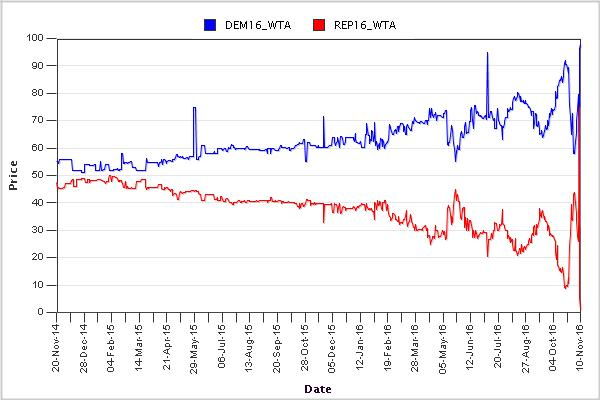
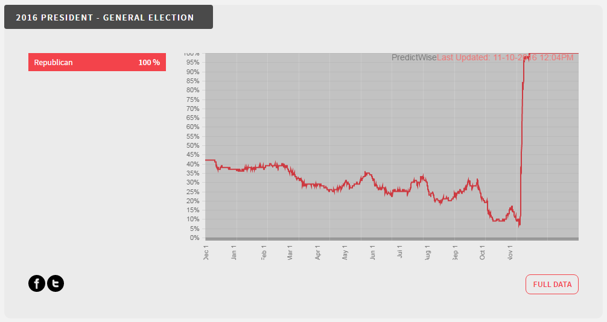

On my drive home from work tonight, I heard [Justin Wolfers](https://twitter.com/JustinWolfers) express continued confidence in prediction markets in the wake of the 2016 election on _Marketplace_ on NPR. Now the election result is perfectly consistent with a sub-50% probability (at some points as low as 10% in the Iowa Electronic Markets pictured above). Even a 10% probability has to come up sometimes. This may have some of you reaching for [the various interpretations of probability](https://en.wikipedia.org/wiki/Probability_interpretations). But the question is: How do we interpret results like this (from [Predictwise](http://predictwise.com/politics/))?

How do we handle this data in real time as an indicator of any property of the underlying system? Some might say this is a classic case of herding, being proven wrong only by incontrovertible results. Some might say that conditions actually changed at the last minute, with people changing their minds in the voting booths (so to speak). I am personally under the impression that [partisan response bias](https://today.yougov.com/news/2016/11/01/beware-phantom-swings-why-dramatic-swings-in-the-p/) was operating the entire time, so everyone was clustering around effectively bad polling data.

But what if this was a serious intelligence question, like whether a given country would test a nuclear weapon? This was actually the subject of a [government funded project](https://en.wikipedia.org/wiki/Aggregative_Contingent_Estimation), so it isn't necessarily an academic question that will remain an academic question. We need _metrics_.

My work on this blog with the information equilibrium framework originally started out as an attempt to answer that academic question and provide metrics, but the result was basically: _[No, you can never really trust a prediction market](http://informationtransfereconomics.blogspot.com/2015/01/is-market-intelligent.html)_. This is also why [non-ideal information transfer comes up pretty early](http://informationtransfereconomics.blogspot.com/2013/04/sticky-prices-from-non-ideal.html) on my blog. A key thing to understand is that markets are good at solving allocation problems, not (knowledge) aggregation problems. The big take-away is that you can only tell if a particular prediction market is working is if they never fail. Additionally, they tend to fail in the particular way these election markets fail -- by showing a price that is way too low (high) because of insufficient exploration/sampling of the state space.

These results haven't gone through peer-review yet, so maybe I made a mistake somewhere. However, even if prediction markets were proven to be accurate ask yourself: how useful were these results shown above? How much more did we get from them than we got from polling data?
