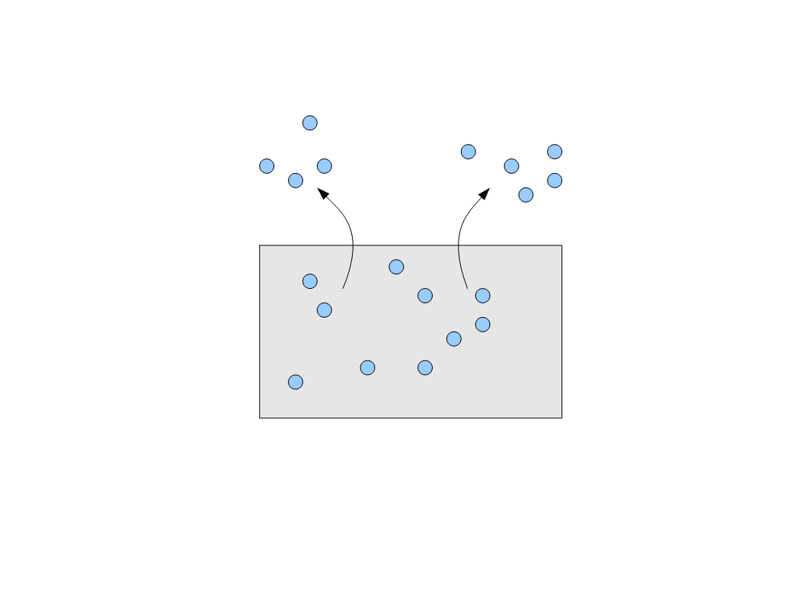

This is an economics and physics blog, but I'll do one post about some of the post-mortem analysis happening out there because it touches on math.

I've seen some arguments out there that such and such loss of voters by one candidate in one election and a shift in another election being interpreted as voters moving from one candidate to another. This is only true under the condition that either turnout is 100% (and therefore moves are zero sum) or voters are drawn from the same pool, like this:

However, the more likely scenario is that voters are drawn from differing pools (e.g. polarized political affiliation):

In this case, "shifts" of votes from one side to the other could just be pulling more or fewer voters from your pool. This is behind partisan response bias.

A specific example I have in mind is that Obama won among white voters in the Midwest in 2008 (or some similar situation), but Trump won them in 2016, therefore a racism wasn't a factor. However it could be the two pools above represent racist and non-racist voters and Obama pulled more from the non-racist reserve in 2008 while Trump pulled more racist voters from the racist pool in 2016. (I'm not ruling out a candidate pulling from both pools, just simplified to that here).

The thing is that some analysis out there appears to assume turnout was 100% (in which case, voter shifts are zero sum) or from the same pool. This isn't necessarily true.
