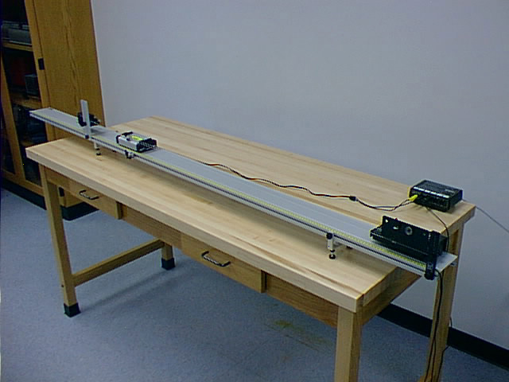
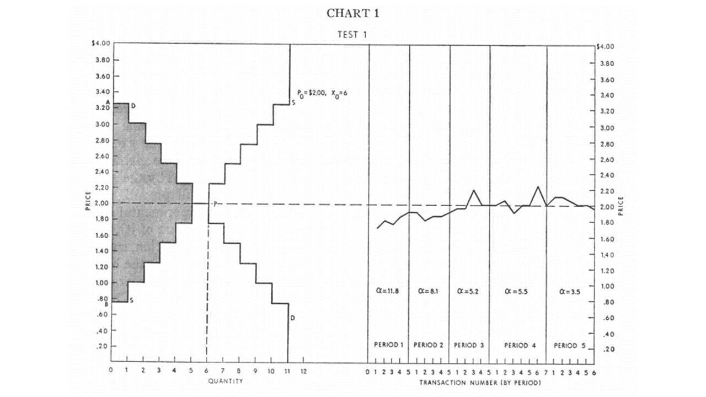
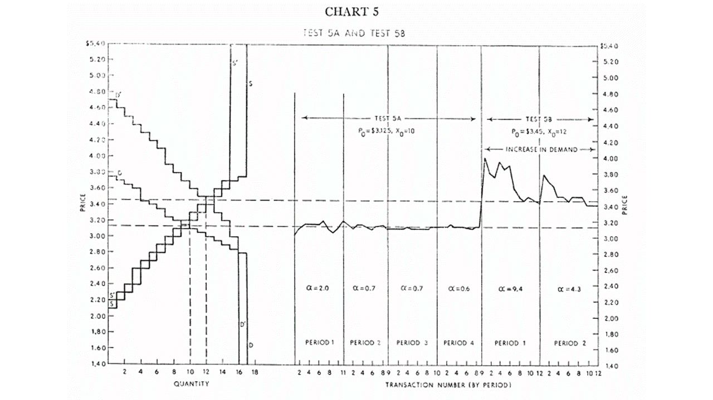

I [butted into a conversation](https://twitter.com/dandolfa/status/802988468385284096) between David Andolfatto (DA) and Noah Smith (NS) on Twitter about methodology in economics. Let me start [with the conversation](https://twitter.com/dandolfa/status/802945875395887104) (edited slightly for clarity) that lead to me jumping in:

> DA _Noah, we all have models (thought-organizing frameworks) embedded in our brains. Unavoidable. No alternative._ 

> NS _Understanding is not the same as thought-organization. Very different things._ 

> DA _OK, let's step back and define terms. How do you define "understanding" something?_

> NS _Let's say "understanding" means having a model that is both internally and externally valid._

> DA _"Validity" is a statement concerning the logical coherence of a sequence of statements, conditional on assumptions._ 

> NS _That's internal validity. External validity means that the model matches data._ 

> DA _Yes, but one needs a well-defined metric with which we judge "match the data." ... In my view, this judgement must be made in relation to the question being asked._

This is where I butted in:

> JS _I LOLed at 1st 1/2 of this. Well-defined metric is theory scope plus stats (works for every other field). Econ does not yet get scope._ 

> DA _"Econ does not yet get scope." What does this mean?_ 

> JS _A model's scope (metrics for "matching data") should be derived alongside the model itself. Doesn't seem to happen in Econ texts._ 

> DA _At the introductory level, the "empirics" we seek to explain/interpret are largely qualitative in nature. So it does happen. ... But better job could be done at upper levels, for sure._

So what did I mean? Basically, economics isn't approached as an empirical theoretical framework with well-defined scope. It is not set up from the beginning to be amenable to experiments that control the scope and produce data (quantitative or qualitative observations) that can be compared with theory. I'll try and show what I mean using introductory level material -- even qualitative.

Let me give a positive example first from physics. One of the first things taught are inelastic and elastic collisions. Inelastic collisions are almost always qualitative descriptions because even graduate students probably wouldn't be able to quantitatively describe the energy absorption in a rubber ball bouncing or friction slowing something down. You can sometimes approximate the latter with a constant force. The experimental setup is not too terribly different from how Galileo set up his tracks (he used balls, but now we know about rotational inertia, so that comes later):

These are set up to mimic the scope of elastic collision theory: approximately frictionless, approximately conserved kinetic energy. That scope is directly related to the scope of the theory. And we show what happens when scope fails (friction slowing the little carts down).

Now I'd say it isn't critical that students carry out these cart experiments themselves (though it helps learning) -- it would probably be a hard hurdle to surmount for economics. Simply describing the setup showing the results of these experiments would be sufficient, and there exist real economics papers that do just this.

In introductory economics, some general principles are usually discussed (like [here](http://informationtransfereconomics.blogspot.com/2015/05/information-equilibrium-as-economic.html) from Krugman, but Mankiw's book starts similarly), then things proceed to the [production possibilities frontier](http://informationtransfereconomics.blogspot.com/2016/02/production-possibilities-and-slope-of.html) (PPF), upward sloping supply curves and downward sloping demand curves. This is probably the best analogy with the physics scenario above.

The assumptions that go into this are rationality and a convex PPF -- these should define the scope of the (qualitative) theory (i.e. individuals are rational and the PPF is convex, which requires 2 or more goods). The way that demand is taught also requires more than one good (so there is a trade-off in marginal utility between the two).

Now first: rationality generally fails (the charitable version is that it's a mixed bag) for individuals in most lab experiments. So there is either an implicit assumption that this is only for a large number of individuals (i.e. collective/emergent rationality, which isn't ruled out by experiments) or only deals with rational robots. As economics purports to be a social theory, we'll have to go with the former.

Additionally, the classic experimental tests of "supply and demand" (e.g. Vernon Smith, [John List](http://informationtransfereconomics.blogspot.com/2016/04/list-2004-field-experiments-with-random.html)) do not approach economics this way. In those experiments, individuals are assigned utilities or reservation prices for a single good. You could imagine these as setting up "rational" agents analogous to the "frictionless" carts in the physics example, but we're still dealing with a single good. As an aside, [there is an interesting classroom demo](https://w3.marietta.edu/~delemeeg/expernom/f99.html#anderson) for the PPF using multiple goods, but [like the experiments designed to show demand curves](http://informationtransfereconomics.blogspot.com/2015/01/is-demand-curve-shaped-by-human.html), this one isn't actually showing what it's trying to show (the area relationship of the pieces immediately leads to a quadratic PPF surface, which will have convex PPF level curves).

Here are a couple of graphics from Vernon Smith (1962):

So, are these results good? Are the fluctuations from theory due to failures of rationality? Or maybe the small number of participants? Is it experimental error? The second graph overshoots the price -- which is what the [information equilibrium (IE) approach](http://informationtransfereconomics.blogspot.com/2016/03/the-emh-and-evaporating-information.html) does by the way:

\[Ed. note: this is a place holder using a positive supply shift until I get a chance to re-do it for a demand shift, which will give the same results, just inverted. **Update: updated.**\]

In the IE model, the fluctuations are due to the number of participants, but the overshoot depends on the details of the size of the shift relative to the size of the entropic force maintaining equilibrium (the rate of approach to equilibrium, much like the [time constant](https://en.wikipedia.org/wiki/Time_constant) in a [damped oscillator](https://en.wikipedia.org/wiki/Harmonic_oscillator#Damped_harmonic_oscillator)).

I use the IE model here just as a counterpoint (not arguing it is better or correct). The way introductory economic theory scope is taught, we have no idea how to think about that overshoot \[1\]. Rationality (or the assigned utility) tells us we should immediately transition to the new price. The analogy with introductory physics here would be a brief large deviation from "frictionless" carts or conservation of energy in an elastic collision.

Aside from rationality, which is a bit of a catch-all in terms of scope, there are issues with how fast shifts of supply and demand curves have to be to exhibit traditional supply and demand behavior. The changes Vernon Smith describe are effectively instantaneous. However much of the microeconomics of supply and demand depend on whether the changes happen slowly (economic growth, typically accompanied by inflation) or quickly (such as [this story about Magic cards](http://informationtransfereconomics.blogspot.com/2016/04/simulations-with-supply-demand-and.html)). And what happens after supply and demand curves shift? Is the change permanent, or do we return to an equilibrium ([as IE does](http://informationtransfereconomics.blogspot.com/2015/03/supply-and-demand-as-entropy.html))? Does the speed of changes have anything to do with [bubbles](http://informationtransfereconomics.blogspot.com/2016/11/defining-bubbles-in-information.html) (see [Noah Smith as well](http://noahpinionblog.blogspot.com/2012/01/why-do-bubbles-happen.html))?

In a sense, much of this has to do with the fact that economics does not have a complete theory about transitions between different economic states -- but supply and demand curves are all about transitions between different states. And what happens if nothing happens? Does the price just stay constant (a kind of analogy with Newton's first law)? The EMH says it follows a random walk -- does it return to the equilibrium price as the supply and demand theory seems to suggest? With so much of economics and econometrics looking at time series (even Smith's experiment above), one would expect introductory economics to at least address this.

Another issue is what [David Glasner](https://uneasymoney.com/2013/10/25/microfoundations-aka-macroeconomic-reductionism-redux/) and [John Quiggin](http://crookedtimber.org/2013/10/25/the-macro-foundations-of-microeconomics/) have called the macrofoundations of micro ([here's Krugman](http://krugman.blogs.nytimes.com/2013/10/26/macrofoundations-wonkish/?_r=0) as well) -- the necessary existence of a stable macroeconomy for microeconomic theory to make sense. This also impacts the scope, but could probably be left out of the introduction to supply and demand much like the Higgs vacuum can be left out of the introduction to physics.

Overall, one doesn't get a good sense of the true scope of the theory in introductory economics, and it isn't taught in such a way that is consistent with how the classic experiments are done.

This issue carries over into introductory macroeconomics. One of my favorite examples is that nearly all of the descriptions of the IS-LM model completely ignore that it makes an assumption about the ([well-documented](http://informationtransfereconomics.blogspot.com/2015/06/the-quantity-theory-of-money-as.html)) relationship between the money supply and output/inflation in its derivation that effectively limits the scope to low inflation. But I never see any economist say that the IS-LM model is only valid (is in scope) for low inflation. In the IE version, [this can be made more explicit](http://informationtransfereconomics.blogspot.com/2016/02/the-is-lm-model-as-effective-theory-at.html).

Paul Pfleiderer's chameleon models \[linked [here](https://mathbabe.org/2014/09/29/chameleon-models/)\] points out one problem that arises out of not treating scope properly in economics: models that flip back and forth between being toy models and policy-relevant models. This is best understood as flipping back and forth between different scope ("policy relevant" means the theory's scope is fairly broad, while toy models tend to have narrow or undefined scope). Generally, because of the lack of attention to scope, we have no idea if a given model is appropriate or not. One ends up using DSGE models to inform policy even if they [have terrible track records](http://informationtransfereconomics.blogspot.com/2016/10/forecasting-it-versus-dsge.html) with data.

...

**Footnotes:**

\[1\] That overshoot is also the only thing in my mind that tells me this experiment actually measures something rather than being completely tautological (i.e. impossible for any result other than orthodox supply and demand to emerge).
