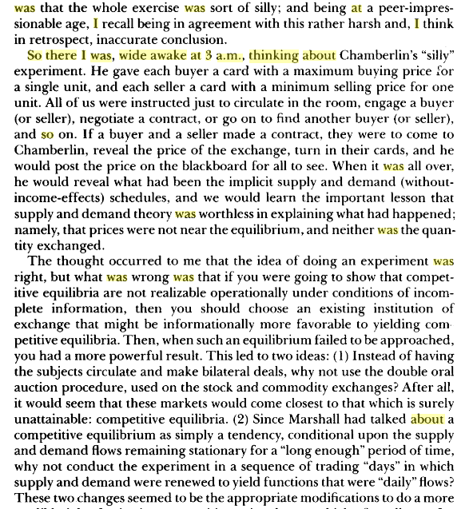
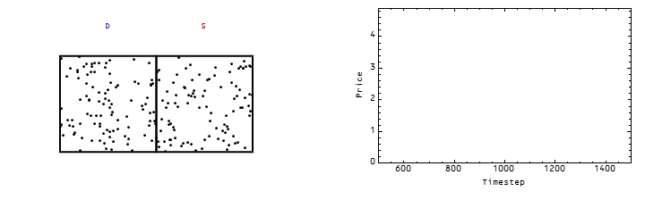

I was reading an interesting historical perspective on economics centering around the year 1952 (written as a [massive tweetstorm](https://twitter.com/Undercoverhist/status/804723682484621312)). I may have more to say about it later, but one thing that caught my eye was a quote from Vernon Smith about Chamberlain's (1948) experiment:

Smith is essentially saying that there wasn't enough exploration of the state space to come to equilibrium. Chamberlain's experiment was essentially redone in List (2004), which [I was able to reproduce using via a simulation with random agents](http://informationtransfereconomics.blogspot.com/2016/04/list-2004-field-experiments-with-random.html). In my code, I let the agents "circulate" until no more transactions could occur. However, if I limit the time (allow only a few attempts at transactions), you certainly don't get the expected equilibrium (left/first is limited, right/second is from the previous link):

This is an example of [non-ideal information transfer](http://informationtransfereconomics.blogspot.com/2016/09/basic-definitions-in-information.html) where the price (and quantity) fall below the equilibrium because of incomplete transfer of information between supply and demand. In a sense Chamberlain's (1948) conclusion

> _Perhaps it is the perfect Market which is "strange"; at any rate, the nature of the discrepancies between it and reality deserves study._

Should be taken as support that markets sometimes fail ‒ especially when the state space hasn't been fully explored. Different auction/market constructions can lead to different "efficiency" (more or less ideal information transfer, more or less exploration of the state space). [Vernon Smith's (1962) experiments](http://informationtransfereconomics.blogspot.com/2016/11/the-scope-of-introductory-economics.html) show ideal information transfer (shown with a [random agent simulation from me](http://informationtransfereconomics.blogspot.com/2016/03/the-emh-and-evaporating-information.html)):

