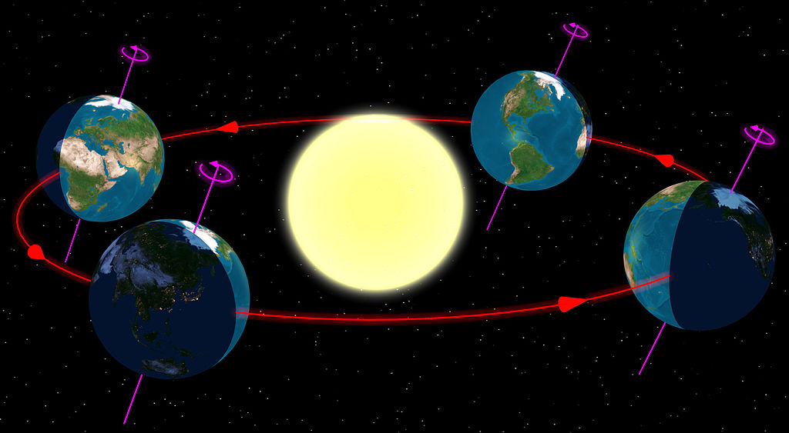

Well, this year turned out to be rather soul-crushing for the reasons everyone is well-aware of, as well as for some personal reasons that I won't go into. One bright point was the blog, though. It's been a long journey ...

**January**

It kicked off nicely in January after [Scott Sumner wrote down](http://informationtransfereconomics.blogspot.com/2016/01/scott-sumner-latest-information.html) an information equilibrium model (and [again](http://informationtransfereconomics.blogspot.com/2016/03/scott-sumner-writes-down-another.html) a few months later), and I was [invited to give a talk at BPE 2016 in DC](http://informationtransfereconomics.blogspot.com/2016/01/draft-paper-for-talk-this-summer.html) (which I unfortunately had [to drop out of](http://informationtransfereconomics.blogspot.com/2016/03/dropping-out-of-bpe-2016.html) because of my real job).

**February**

I wrote a series of posts that blended from production possibilities to evolutionary fitness ([one](http://informationtransfereconomics.blogspot.com/2016/02/production-possibilities-and-slope-of.html), [two](http://informationtransfereconomics.blogspot.com/2016/02/production-possibilities-and-brownian.html), [three](http://informationtransfereconomics.blogspot.com/2016/02/fitness-trade-offs-and-macrofoundations.html), [four](http://informationtransfereconomics.blogspot.com/2016/02/as-if-positive-economics-evolution-and.html)). A [more recent post](http://informationtransfereconomics.blogspot.com/2016/12/emergent-immoral-genes.html) could be considered a follow-up to those four.

But the most traffic was generated when David Glasner appreciated both my back and forth with a commenter on Nick Rowe's blog as well as [my follow up](http://informationtransfereconomics.blogspot.com/2016/02/one-more-physics-analogy.html).

**March**

In March, I kicked over a hornets' nest when [I criticized Stock-Flow Consistent modeling](http://informationtransfereconomics.blogspot.com/2016/03/more-like-stock-flow-in-consistent.html). I also wrote down the most accurate yet simplest information equilibrium model to date that simply explains inflation and output in terms of labor and capital (the "[quantity theory of labor and capital](http://informationtransfereconomics.blogspot.com/2016/03/a-quantity-theory-of-labor-and-capital.html)") for several countries.

**April**

The blog turned three years old at the end of April, and I celebrated with closing out several forecasts using the information transfer model that were fairly successful ([here](http://informationtransfereconomics.blogspot.com/2016/04/celebrate-this-blogs-birthday-with.html), [here](http://informationtransfereconomics.blogspot.com/2016/04/blog-birthday-week-continues-another.html), [here](http://informationtransfereconomics.blogspot.com/2016/04/blog-birthday-week-continues-another_29.html)).

I also [decided to write a book](http://informationtransfereconomics.blogspot.com/2016/04/a-random-physicist-takes-on-economics.html) (which is still in the editing process).

**May**

In May, [I reviewed](http://informationtransfereconomics.blogspot.com/2016/05/a-review-of-cesar-hidalgos-why.html) Cesar Hidalgo's book _Why Information Grows_ (with a quasi-follow up [here](http://informationtransfereconomics.blogspot.com/2016/05/where-is-information-encoded.html)).

**June**

June had some light blogging for a variety of reasons, but I did write posts relating [regulators in quantum field theory to discount factors](http://informationtransfereconomics.blogspot.com/2016/06/regulators.html) (and explained why [Ole Peters' claim of non-ergodicity is wrong](http://informationtransfereconomics.blogspot.com/2016/06/sleight-of-hand-with-regulator.html)), came up with a [new way of framing unemployment data](http://informationtransfereconomics.blogspot.com/2016/06/unemployment-equilibrium.html) (that turns out [might well have some legs](http://informationtransfereconomics.blogspot.com/2016/10/dynamic-unemployment-equilibrium-and.html), and which [Roger Farmer](https://twitter.com/farmerrf) suggested I publish), and [applied information equilibrium to the urban environment](http://informationtransfereconomics.blogspot.com/2016/06/the-urban-environment-as-information.html).

**July**

In July, Todd Zorick (MD, neuroscience researcher, and frequent commenter on the blog) and I [finally managed](http://informationtransfereconomics.blogspot.com/2016/07/information-equilibrium-in-neuroscience.html) to get our paper published on applying information equilibrium to EEG measurements (which includes [a connection between](http://informationtransfereconomics.blogspot.com/2016/05/lyapunov-exponents-and-information.html) the information transfer index and Lyapunov exponents). Gregor Semieniuk and I started some cross-pollination on [statistical equilibrium](http://informationtransfereconomics.blogspot.com/2016/07/a-statistical-equilibrium-approach-to.html) as a useful principle to understand economic data. I turned this connection into a [mini-seminar on the economic state space](http://informationtransfereconomics.blogspot.com/2016/09/the-economic-state-space-mini-seminar.html) and the information transfer (IT) index.

**August**

In August, [I constructed a New Keynesian DSGE model](http://informationtransfereconomics.blogspot.com/2016/08/dsge-part-5-summary.html) in terms of information equilibrium relationships. There are some slight differences, but the main takeaway is that the NK DSGE model incorporates much less empirically accurate IE relationships than I use for the IE models and forecasts.

**September**

I [took on the analogy](http://informationtransfereconomics.blogspot.com/2016/09/macro-is-not-like-string-theory.html) people make between string theory and macroeconomics; I think it is misguided and misunderstands both string theory and the real issues with macro.

I also [re-wrote the Kaldor facts of growth economics](http://informationtransfereconomics.blogspot.com/2016/09/the-kaldor-facts.html) in terms of information equilibrium, talked about how [causal entropy](http://informationtransfereconomics.blogspot.com/2016/09/causal-entropic-forces-as-economic.html) may be useful in economics ([quantitatively](http://informationtransfereconomics.blogspot.com/2016/09/supply-and-demand-as-causal-entropic.html)), and how we can understand [Christopher Sims work](http://informationtransfereconomics.blogspot.com/2016/09/channel-capacity-and-rate-distortion-in.html) on information theory in economics in the context of information equilibrium.

**October**

[I took on Steve Keen](http://informationtransfereconomics.blogspot.com/2016/10/keen-chaos-and-equilibrium.html) (and nonlinear models in general) in October. More accurately, I seconded Roger Farmer's take and added a bit. This was re-tweeted by [Noah Smith](https://twitter.com/Noahpinion) and [Roger Farmer](https://twitter.com/farmerrf) (among others), making it my most widely read post of the year besides the SFC critique in March.

I also subjected the IE models to the same forecasting tests that DSGE (and other economic models) had failed, and it generally did a much better job ([here](http://informationtransfereconomics.blogspot.com/2016/10/forecasting-it-versus-dsge.html), [here](http://informationtransfereconomics.blogspot.com/2016/10/forecasting-it-versus-all-comers.html)).

A new long time series database became available and I did a first take in a [series of posts](http://informationtransfereconomics.blogspot.com/2016/10/parsing-macrohistory-database-for.html), looking at principal components (which turn out to be dominated by the US).

**November**

November kicked off with an unproductive [back](http://informationtransfereconomics.blogspot.com/2016/11/economics-physics-and-data-response-to.html) and [forth](http://informationtransfereconomics.blogspot.com/2016/11/blackfords-information-equilibrium-model.html) with George Blackford about Milton Friedman's "as if" methodology (which I think is a distraction ‒ the real problem is not that Friedman said it was fine if bad assumptions lead to macro models that explain the data; the real problem is the lack of macro models that explain the data).

The most interesting thing I did was try to understand an [agent-based model put together by Ian Wright (which he sent me a link to) in terms of information equilibrium](http://informationtransfereconomics.blogspot.com/2016/11/information-equilibrium-in-agent-based.html); I think this may turn out to be a fruitful avenue of research.

My most [popular post of November](http://informationtransfereconomics.blogspot.com/2016/11/exactly-people-do-not-behave-in-similar.html) (it got several re-tweets H/T [Ninja Economics](https://twitter.com/NinjaEconomics)) was unfortunately a bit embarrassing for me because it is poorly written. That's happened a couple times before ‒ something I just quickly produced got picked up somewhere and I immediately wish I had spent a little more time writing it.

**December**

My blogging usually drops off in December due to the holidays (it's also the end of the budget year at my real job, so most projects come to an end making it the opportune time to take a longer than usual vacation), and this year was no different. However, I did manage to put together a ["general theory" of stock market prices](http://informationtransfereconomics.blogspot.com/2016/12/stocks-and-k-states.html) in terms of information equilibrium ... as well as this post.

**_\*  \*  \*_**

Here's to a better 2017. Thank you to everyone for reading and re-tweeting. A couple of shout outs to commenters Todd Zorick (we finally finished that paper), Tom Brown (and his boundless enthusiasm), and Jamie (for challenging me, allowing me to get better at explaining the information equilibrium framework).

Thanks to [Cameron Murray](https://twitter.com/Rumplestatskin), [Roger Farmer](https://twitter.com/farmerrf), [Nick Rowe](https://twitter.com/MacRoweNick), [David Glasner](https://twitter.com/david_glasner), [Diane Coyle](https://twitter.com/DianeCoyle1859), [Paul Romer](https://twitter.com/paulmromer), [Ninja Economics](https://twitter.com/NinjaEconomics), [Unlearning Economics](https://twitter.com/UnlearningEcon), [Pedro Serôdio](https://twitter.com/pdmsero), [Jo Michell](https://twitter.com/JoMicheII), [Claudia Sahm](https://twitter.com/Claudia_Sahm), [Lionel Yelibi](https://twitter.com/TehRaio), [Noah Smith](https://twitter.com/Noahpinion), [Mike Sankowski](https://twitter.com/traderscrucible), [Tom Hickey](https://twitter.com/tjfxh), [Igor Carron](https://twitter.com/IgorCarron), and [Tom Brown](https://twitter.com/browntom1234) for the re-tweets, likes, and engagement on Twitter and on blogs (probably missed someone). \[I did, and have gone back into this list to add a few names.\]

Thanks to Cameron (again) and [Brennan Peterson](https://twitter.com/brenpdx) for editing/reading/commenting on my forthcoming book.
