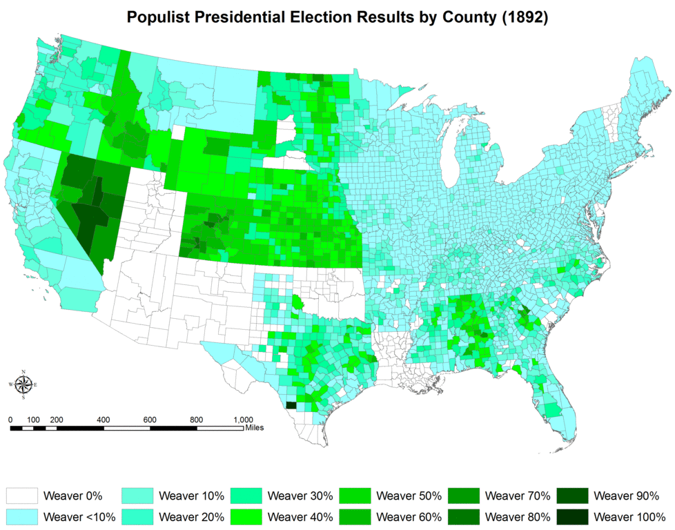

Simon Wren-Lewis has an [interesting post](https://mainlymacro.blogspot.com/2016/12/what-are-populist-policies.html) dissecting and defining populism (mostly in light of Brexit and UK austerity). However I think I have a simpler definition: populism is just the zero-sum heuristic applied at the macro scale.

Trade protectionism, immigration restrictions, and even [free silver](https://en.wikipedia.org/wiki/Free_silver) from the populism of yore are all policies that aim their negative effects at some "other" (foreign countries, foreign people, big city banks) and hope to positively impact the group advocating the policy (native country, citizens, rural farmers). What makes them populist is that the positive impacts are "derived" via the zero-sum heuristic from the obvious and direct negative impacts; no constructive argument is made in favor of the positive impacts. Tariffs purportedly benefit e.g. domestic steel by making imported steel less competitive, not by making domestic steel better, increasing domestic steel productivity, or incentivizing entrepreneurship in the steel industry \[1\].

Since zero-sum bias is easy for humans ([especially with regard to desirable resources](https://www.ncbi.nlm.nih.gov/pmc/articles/PMC3153800/) like jobs) while many positive macroeconomic policy impacts are not zero-sum, the end result of populism is a tendency towards bad policy.

**Footnotes**

\[1\] In particular, steelworkers in favor of tariffs on Chinese steel would likely also dislike the idea of another steel start-up undercutting prices and paying lower wages.
