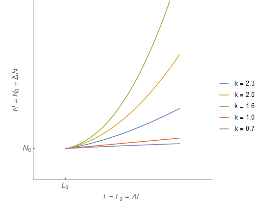
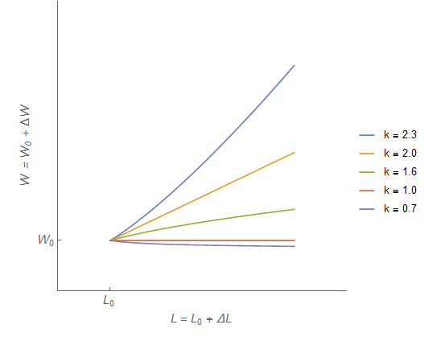

Noah Smith [has a great new post up](http://noahpinionblog.blogspot.com/2016/12/an-econ-theory-falsified.html) about "Econ 101-ism" and the labor market. As they say, read the whole thing (including the comments). He has a great discussion of falsification right off the bat. I only have one quibble with this line:

> _So since people have different expectations for a theory ... whether a theory has been falsified will often be a matter of opinion._

I'd rather say that "falsified" is not a useful term for any theory except one that should **_never_** be used (e.g. aether). It's whether a theory is "good enough" (sign/direction, relative magnitude, order of magnitude, 10% error, 1% error, etc) for a problem at hand that will always be a matter of opinion.

But really, just read Noah. Towards the end he says we should stop using Econ 101 for the labor market:

> _If econ pundits, policy advisors, and other public-facing econ folks were scientifically minded, we'd stop using this model in our discussions of labor markets._

But he then laments that the simple framework probably won't be abandoned:

> _The fact that this theory is such a simple, clear, well-understood tool - so good for "organizing our thinking", even if it doesn't match reality - will keep it in use long after its sell-by date_

Stephen Williamson comments:

> _Partial equilibrium supply/demand is a simple tool that we can teach to someone with little technical expertise, which can help them think about the basics of economic processes. But for the questions in \[Noah's post\], it's not even a matter of the theory being "false" - it's just the wrong tool for the job._

David Andolfatto comments as well:

> _As I (and others) have argued before, Marshall's scissors do not seem like the best organizing framework for the labor market. The scissors assume anonymous spot markets. In contrast, most labor markets involve relationships._

I am 100% behind everything being said. The problem is that abandoning "Econ 101" leaves economics with a dearth of easy-to-communicate tools for understanding what happens in reality. _Good_, you might say, _Econ 101 is wrong about this stuff_. And that's true. However, if we have to resort to heterogeneous agents or matching theory ‒ or worse, _macro models_ ‒ then for most people they're going to replace supply and demand with zero sum heuristics. To a large extent, that has already happened. "Immigrants take our jobs," is the common refrain.

What we need is something that's as easy to understand as Marshall's scissors and hasn't been falsified. To that end, let me present the information equilibrium approach to the problem ... which can hopefully save the scissors by clearly defining the scope of the partial equilibrium approach.

I will just look at the labor supply shock below as I've looked at the minimum wage a few times before (notably, [here](http://informationtransfereconomics.blogspot.com/2014/06/seattles-new-minimum-wage-and.html) and [here](http://informationtransfereconomics.blogspot.com/2015/11/the-minimum-wage-in-info-econ-101.html)).

**_\*  \*  \*_**

Let's start by saying the nominal output of jobs (the aggregate demand for jobs) is $N$ and the labor supply is $L$. These derive from distributions over the possible states of the economy (jobs available in Seattle during the summer versus jobs available in Albuquerque in the winter, and workers available in Chicago in the spring), and we have equilibrium when the two distributions are the same. Everyone who wants a job at a specific time in a specific place has found one. The picture we have looks something like this:

where the blue density is the distribution of workers and the white density (with level curves) is the distribution of jobs. Think of something like this picture of population:

These represent distributions over possible states in the economy, and as such are inherently heterogeneous (e.g. just add dimensions for different kinds of jobs). What we want to know is what happens to the information entropy of the distributions when we change either distribution by a little bit (e.g. $N \rightarrow N + d N$). The simplest case would be for uniform distributions and keeping the relative information entropy constant. This results in the information equilibrium condition

$$ 
W \equiv \frac{dN}{dL} = k \; \frac{N}{L} 
$$

where we've defined the "wage" $W$ as the "exchange rate" \[1\] between aggregate demand for labor and labor supply. The parameter $k$ is called the information transfer index. We can write a shorthand for this relationship using the following notation: $W : N \rightleftarrows L$. This differential equation has the solution \[2\]

$$ 
\frac{N}{N_{0}} = \left( \frac{L}{L_{0}}\right)^{k} 
$$

where $N_{0}$ and  $L_{0}$ are parameters that we use to define the equilibrium (the state where the distributions pictured above match). We can also solve for the wage $W$:

$$ 
W = k \; \frac{N_{0}}{L_{0}} \; \left( \frac{L}{L_{0}}\right)^{k - 1} 
$$

Note that we've already changed how we're approaching "Econ 101". This is the "usual" (i.e. general equilibrium) case of adding to the labor supply and we've left open the possibility that this **increases** wages (if $k &gt; 1$). Let's rewrite this in terms of a difference from equilibrium $\Delta X \equiv X - X_{0}$

$$ 
\begin{align} 
1+&nbsp;\frac{\Delta N}{N_{0}} = \left( 1+&nbsp;\frac{\Delta L}{L_{0}}\right)^{k}\\ 
\frac{W}{W_{0}} = \left(1+&nbsp;\frac{\Delta L}{L_{0}} \right)^{k - 1} 
\end{align} 
$$

where $W_{0} \equiv k N_{0}/L_{0}$ \[3\]. This defines a family of relationships that depend critically on $k$

If we go back to our original relationship and ask what happens if $N$ changes **slowly** \[4\] with a change in $L$ (i.e. supply changes quickly). In this case we find that \[3\]

$$ 
W = W_{0} \; \exp \left( k\;\frac{\Delta L}{L_{0}}\right) 
$$

this traces out a supply curve. Compared to the general equilibrium solution above, this is partial equilibrium. Changes in $L$ is movement _along_ the labor supply curve. _Shifts of_ the labor supply curve shift the parameter $L_{0}$ which defines equilibrium (note that shifting $L_{0}$ also changes $W_{0} \equiv k N_{0}/L_{0}$, so a positive/rightward shift of the supply curve represents a fall in price).

Likewise, we can ask what happens if $L$ changes slowly with respect to $N$; in this case, we get a demand curve defined by \[3\]:

$$ 
W = W_{0} \; \exp \left( - \frac{\Delta N}{k N_{0}}\right) 
$$

We can show these with the traditional Marshallian scissors graphs \[5\] with the supply curve in red, and the demand curve in blue:

The second graph shows the rightward shift of the supply curve (movement _along_ the demand curve) from a sudden shock of additional labor supply resulting in lower wages. We've finally gotten to the Econ 101 result, but we've had to make some additional assumptions to get here. Namely, that the supply shock is fast or large (or fast and large) relative to the change in demand.

This is where David Andolfatto's comment above comes in (along with Noah's talk of general equilibrium and matching). Under what circumstances can we ever say that a labor shock is fast relative to demand? It takes time to find jobs, and people need stuff to live while they are looking. In a sense, a big influx in migration would probably first be a positive demand shift.

This is not to say there's never a scenario where Econ 101 might occur in a labor market. It does seem to be true that a tight labor market raises wages exactly how Econ 101 says. It's possible that closing a major employer in one town might put downward pressure on wages, but that also might be tied up with a demand shock. Basically, we should probably look at the general equilibrium solutions in the labor market.

Where do the partial equilibrium solutions matter? When demand and supply can be separated and we can definitely make the assumption that supply changes faster than demand. A good example would be dumping a bunch of blueberries or [Magic, the Gathering cards](http://informationtransfereconomics.blogspot.com/2016/04/simulations-with-supply-demand-and.html) on the market. You can usually change the supply of either much faster than the demand for either. In this case you might briefly fall into the "partial equilibrium" regime like the simulations [at this link](http://informationtransfereconomics.blogspot.com/2016/04/simulations-with-supply-demand-and.html) (same as the Magic cards link):

However, the "usual case" is that an increase in labor supply either increases wages or leaves them the same, and you have to bend over backward with the assumptions to get the Econ 101 result. But lab experiments have shown supply and demand to be a useful description sometimes (see [here](http://informationtransfereconomics.blogspot.com/2016/11/the-scope-of-introductory-economics.html) and [here](http://informationtransfereconomics.blogspot.com/2016/12/chamberlain-1948-vs-smith-1962-non.html)), so sometimes we are in the Econ 101 domain of validity.

Can we save the scissors by clearly defining the scope?

PS Commenter Unknown makes a great point at Noah's post:

> _People don't oppose increasing minimum wage because of econ 101. They deploy econ 101 because they oppose increasing the minimum wage, and the opposition to it does not have a prior justification that has anything whatsoever to do with economics._

**_\*  \*  \*_**

**Footnotes:**

\[1\] You can think of an exchange rate as the ratio of a tiny amount of dollars ($dD$) for a tiny amount of Euros ($dE$), or $dD/dE$. This is also how Irving Fisher thought about exchange in [his 1892 thesis](http://informationtransfereconomics.blogspot.com/2014/08/fishers-proto-information-transfer.html).

\[2\] If we're presenting this without calculus, we can just start here, just like in introductory physics without calculus you start with 

$$ 
S = \frac{1}{2} a t^{2} 
$$

which is the result of an integral (integrating the constant $a$ twice with zero constants of integration). In fact, you solve the information equilibrium differential equation by integration.

\[3\] We can write these in even more compact form by defining $x \equiv X/X_{0}$ and $\Delta x \equiv \Delta X/X_{0}$

$$ 
\begin{align} 
1+&nbsp;\Delta n &amp; = \left( 1+ \Delta \ell \right)^{k}\\ 
w &amp; = \left(1+&nbsp;\Delta \ell&nbsp;&nbsp;\right)^{k - 1} 
\end{align} 
$$

along with the supply and demand curves

$$ 
\begin{align} 
w &amp; = e^{k \Delta \ell}\\ 
w &amp; = e^{-\Delta n/k} 
\end{align} 
$$

\[4\] Technically, we ask

$$ 
\frac{dN}{dt} \ll \frac{dL}{dt} 
$$

This defines the scope (domain of validity) of the partial equilibrium solutions.

\[5\] The angle brackets are unnecessary to the main thrust of this post, but [are explained here](http://informationtransfereconomics.blogspot.com/2014/06/is-supply-curve-flat.html).
