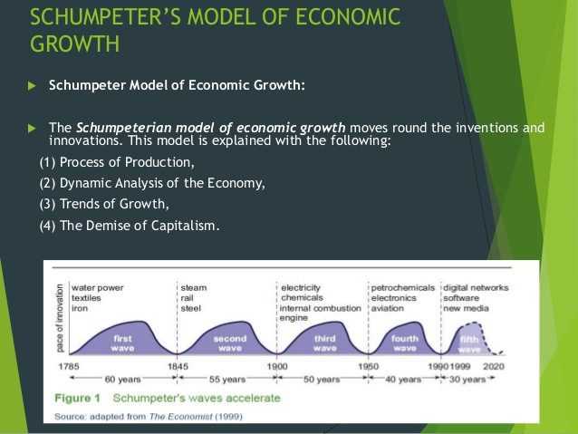

A lot of people have been linking to [Robert Skidelsky's critique of economics at Project Syndicate](https://www.project-syndicate.org/commentary/mathematical-economics-training-too-narrow-by-robert-skidelsky-2016-12) so I had to finally read it. It's pretty much a ["lazy econ critique" per Noah Smith](http://noahpinionblog.blogspot.com/2015/10/lazy-econ-critiques.html), and while I agree with the general idea that people should have broad educations, some of it just doesn't make sense. I've tackled this somewhat at random, so basically there are a bunch of quotes with my issues following ...

**_\*  \*  \*_**

> _Most economics students are not required to study psychology, philosophy, history, or politics._

I think this is a British thing, so maybe we should just stop listening to British economists? Joking aside, undergraduate economics majors in the US do have history requirements as well as other social science requirements. (Noah Smith [points out](http://noahpinionblog.blogspot.com/2011/04/what-i-learned-in-econ-grad-school.html) that intro undergraduate economics actually does touch on a lot of history and doesn't get very mathematical \[per below\].) Graduate economics students either were undergraduate economics students or came from other disciplines that also require electives. It's true that grad students probably aren't required to take psychology or history (though I strongly suspect at least some economic history is required as part of a econ PhD) but by the time you reach graduate school you should be focusing on your chosen discipline.

As a physicist, it's true to say I wasn't "required" to study specific things aside from physics but I did study linguistics, philosophy, international relations, government, history, history of science, art, molecular biology, chemistry, computer science, and Spanish. My undergraduate education is probably not entirely unrepresentative, and people with a desire to be an economist would likely place more emphasis on the fields Skidelsky points out.

> _Schumpeter got his PhD in law; Hayek’s were in law and political science ..._

I'm not sure there was a widely granted PhD in economics back then (1906 for Schumpeter, 1921 & 1923 for Hayek) — I wasn't able to find a good reference. Schumpeter's advisor was considered [an economist](https://en.wikipedia.org/wiki/Eugen_B%C3%B6hm_von_Bawerk), so as far as I'm concerned his PhD is in economics. Irving Fisher received the first PhD in economics granted by Yale and he cobbled [his 1892 thesis](http://informationtransfereconomics.blogspot.com/2014/08/fishers-proto-information-transfer.html) together from theoretical physics (advisor Willard Gibbs) and sociology (advisor William Summer) — a forerunner of today's interdisciplinary PhDs? And I'm not sure there really was a major bright line between political science and economics (regarding Hayek).

> _\[Hayek\] also studied philosophy, psychology, and brain anatomy._

Aside from the philosophy, the other two would have been full of bad theories and errors (Freud, phrenology). I'm not sure how learning stuff that is wrong should be listed in a positive light.

> _Economics – how markets works, why they sometimes break down, **how to estimate the costs of a project properly**_ — _ought to be of interest to most people._

I disagree that the bolded item is the purview of economics. That's business, accounting, plus whatever discipline the project belongs to — are we building a bridge (engineering) or running an ad campaign (advertising)?

> _Economists claim to make precise what is vague, and are convinced that economics is superior to all other disciplines, because the objectivity of money enables it to measure historical forces exactly, rather than approximately._

No, this is a category error. Examining things that are measurable does not make them precise or exact, just measurable. That allows you to compare your theories to data, and if it is not measurable then it's useless as science. Also, is Skidelsky claiming the objects of economic study are _inherently_ vague? The idea of studying something is precisely that it becomes less vague as you study it; does it stop being part of economics when it is no longer vague? Skidelsky might as well have said economics studies things that can't be understood and then dressed up as a Zen Buddhist. 

> _Not surprisingly, economists’ favored image of the economy is that of a machine. The renowned American economist Irving Fisher actually built an elaborate hydraulic machine with pumps and levers, allowing him to demonstrate visually how equilibrium prices in the market adjust in response to changes in supply or demand._ 

> _If you believe that economies are like machines, you are likely to view economic problems as essentially mathematical problems. The efficient state of the economy, general equilibrium, is a solution to a system of simultaneous equations._

I thought modern economists studied DSGE models, which are decidedly not models of machines (unless you think of [a ribosome as a "machine"](https://www.youtube.com/watch?v=FGBMoFsdcEw) \[YouTube\]). They are stochastic models; while we were young we may have had cars that worked stochastically, but that is not the typical image conjured by the word "machine". In any case, using Fisher's machines as part of a critique of modern economics is disingenuous because no one uses Fisher's models (they aren't DSGE models).

I also disagree with the implication. "Mechanical" thinking does not invariably lead to mathematics ([Faraday](https://en.wikipedia.org/wiki/Michael_Faraday) comes to mind) and mathematics does not only follow from "mechanical" thinking. _Mathematics is the formalization of the concept of relationship_. It follows from any kind of thinking besides irrational thinking. If you think things are related, there is some mathematics behind it. If you think _A_ causes _B_ or that there is a pattern in a set of data, then you are using math. Just because you might not know what the math is does not mean it does not exist. That is your own failure of imagination — your own ignorance.

> _One can understand why economists trained in this way were seduced by financial models that implied that banks had virtually eliminated risk._

To quote [Noah Smith](http://noahpinionblog.blogspot.com/2015/10/lazy-econ-critiques.html): _Someone doesn't know the difference between econ and financial engineering!_ This appears to be a reference to a specific piece of the derivation Black-Scholes equation where you can "cancel" risk by constructing a particular portfolio. [LTCM failed spectacularly](https://en.wikipedia.org/wiki/Long-Term_Capital_Management) trying to implement this, but it didn't bring down the economy. It was really the EMH that lead to the idea that the market would discipline bad behavior of banks if they were allowed to invest (hence deregulating/repealing Glass-Steagall), which lead to the spectacular failure of the "shadow banking" sector involved in the Global Financial Crisis. There is no real model behind the EMH except that prices are random, and the EMH (the economy is a random process) [is a pretty good null hypothesis going in](http://informationtransfereconomics.blogspot.com/2016/10/forecasting-it-versus-all-comers.html).

> _Joseph Schumpeter and Friedrich Hayek, the two most famous Austrian economists of the last century, also attacked the view of the economy as a machine. Schumpeter argued that a capitalist economy develops through unceasing destruction of old relationships. For Hayek, the magic of the market is not that it grinds out a system of general equilibrium, but that it coordinates the disparate plans of countless individuals in a world of dispersed knowledge._

Hayek viewed the market as a system for communicating information – like the internet, which is a machine. Schumpeter's creative destruction and waves of growth are precisely the kind of counterbalancing forces that make up an oscillating circuit (another machine):

In any case, both Hayek and Schumpeter are positing theories that can be represented in terms of mathematics, simulated with algorithms, and (most importantly) compared to data. The fact that Hayek and Schumpeter did not do so does not mean their ideas are non-mathematical or non-mechanical. They were just lawyers and political scientists who didn't know how to mathematically present their theories and therefore failed to imagine how they could be presented mathematically. If I don't know electronics or computer programming, I might well fail to imagine something I want to build can be built as an electronic system. And I might even say that writing apps for iPhones will never create anything useful.

I've said it [before](http://informationtransfereconomics.blogspot.com/2015/11/math-up.html) and I'll say it again: people who avoid mathematical descriptions of models or processes are either not trained in mathematics or trying to avoid confronting the data. It's probably because when they do confront the data, the data rejects the theory (e.g. [almost no information](http://informationtransfereconomics.blogspot.com/2016/09/channel-capacity-and-rate-distortion-in.html) from prices appears to be used, and Schumpeter's waves, [like Keen's, have no observations in economic data that would differ from explanation in terms of stochastic time series](http://informationtransfereconomics.blogspot.com/2016/10/keen-chaos-and-equilibrium.html)).

> _\[Economists\] don’t even read the classics of their own discipline._

As a physicist, I've never read Aristotle or even Newton. Part of participating in a living scientific discipline is that no one owns the ideas, so therefore anyone can have a hand at explaining them. Over time through the variations in explanations new explanations will arise that are superior to the original in any number of ways ‒ being more accurate, more general, more intuitive, or simply clearer.

Understanding quantum electrodynamics as an effective field theory (as it is today) makes much more sense than understanding it as a fundamental theory (as it was from its inception through the 1970s). Understanding Newtonian physics as a consequence of Galilean invariance is a much more powerful concept than understanding it as a series of axioms.

This

> _Lex II: Mutationem motus proportionalem esse vi motrici impressae, et fieri secundum lineam rectam qua vis illa imprimitur._

is not more useful than understanding symmetry and Noether's theorem. Heck, what Newton wrote isn't even how it's understood today. A somewhat direct translation is

> _Second Law: The alteration of motion is ever proportional to the motive force impressed; and is made in the direction of the right line in which that force is impressed._

The modern understanding is:

> _Second Law: The change of momentum of a body is proportional to the impulse impressed on the body, and happens along the straight line on which that impulse is impressed._

In the modern understanding, momentum and impulse have specific definitions that did not exist at the time of Newton.

The fact that no one reads the "classics" of economics means that they're probably _garbage_. If they were really insightful, we would have developed models from them that performed well when compared to data. And in that case you wouldn't need the classics, just the models. However, [there are no accurate models in economics](http://noahpinionblog.blogspot.com/2011/05/what-i-learned-in-econ-grad-school-part.html). That must mean there are no accurate ideas for models to be based upon in those classics. For example, Keynes' ideas incorporated in the ISLM model are not correct except possibly when inflation is low (and/or interest rates are at the zero lower bound), and even then only as an estimate of the direction of effects, not magnitudes. It's a start — as Noah puts it in the previous link it might "point us in the direction of models that might work someday". A lot of what Keynes wrote was vague talk about animal spirits and persistently high unemployment (which [does not appear to happen](http://informationtransfereconomics.blogspot.com/2016/06/unemployment-equilibrium.html), by the way, ergo the theory is rejected).

A scientific discipline is not sentimental. The classic works are not talismans, and any ideas they contained have been either successfully extracted and reprocessed by thousands of working scientists into useful theories or dropped. [Paul Krugman](http://krugman.blogs.nytimes.com/2012/03/27/minksy-and-methodology-wonkish/?_r=0) is a bit more charitable than I am, but the end result is the same:

> _So, first of all, my basic reaction to discussions about What Minsky Really Meant — and, similarly, to discussions about What Keynes Really Meant — is, I Don’t Care. I mean, intellectual history is a fine endeavor. But for working economists the reason to read old books is for insight, not authority; if something Keynes or Minsky said helps crystallize an idea in your mind — and there’s a lot of that in both mens’ writing — that’s really good, but if where you take the idea is very different from what the great man said somewhere else in his book, so what? This is economics, not Talmudic scholarship._

**_\*  \*  \*_**

I agree with Skidelsky that people should have broad educations. However this seems like a glittering generality that isn't even a real problem. I've met very few people with advanced degrees that are completely ignorant of "psychology, philosophy, history, or politics". Usually the kinds of people curious enough to take up even a "soft" science like economics have outside interests and general reading habits that expose them to research in other disciplines. Case in point: I'm a physicist that took up economics as a hobby. I've read papers by Daniel Kahneman and other research into neuroscience. I published a paper with [Todd Zorick on EEG analysis](http://informationtransfereconomics.blogspot.com/2016/07/information-equilibrium-in-neuroscience.html). Nick Rowe [linked to a piece](https://twitter.com/MacRoweNick/status/813196881769730048) on evolutionary biology the other day (and has [suggested things in the past](http://informationtransfereconomics.blogspot.com/2016/02/fitness-trade-offs-and-macrofoundations.html)). Nearly every economist seems to make some claims about physics ([here](http://informationtransfereconomics.blogspot.com/2015/02/why-do-macroeconomists-think-they-know.html), [here](http://informationtransfereconomics.blogspot.com/2016/05/modeling-in-physics-versus-modeling-in.html)). Intelligent people usually have diverse interests. 

The problem with (macro)economics is that there aren't any theories that match the data. But it's not like there are theories in disciplines outside economics that do match the economic data and economists just don't learn about them because their education isn't broad enough. They don't exist (or at least [haven't been peer reviewed](http://econpapers.repec.org/RePEc:arx:papers:1510.02435)); they haven't been left off the grad school curriculum.

In the end, it's just (as [David Andolfatto put it](https://twitter.com/dandolfa/status/813841789698379776)) "whining and crying" — what really needs to be done is to improve or come up with new theories that explain the data. Reading the classics and getting a broader education are not obvious steps to accomplish that.

...

I do think mathematics education should be improved among economists, political scientists, and historians. It would help prevent the kind of ignorance of what mathematics is that Skidelsky demonstrates above, and possibly help economists [understand limits](http://informationtransfereconomics.blogspot.com/2015/11/on-limits.html) and [regulate infinities](http://informationtransfereconomics.blogspot.com/2016/06/regulators.html) better.
