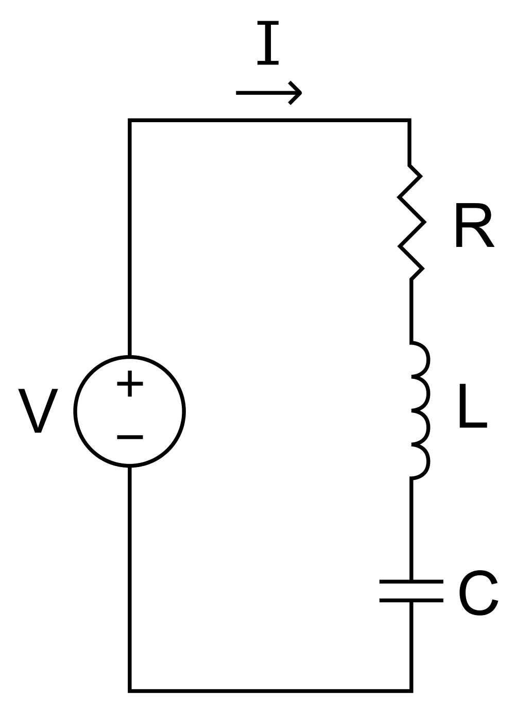
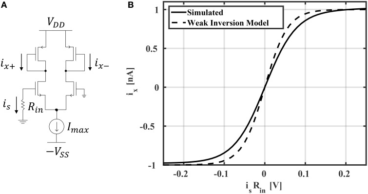
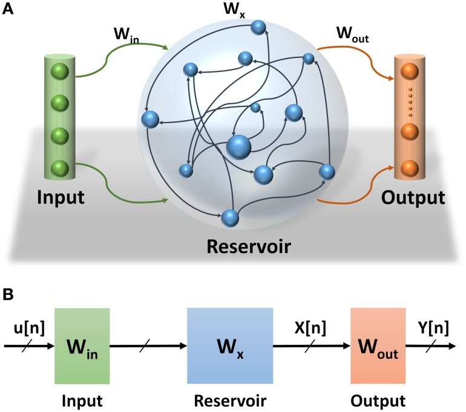

> **Update 3 February 2017:** _Welcome visitors from some unknown link. (If someone could leave a comment saying where you stumbled upon this post, I'd be interested. It's rapidly becoming my most popular post of all time, but I have no idea why.) Also, you might find [this of interest](http://informationtransfereconomics.blogspot.com/2017/02/a-desired-wealth-to-income-ratio-as.html): desired wealth to income ratio (mentioned below) as an information equilibrium model._

> **Update 25 August 2017:** _Welcome visitors from some unknown link. Maybe you might be interested in my book **A random physicist takes on economics**: [out now on Amazon.com](https://www.amazon.com/dp/B0754X3PYF/ref=as_li_ss_il?ie=UTF8&linkCode=li3&tag=arandomphysic-20&linkId=2e568ae2894f04659913c24caeb03bfd)!_

Steve Roth has a [nice article up at Evonomics](http://evonomics.com/economists-dont-know-think-wealth-profits/) about the only recently available data from the Fed's quarterly Z.1 report. And as a description of the data available, it's great. And more data is always great.

However, the article is unfortunately framed in terms of "Stock Flow Consistent" (SFC) analysis and "Modern Monetary Theory" (MMT). [Here's a good discussion of SFC](https://mainlymacro.blogspot.com/2016/09/stock-flow-consistent-models-response.html) (actually a response to response to a previous post about SFC) from Simon Wren-Lewis. I've talked about SFC before, but I thought I'd do a thorough job here using an analogy from engineering.

Let me say this clearly: SFC analysis is tangential to the results claimed by SFC models.

That's the charitable way of putting it. The uncharitable way of putting it is that SFC is obfuscation designed to cover up the fact that the underlying model is entirely _ad hoc_. Wren-Lewis gives the example of a desired wealth to income ratio. Sure, it's a ratio of a stock and a flow, so it's best to be consistent with them. But the assertion that the ratio is relevant to macroeconomics is of questionable empirical validity.

I like Wren-Lewis's description:

> _It is true that stock-flow accounting is important in modelling, in the sense that doing it stops you making silly errors._

SFC is like the "natural" label on food in the US. More literally, saying something is SFC is little more than asserting that you got the math right. "An SFC model" is basically just "a model".

That's the TL;DR. Here's the full account ...

**_\*  \*  \*_**

Ok, let's begin. Stock-flow consistency basically uses a matrix to make sure that all the "money" is accounted for, whether it is a lump of money ("a stock") or money moving from one element (node) in the model to another ("a flow"). It's essentially a kind of conservation law (there's non conservation via e.g. revaluation that I'll mention later). In fact, SFC is practically isomorphic to another set of rules that follow from conservation laws: [Kirchhoff's circuit laws](https://en.wikipedia.org/wiki/Kirchhoff's_circuit_laws).

The currents through a node must sum to zero and the sum of voltage drops around a loop must equal zero. You can think of the currents as flows of electrons and the voltages as stocks of electrons \[1\]. You are now armed with the equivalent of SFC for electric circuits. So, what does this circuit do?

No idea, right? Kirchhoff's laws tell us that

The current law only tells us there's a single current. If the block on the left was a battery (voltage $V_{0}$) and the three blocks on the right were resistors ($R_{i}$, $V_{i \neq 0} = 0$), then you'd say that there's a steady state current that sets up such that

But that required us to add in Ohm's law ($V = i R$). Kirchhoff's laws only told us that

Ok, so SFC, I mean, Kirchhoff plus Ohm's "behavior" law let's us understand how this circuit works. You may have noticed that I just blocked out the elements in that diagram; let's analyze the original circuit:

Ah, [an RLC circuit](https://en.wikipedia.org/wiki/RLC_circuit). We can used Kirchhoff's voltage law to give us

Now what? Well, we need to know how the various components work. This doesn't come from Kirchhoff's laws, but rather the behavior of the components (e.g. Ohm's law). We find that (after differentiating)

Cool. Now we've narrowed down the behavior of the economy, I mean, circuit right? Not really. All of these functions are solutions to that differential equation:

So we could have an oscillating circuit ($R = 0$), a damped oscillator, or simply decay ($L = 0$). The behavior is characterized by the parameters $R/L$ (decay time) and $1/LC$ (oscillation frequency (squared)). The simple monetary model SIM in Godley and Lavoie's SFC/MMT tome can be thought of as the saturating voltage of an RC circuit (where they tell us what the voltage $V$ is, but "hide" $RC$ by defining it to be 1).

This has almost nothing to do with Kirchhoff's laws. Actually, it has nothing to do with Kirchhoff's laws. Why? Because you can get this [exact same behavior](https://en.wikipedia.org/wiki/Harmonic_oscillator#Damped_harmonic_oscillator) from a pendulum where the equations are built using balancing forces \[2\].

Note that as it appears, energy is not conserved when $R &gt; 0$; that's because we lose energy to heat in the resistor ($P = i^{2} R$). We could think of the "revaluation" that happens in an SFC model as a time-reverse of this power loss. In any case, that depends on thermodynamics (blackbody radiation) and diffusion, not Kirchhoff. The chemical reactions in a battery produce its voltage drop that is the source of the current. Again, not Kirchhoff.

The takeaway is that Kirchhoff's laws are simply one way to put a bunch of _things that are models unto themselves_ together. You could put those elements together in other ways. And the behavior of the assembled circuit depends on the models of the elements. Kirchhoff's laws (and likewise, SFC) is just one step. And it's just one step in getting to the result **assuming you are starting with that step**. We can get to a damped oscillator is at least two ways:

1.  Kirchhoff's laws
2.  models of components
3.  damped oscillator

Or:

1.  free body diagram
2.  (isomorphic) damped oscillator

There's also \[2\].

Similarly, an SFC model depends on the assumed behavior of the households, governments, firms, banks, whatever. In fact, Jo Michell pointed out something that Simon Wren Lewis noted in that link at the top of the page:

> _Any behavioural model contains some kind of theory. What I think I said was that \[SFC\] models often seemed ‘light on theory’, which means that they talk a great deal about the accounting and rather little about theory. ... For example, to say that consumers have a desired wealth to income ratio is light on theory. Why do they have such a ratio? Is it because of a precautionary motive? If it is, that will mean that this desired ratio will be influenced by the behaviour of banks. The liquidity structure of wealth will be important, so they may react differently to housing wealth and financial assets. Now the theory behind the equations in the Bank’s paper may be informed by a rich theoretical tradition, but it is normal to at least reference that tradition when outlining the equations of the model. ... If the point is to emphasise that stocks matter to behavioural decisions about flows, then that is making a theoretical point. As Jo says, DSGE models are stock-flow consistent, but in the basic model consumers have no desired wealth ratio: it is the latter that matters. So when Jo says this absence should ring alarm bells, he is making a theoretical statement._

When Wren Lewis says "light on theory", think ad hoc or assumed behavior of the components. Instead of Ohm's law coming from experiments with materials, the SFC models just assert some sort behavior for households. The example in the quote is a desired wealth to income ratio. This is like asserting that a component in a circuit tend to act such that

that is to say a component that attempts to achieve a specific [impedance](https://en.wikipedia.org/wiki/Electrical_impedance). I don't know if such a component is commonly available (it would have to adjust its inductance and/or capacitance depending on the input frequency, but my circuit theory is rusty), but if you wanted to assert it in a circuit, you'd have to design and test it first.

Stock-flow consistency is taken to absolve SFC models of these unfounded assertions \[3\] about the behavior of components. But those assertions are doing most of the work.

The information equilibrium model is completely compatible with stock-flow consistency (you can [rewrite SFC models as information equilibrium models](http://informationtransfereconomics.blogspot.com/2016/03/information-equilibrium-common-language.html)). How would the SFC advocates feel if I started calling my models SFC models? Sure, [this model](http://informationtransfereconomics.blogspot.com/2016/03/traffic-model-on-wicksellian-roundabout.html) is completely stock-flow consistent, but it has all kinds of behaviors that depend on the entropy of the various "accounts" (see also [here](http://informationtransfereconomics.blogspot.com/2016/06/what-does-it-mean-when-we-say-money.html)) \[4\].

And that's one of the issues with MMT and post-Keynesian economics. I think the unifying element is SFC. However, since SFC doesn't narrow things down all that much, and since the real behavior of models depends on the the pieces that are beyond SFC (i.e. models depend on the component behavior, not Kirchhoff's laws) what you have is just a bunch of different ideas that should really be tested separately.

**_\*  \*  \*_**

Speaking of emergent concepts like entropy, what if we build a more complex nonlinear circuit? Like [this](https://www.ncbi.nlm.nih.gov/pmc/articles/PMC4740959/):

And put several of them together in a network like this:

While Kirchhoff's laws are still in effect, once we reach this level of system complexity the stocks and flows of electrons stop being a useful way to understand the circuit. It's far better to look at the circuit as a "[learning machine](https://en.wikipedia.org/wiki/Extreme_learning_machine)" -- in fact, the details of the underlying circuit stop mattering. Much like our behavior is "emergent" from the simpler behaviors of neurons, macroeconomics is (probably) "emergent" from the behaviors of households and firms. You could potentially use the SFC framework to set up a model of an economy (maybe even an accurate one!). However, much like the oscillating circuits above (or oscillating chemical reactions here \[4\]), the SFC is tangential \[5\] to the final result. I imagine you could build an SFC model that reproduces the IS-LM model. But you can end up with the IS-LM model lots of different ways (say, [like this](http://informationtransfereconomics.blogspot.com/2014/03/the-islm-model-again.html)).

If you don't like the reservoir computing analogy, just think of the collection of capacitors, transistors, and other elements making up the computer's processor you're using now to read this. Is it an ARM? An i7? Running iOS running Chrome? Running Windows 10 running Firefox? At that level, understanding how those circuits work has little to do with Kirchhoff's laws, barely anything to do with registers and assembly language, and only tangentially related to the network protocols connecting computers on the Internet. In fact, the software was likely programmed using C++ or Java and compiled to work for your OS (which works for your processor). I didn't even have to write up most of the html used to encode this document and serve it to your browser.

Now there is nothing wrong with trying to understand Twitter using Kirchhoff's laws (theoretically you should be able to), it's just that several layers of abstraction exist between you and the electrons.

And that's the issue. As I mentioned above, the results of SFC analysis have little to do with the SFC itself, but instead depend on the assumptions about the behavior of the "circuit elements" (firms, households, government) about which SFC analysis tells us almost nothing.

**_\*  \*  \*_**

**Footnotes**

\[1\] This is not exactly the best analogy (I'll leave that as an exercise for the reader; hint: what is the voltage law conservation of?). The "perfect" analogy is a bit more abstract, but not more illuminating.

\[2\] Another way to look at this is "effective field theory" where you have a field $x(t)$ and you simply say that

and fit the coefficients $c_{i}$. This is closer to the modern way physicists would look at the harmonic oscillator if starting from scratch.

\[3\] Speaking of unfounded, does anyone know exactly how SFC was involved in Steve's claims about predicting the global financial crisis?

> _These accounting-based economists more than any others managed to accurately predict our recent Global Great Whatever. And Wynne Godley, rather the pater familias of MMT, predicted the current Euro crisis in amazingly precise and accurate detail — in 1992, before the project was even launched._

All of those predictions (at the links in the original quote) were basically that the housing crisis (which starts in 2005 or 2006) would likely lead to a recession (none say a financial crisis, just growth stagnation, unemployment -- the closest is a "bear market"). This has nothing to do with SFC -- a shock to consumption because people discovered they are poorer than they were does not require detailed analysis of flows. For example, [Krugman](http://krugman.blogs.nytimes.com/2010/04/05/me-and-the-bubble/).

Many people saw that the Euro monetary union without fiscal union would lead to economic crisis based on mainstream theory (e.g. optimum currency area, again [Krugman](http://krugman.blogs.nytimes.com/2012/06/24/revenge-of-the-optimum-currency-area/)).

\[4\] This points to another way to obtain oscillation without "Kirchhoff's laws": [chemical oscillation](https://en.wikipedia.org/wiki/Briggs%E2%80%93Rauscher_reaction).

\[5\] Sure, I have no problem starting with an SFC matrix as a way to begin the modeling process. However, there are other issues because SFC models tend to have lots of (sometimes hidden) parameters (such as the identification problem).
