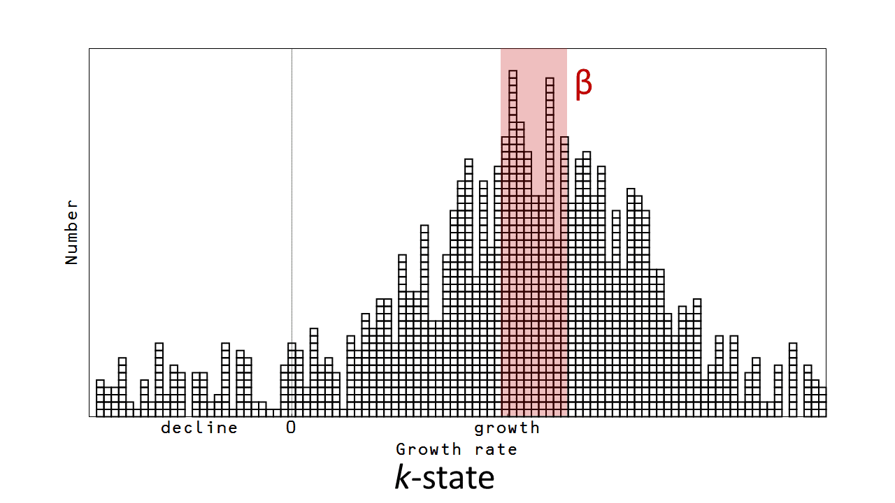
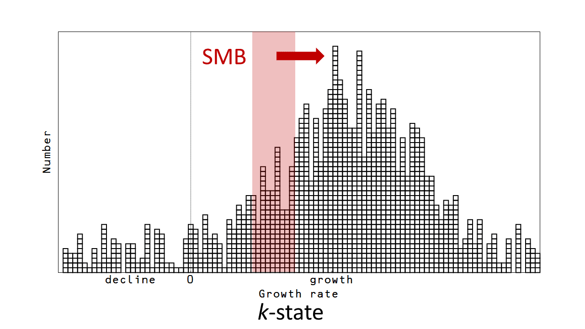
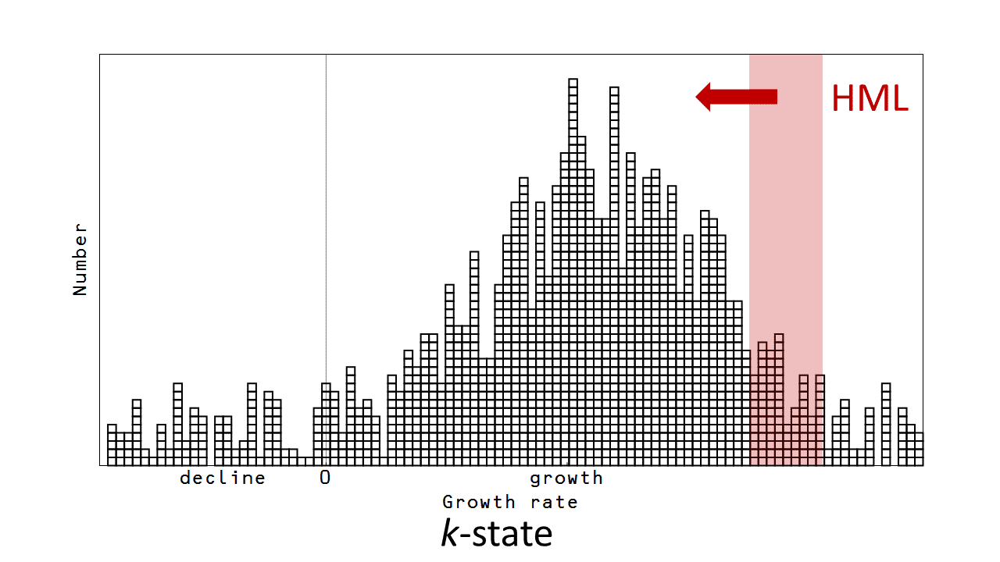
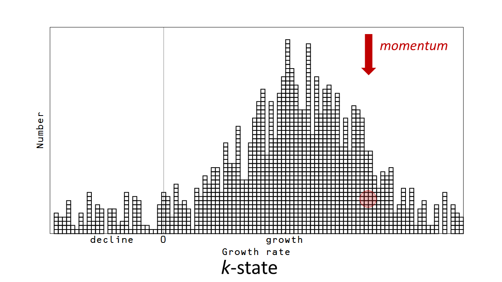
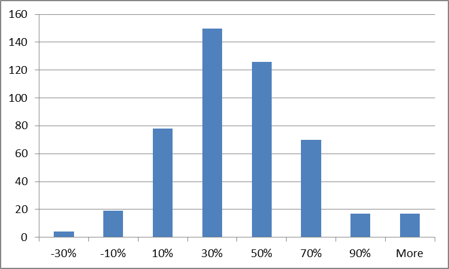
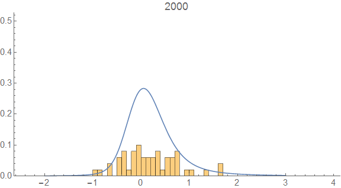
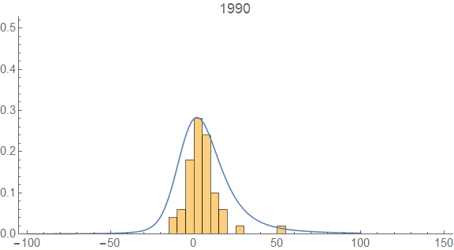
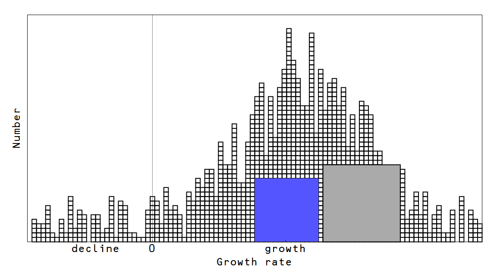
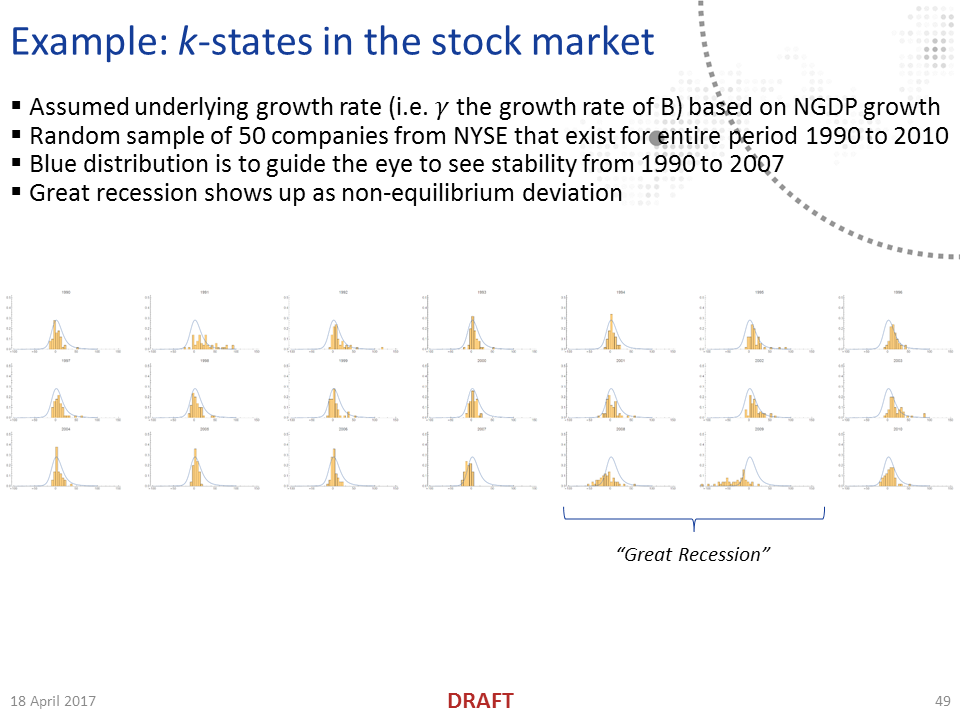

Noah Smith has a [fun article](https://www.bloomberg.com/view/articles/2016-12-14/when-to-send-an-investing-model-into-retirement) at Bloomberg View about how the EMH is becoming Ptolemaic, with epicycles upon epicycles. I thought it would be a good jumping off point for discussing stock market investing based on the information equilibrium model.

Now some disclaimers. First: financial. I own a few shares of Boeing stock and have my 401(k) invested in index funds. Second: invest at your own risk. I am potentially a crackpot physicist who thinks he understands economics and finance. Do you really want to trust your life savings to such a person?

Anyway, that aside, I will start with the basic information equilibrium model between "market capitalization" $M$ and "book widgets" or "book value" $B$ which is

[also written](http://informationtransfereconomics.blogspot.com/2016/09/basic-definitions-in-information.html) $p : M \rightleftarrows B$ where $p$ is the stock price. This is basically the model from [this post](http://informationtransfereconomics.blogspot.com/2015/04/solving-dark-matter-problem.html). And we'd expect a stock price to evolve as a random walk with drift per [this post](http://informationtransfereconomics.blogspot.com/2015/09/price-movements.html).

However, since we are looking a "the market", we actually want an ensemble of companies $p_{i} : M_{i} \rightleftarrows B_{i}$ (previously discussed [here](http://informationtransfereconomics.blogspot.com/2016/07/an-ensemble-of-labor-markets.html) and [here](http://informationtransfereconomics.blogspot.com/2016/09/balanced-growth-maximum-entropy-and.html) using an ensemble of labor markets). This results in a ["statistical equilibrium" distribution](http://informationtransfereconomics.blogspot.com/2016/09/the-economic-state-space-mini-seminar.html) of information transfer indices $k_{i}$ that looks something like this:

Each little box represents a particular $k_{i}$ state and since a stock price grows as

a higher $k$ is associated with higher growth. Great. But that distribution represents a statistical equilibrium based on macroeconomic constraints. We'd imagine individual companies changing from one $k$ state to another over time, but this does not necessarily change the distribution. It turns out we can kind of understand the French and Fama three-factor model (as well as other factors Noah discusses) as a description of the properties of the $k$-states making up this distribution.

First, the famous "**_beta_**" ($\beta$). According to Noah's article, the idea that $\beta$ leads to excess returns isn't well-supported by the data. This makes sense because high $\beta$ essentially means that company is close to the peak of the distribution pictured above. In terms of $k$, it means a stock with high $\beta$ will have typical $k$, and so won't outperform the market. This may prevent you from making mistakes and under-performing, but it won't typically yield excess returns.

Second, the "**_SMB_**" term for "small minus big", or the excess return of small cap (i.e. small $M_{i}$) stocks over large. Small cap stocks likely haven't been in high $k$ states for long. If they had, they'd be large cap stocks because $M \sim e^{k\;r\;t}$ where $r$ is some underlying fundamental growth rate in the economy. In a sense, this accounts for a sort of mean reversion: if $k$ has been low and were in statistical equilibrium, we'd expect a high $k$ in the future. Basically, [mean reversion](https://en.wikipedia.org/wiki/Regression_toward_the_mean).

Third, the "**HML**" term for the high book to market cap ratio minus low. This is the excess return of "value" stocks over "growth" stocks. In terms of the model, high book to market cap ratio means low market cap to book ratio, or low $M/B$ which is (proportional to) the stock price $p$ from equation (1). Now via equation (2) above implies a high market to book ratio (high stock price) means that the $k$-state has been large (compared to the average), so from mean reversion (assuming statistical equilibrium, i.e. that the distribution above stays the same) we'd expect a small $k$-state in the future.

Finally, there's **_momentum_**. This isn't included in the three-factor model but is supported by the data. This would imply that the $k$-state changes slowly enough that you should be able to catch a high $k$ stock while it is still rising.

So there we have it. SMB, HML, and momentum are explainable (in the information equilibrium model) as statements about statistical equilibrium, mean reversion, and the rate of change of $k$ states. The model also explains why $\beta$ isn't a good measure.

This model also says that there shouldn't be many more useful factors since given a distribution you really only have the rate of draws from that distribution (rate of change of $k$ states) and mean reversion. There could be more nuanced ones based on the particular form of the distribution (which we don't know) ‒ and there definitely could be fundamentals based factors.

Another interesting takeaway is that this isn't the EMH plus risk. Each price should follow a random walk in the short run (per the link above), which is the essence of the EMH piece. But high $k$ does not necessarily follow from high risk. At best, we can say that high $k$ means that demand is disproportionately high relative to the available book value. This doesn't say much more than simply saying the stock is "desirable". It could be a well run or consistently profitable company that may pay high dividends (and therefore not risky). It could be "the next big thing" (and therefore risky). Excess returns ‒ in the information equilibrium model ‒ are basically fundamentals and fads. However, due to macroeconomic constraints ‒ the statistical equilibrium distribution pictured above ‒ you should have some indication whether your excess returns are about to regress to the mean.

...

**Update 15 December 2016**

You may ask whether that empirical distribution pictured above qualitatively describes real data. It's difficult to find graphs out there already made that show the information in the correct way. Many show the distribution of daily returns, but those will be swamped by the noise of the day-to-day random walk. Many show the return of the distribution of the returns from the S&P500, but that's not the returns of individual stocks. What you need is performance of many individual stocks over a longer period to get the time-average. I plan on using Wolfram data servers to do my own version, [but I found a blog post out there](http://www.hullfinancialplanning.com/throw-a-dart-at-the-dartboard-or-invest-in-the-index-the-sp-500s-2013-performance-by-the-numbers/) that did the required calculation for 481 stocks for a full year (2013):

The average is 29.6% gain. If we consider the NGDP growth rate to be the underlying rate $r$ described above, this implies a the average $k \sim$ 9.1 (NGDP growth was 3.26% in 2013). So to translate between the graphs in the post above, you'd divide the percentages by about 3 (i.e. $k \sim$ 90/3 = 30 for the 90% bin).

PS You'd divide by a negative -2.1% for 2009 -- for example, Google/Alphabet (GOOG) lost about 30% (-30%) over 2009, which implies a $k \sim$ 15.

...

**Update 16 December 2016**

I created the above graph using a random sample of 50 NYSE listed stocks for the years 2000 to 2010. Here is a plot of the mean $k$-value (using NGDP growth as the underlying rate $r$) versus time (with the NBER recession indicated in gray):

And here is an animation of the distribution (the blue curve is more meant to guide the eye, showing that the distribution of $k$ states is roughly stable compared to the version below):

You can see the recession as a major deviation ([non-ideal information transfer](http://informationtransfereconomics.blogspot.com/2016/09/basic-definitions-in-information.html)), but otherwise the distribution is fairly stable. Constructing the $k$ value from the cumulative return is essential. The two graphs below show that the distribution moves around a lot more if you neglect the underlying rate of economic growth (and the recession isn't associated with any interesting features of the graph):

**Update 25 December 2016**

I should note that the ratio $M/B$ is (one version of) "[Tobin's Q](https://en.wikipedia.org/wiki/Tobin's_q)", making $Q$ proportional to the stock price $p$ (or aggregate industry stock price $\Sigma_{i \in I} \; p_{i}$):

$$ 
p \equiv \frac{dM}{dB} = k \; \frac{M}{B} = k \; Q 
$$

This wouldn't necessarily predict investment (per Tobin's original argument cited [here](https://www.jstor.org/stable/2662898?seq=1#page_scan_tab_contents)), but as described above it can be used to understand price dynamics (in a statistical sense).

**Update 4 January 2017**

Here's a different random sample of the NYSE, but looking over 20 years from 1990 to 2010. First, the $k$-state distribution

And here is the ordinary cumulative return that is far less stable:

**Update 14 January 2017**

The above correlated movement in the collapse of 2008-9 is motivation for [this picture](http://informationtransfereconomics.blogspot.com/2015/04/do-macro-models-need-financial-sector.html) of the financial sector (gray, government in blue):

...

**Update 10 May 2017**

I couldn't use an animation in a static presentation, but it made me realize just showing the frames was a good way to see the distribution:

