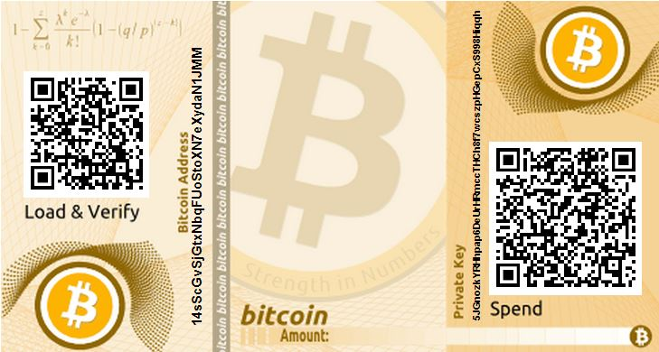

How's that for a bold title? Well, either bold or trivial. Anyway, let's assume [information equilibrium is correct](http://informationtransfereconomics.blogspot.com/2016/09/basic-definitions-in-information.html). I thought I'd give some reasons for why the debate over bitcoin scaling (H/T Frances Coppola in tweets [here](https://twitter.com/Frances_Coppola/status/804487693698736128), [here](https://twitter.com/Frances_Coppola/status/804490639857553408)) is not resolvable. The [store of value](https://en.wikipedia.org/wiki/Store_of_value) and [medium of exchange](https://en.wikipedia.org/wiki/Medium_of_exchange) purposes of money are incompatible using information equilibrium.

We'll follow the usual [information equilibrium argument](http://informationtransfereconomics.blogspot.com/2015/05/money-defined-as-information-mediation.html) for money as a medium of exchange here. We'll start with two goods $Y_{1}$ and $Y_2$ and two demands for those goods $X_{1}$ and $X_2$. So we start with $X_{i} \rightleftarrows Y_{i}$ (with IT indices $k_{i}$). Let's introduce money $M$ so that we have

This gives us two (well, four ... two for each $i$) information equilibrium conditions

This [follows](http://informationtransfereconomics.blogspot.com/2015/05/money-defined-as-information-mediation.html) via the chain rule (no pun intended) and the identity $M/M = 1$. This represents our medium of exchange. You can buy $Y_{1}$ with money and the seller can then buy $Y_{2}$ with that money. In this arrangement, what does store of value mean? It means that the exchange rate for money for $Y_{1}$ is constant ‒ money never buys less of $Y_{1}$ or more. Therefore

In order for this to be true, we must have $k^{(m)}_{1} = 1$, and therefore $M \propto Y_{1}$. However, you could have picked $Y_{2}$, and if you did, you'd find $M \propto Y_{2}$. Therefore:

where $\alpha$ is some constant. This means that $Y_{1} \rightleftarrows Y_{2}$ with IT index 1 so that $Y_{1}$ and $Y_{2}$ grow at the same rate $R$. You can then, by induction, prove this for any pair of goods $Y_{i}$ and $Y_{j}$.

In order to have money $M$ operate as a store of value and a medium of exchange, it requires the entire economy to basically scale the exact same way. You can't introduce new products. Effectively we're stuck with an economy that is just scaled version of the economy in the past (by a factor of $e^{R \; t}$). (Every good would have to also grow so that there was always the same relative number of units, which would present a problem for bulk goods like blueberries or fluids like beer.) This is connected to the idea that money is something of a [physical manifestation of scale invariance](http://informationtransfereconomics.blogspot.com/2015/12/money-is-that-which-is-conserved-via.html) (at least in the information equilibrium picture). However the reason the problem exists easy to understand: it's because you can exchange money for one good, and then that money can be exchanged for a different good. Because that simple sequence of transactions is possible, every pair of goods has to grow at the same rate relative to the money stock. That is to say, it's basically because money is a medium of exchange.

And the problem is basically that store of value assumption. There's nothing wrong with an ensemble of markets with different/changing growth rates (like the discussion [here](http://informationtransfereconomics.blogspot.com/2016/07/an-ensemble-of-labor-markets.html), except it uses labor and productivity). With an ensemble, you'd have inflation that decreases over time (like the productivity that decreases over time) ‒ but that is exactly degrading the value of money.

So we have an incompatibility. Money can be a store of value, but only if it's not a medium of exchange. And money can be a medium of exchange, but only if it's not store of value.
