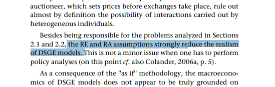
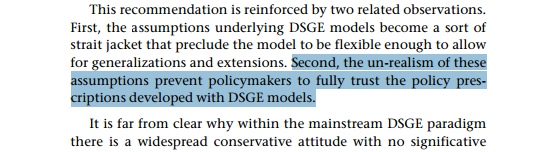
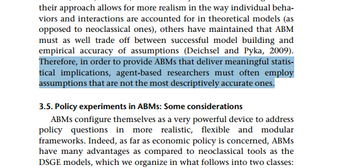

If you think you have a better economic modeling paradigm, just show that it's better. If you rely on arguments against other paradigms, you'll end up looking foolish when you have to make the same "mistakes" as those paradigms.

[Pedro Serôdio](https://twitter.com/pdmsero/status/804434894269124609) points us to [a paper](http://www.ofce.sciences-po.fr/pdf/revue/4-124.pdf) \[pdf\] that trashes DSGE in favor of agent based modeling. It says a couple things about DSGE having unrealistic assumptions (these are just two examples):

However a few pages later, we get this:

I fail to see the difference between "not the most descriptively accurate" and "unrealistic". Here's the definition of realistic:

> **re·al·is·tic**
>
> __adjective__
>
> 2\. representing familiar things in a way that is accurate or true to life

So a good definition of unrealistic is "not representing things in a way that is accurate", so in order for ABMs to deliver meaningful statistical implications, research must often employ unrealistic assumptions.

This not to say I think ABMs are misguided. It's a tool, and tools can be used effectively or not. Basically, my view can be boiled down to a few points. First, I've used an [agent based model here](http://informationtransfereconomics.blogspot.com/2016/04/list-2004-field-experiments-with-random.html) (an incredibly simple agent, but an agent nonetheless). But the major issue with complex agents -- basically the one above -- is the same issue with any complex economic model: _too many parameters_. My agent model was simple. Check out [this agent](https://arxiv.org/abs/1501.00434), though:

... and the authors called it "stylized" (and "Mark 0") meaning it's only going to get more complex.

Second, I think it is an interesting question as to whether information equilibrium relationships arise out of agent based models. [Some preliminary results](http://informationtransfereconomics.blogspot.com/2016/11/information-equilibrium-in-agent-based.html) say yes, they can. Note that this agent model is also pretty simple (a few lines of _Mathematica_ code).

And finally, there are some basic reasons to expect that macroeconomics is either independent of the details of its agent substrate (macro is a theory restricted a low-dimensional subspace of the million-dimensional agent space) or completely intractable (macro is a theory that requires most of the million-dimensional agent space). I wrote about this more [here](http://informationtransfereconomics.blogspot.com/2016/03/the-irony-of-microfoundations.html) (with a Socratic dialog).

Instead of arguing that mainstream paradigm _X_ sucks (e.g. _X_ \= DSGE), you should just show us that your new paradigm _Y_ works. Show us that _Y_ makes successful predictions. Show us that _Y_ describes the data well (like [this](http://informationtransfereconomics.blogspot.com/2015/09/prediction-aggregation-redux.html)). Show us that _Y_ is **_useful_**. This is how science works.
