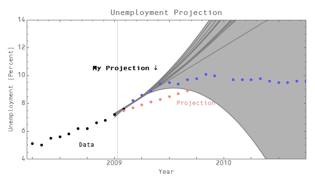
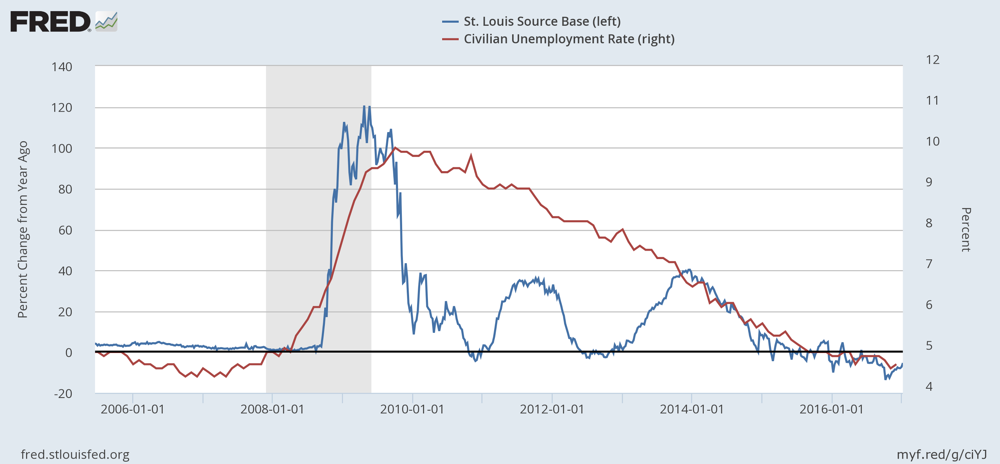

With the new unemployment rate out for Dec 2016 (it was 4.7%, up 0.1 percentage points from 4.6% in November), I thought I'd update [this projection](http://informationtransfereconomics.blogspot.com/2016/12/a-may-2017-recession.html) based on this [**extremely** simplified model](http://informationtransfereconomics.blogspot.com/2016/10/defining-recessions.html). I'll put the results side-by-side with the old ones so you can toggle back and forth to see the changes. The biggest change is the reduction in the uncertainty; the onset date (see [here](http://informationtransfereconomics.blogspot.com/2016/10/defining-recessions.html)) is consistent with the previous result 2017.6 ± 0.4 (end of June) versus 2017.4 ± 0.4 (latter half of May, plus or minus 5 months). Here are the graphs (new result first):

You can see the reduction in the uncertainty (end of Q1 2017, Q2 2017, Q3 2017, Q4 2017 and Q1 2018); again the new result is first:

I'll keep updating this each month and see if it is useful in forecasting recessions.

**_\*  \*  \*_**

PS Projecting unemployment with a new administration waiting in the wings reminded me of a time back in January or February of 2009 when I projected that we'd have higher unemployment than than the projections that were coming out of [the CBO](https://www.cbo.gov/sites/default/files/111th-congress-2009-2010/reports/01-07-outlook.pdf) \[pdf\] and from [the Obama economic team](http://krugman.blogs.nytimes.com/2009/01/10/romer-and-bernstein-on-stimulus/) (I can't remember which values I used in the graph ‒ I believe the latter):

The pink dots represent the Romer/Bernstein projection (I think). The blue dots show the data that came out after the projection (the vertical line representing the projection start for both). Using the model at the top of this post, I would have shown something very similar: 

The center of the recession is estimated at 2009.4 ± 0.7 which is consistent with the estimate of 2008.8 ± 0.1 using all the data. The other interesting thing is that the fact that the data starts deviating strongly starting in mid-2009 ([right as the ARRA goes into effect](https://fred.stlouisfed.org/series/TOTEXPQ027SBEA)), and then continues to hug the 50% confidence contour could be taken as an estimate of its impact.

**Update 7 January 2017**

Commenter Anti below suggests that the first round of Quantitative Easing (QE) is a confounding factor with regard to the effect of the ARRA, and in principle I agree. However, two other rounds of QE happened and were not associated with any comparable deviation in the dynamic equilibrium:

There is a small change roughly corresponding to QE 3; however, that appears to be better understood in terms of [Obamacare going into effect](http://informationtransfereconomics.blogspot.com/2016/10/defining-recessions.html). In any case, 2012 QE 2 shock does not appear to have had any impact on the dynamic equilibrium (roughly constant decline in the unemployment rate).  It is hard to reconcile QE 1 being a large impact, QE 2 having no impact, and QE 3 having a smaller impact pound-for-pound given it and QE 2 were on the order of 1/3 the size of QE 1.

It is easier to reconcile the unemployment data with the effect of the ARRA (about 4 percentage points) and a small boost in health care employment due to the ACA (about 1 percentage point).

In fact, we can look at the case where QE 2 and QE 3 have the same impact as the deviation I attributed to the ACA:

 It is noticeably lower than the data.

That doesn't preclude an "it's complicated" combination of QE and fiscal stimulus/austerity at each point, but Occam's razor would suggest the simpler explanation.
