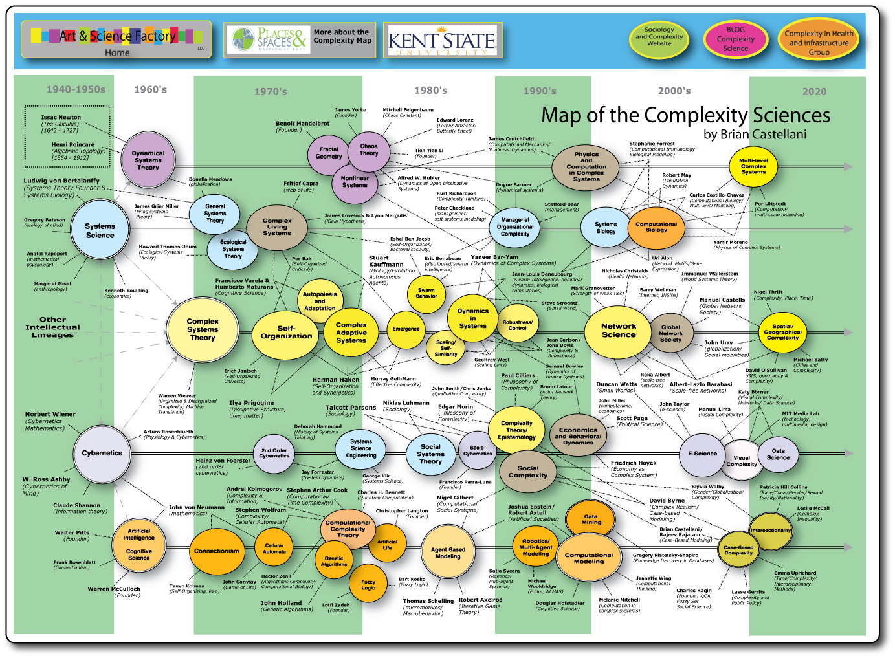

One thing I've noticed over the years is a tendency for many mainstream economists, heterodox economists, and non-economists to misunderstand complexity. This is understandable as there are [various meanings of complexity in various fields](https://en.wikipedia.org/wiki/Complexity#Varied_meanings). However, one common thread in the misunderstanding is that people seem to use "complexity" as a shorthand for "other models do not include things I think should be included". In a sense, it is the audience member at a talk saying to the speaker "things are more complicated than your model". In a subject without a lot of data, it's generally a silly thing to say (due to the [identification problem](http://informationtransfereconomics.blogspot.com/2016/09/of-phlogiston-and-frameworks.html) and limited [model complexity](http://informationtransfereconomics.blogspot.com/2015/04/all-models-are-wrong-but-some-are.html) that can be supported by the data). I've discussed "complexity" before many times in many contexts ([here](http://informationtransfereconomics.blogspot.com/2015/07/assuming-complexity.html), [here](http://informationtransfereconomics.blogspot.com/2016/04/its-complicated-alternative-approaches.html), [here](http://informationtransfereconomics.blogspot.com/2016/03/goldilocks-complexity.html), [here](http://informationtransfereconomics.blogspot.com/2016/05/recognizing-complexity-by-inspection.html), [here](http://informationtransfereconomics.blogspot.com/2016/03/economics-doesnt-need-new-theories-it.html), [here](http://informationtransfereconomics.blogspot.com/2016/01/complexity-without-purpose-evolution-as.html) or [here](http://informationtransfereconomics.blogspot.com/2015/07/biologists-unoriginal-and-misguided.html)).

This [blog post](https://rwer.wordpress.com/2017/01/07/keynesian-complexity/) at RWER illustrates this concept brilliantly. After the second paragraph the author writes:

> _Economists as a whole failed to understand ... that the economy is a complex system. This means that what happens in the macroeconomy **cannot be reduced to the microeconomic behavior of the agents**. ... aggregation of micro-behavior cannot be done to get macro-behavior ..._

Emphasis mine. However, the closing sentence is:

> _Thus major progress is possible, with the help of **agent based models** and complexity theory._

Emphasis mine. I am not sure how you can use agent based models if the macroeconomy cannot be reduced to the behavior of agents, and you cannot aggregate agents into a macroeconomy. Actually, I am not entirely sure I understand what the author was even trying to say. It seems that he might mean "simply reduced" or "trivially reduced" in the former; evidence for that is in this sentence:

> _... the system as whole does not act as a simple aggregate of the actions of the individual agents within the system._

That is something that I could get behind because it is the idea behind [entropic forces](http://informationtransfereconomics.blogspot.com/2016/09/causal-entropic-forces-as-economic.html) and weakly [emergent](http://informationtransfereconomics.blogspot.com/2016/04/different-types-of-emergence.html) behaviors (e.g. [jamitons](http://informationtransfereconomics.blogspot.com/2016/03/traffic-model-on-wicksellian-roundabout.html)). However, this does not mean the weakly emergent behaviors are themselves a complex system or even based on a complex system. For example, the simple linear model of sound waves can be built upon the weakly emergent concept of pressure from statistical mechanics. No single atom has a pressure, but an aggregate system of atoms can have one, and that pressure can have fluctuations that can carry information from a human mouth to a human ear through speech.

Some of the other assertions the author makes should be backed up with empirical data. For example, he states:

> _When we simplify an economy by creating a representative agent, we have thrown out the baby with the bath water in the process of simplification. A complex economy cannot be understood by reducing to a single agent ..._

As I showed [here](http://informationtransfereconomics.blogspot.com/2015/09/the-emergent-representative-agent-1.html), it is possible that a rational utility maximizing representative agent is a weakly emergent concept. In fact, that is a problem I have with the claims that macroeconomics is emergent is a critique of mainstream macroeconomics ‒ how do you know that mainstream economics isn't the correct weakly emergent theory from agent based models? That is to say, what if after doing everything you say, you end up with a DSGE model? (In some sense, this is [probably guaranteed](http://informationtransfereconomics.blogspot.com/2016/10/keen-chaos-and-equilibrium.html).)

I found this phrasing problematic:

> _the macro does not replicate the micro_

This is essentially another assumption. Many complex systems manifest [self-similar structures](https://en.wikipedia.org/wiki/Self-similarity), so saying this outright is something of an article of faith. In fact, [aggregating information equilibrium markets results](http://informationtransfereconomics.blogspot.com/2014/06/the-macroeconomic-partition-function.html) in something that looks like a single information equilibrium market, but with a changing IT index. The phrase is re-used in discussion of the [SMD theorem](https://en.wikipedia.org/wiki/Sonnenschein%E2%80%93Mantel%E2%80%93Debreu_theorem):

> _The Sonnenschein–Mantel–Debreu theorem illustrates complexity of the demand function. The properties of the micro-agents are not replicated at the macro level when we aggregate the demand functions._

Well, some of their properties are replicated, but some aren't. Additionally, the primary consequence of the theorem is that equilibria are only locally unique (there could be more than one equilibrium). The best interpretation is that the weakly emergent macroeconomic theory isn't as constrained by the agent models and the microeconomic theory as you might think and in fact several different agent models [might lead to the same macro theory](http://informationtransfereconomics.blogspot.com/2016/03/the-irony-of-microfoundations.html). Originally, this was a blow to the idea of microfoundations ‒ macro is basically unconstrained by a requirement for rational agent microfoundations. However, this should generally apply to most agent models if we think there is something called "macroeconomics" because otherwise the macro theory [would likely be intractable](http://informationtransfereconomics.blogspot.com/2014/06/what-if-money-was-made-of-vinegar.html). All of this falls under the heading of "macroeconomics is weakly emergent", which doesn't really lead to a lot of specific research recommendations or need to include specific effects.

In any case, this isn't really "complexity", just "complicated". And that is pretty much true of many of the discussions of complexity in economics. I agree that the macroeconomy is a _complicated_ system. I'm just not sure it is a _complex system_ in any of the senses that require the adoption of agent based models, nonlinear models, or evolutionary models. There isn't enough data to distinguish nonlinear dynamics from stochastic shocks. Realistic agents are far too complicated (high dimensionality) [to model realistically any time soon](http://informationtransfereconomics.blogspot.com/2016/12/why-dont-you-just-show-us-why-its-better.html), so any simplification you make for tractability in your agent based model \[_update 2 Aug 17:_ [here is an explicit example of this](http://informationtransfereconomics.blogspot.com/2016/12/why-dont-you-just-show-us-why-its-better.html)\] will result in various and undetermined simplifications in the macro model space. Since we do not know which simplifications lead to the correct macro model, you might as well avoid the mapping problem that results by just assuming the macro theory is a weakly emergent dimensionally reduced dynamic system and looking for empirical regularities to base an [_effective_ macro theory](https://en.wikipedia.org/wiki/Effective_theory) on.

That's the approach I take on this blog. I'm not saying agent based models won't get us there or that the economy is definitely linear. I'm saying at the level of simulation fidelity we can achieve and the available data we have, we are looking at a scenario where agent effects are going to be subsumed into a few parameters fed into a macro theory that will be [approximately linear](http://informationtransfereconomics.blogspot.com/2016/09/on-using-taylor-expansions-in-economics.html) with [stochastic shocks](http://informationtransfereconomics.blogspot.com/2016/10/keen-chaos-and-equilibrium.html).
