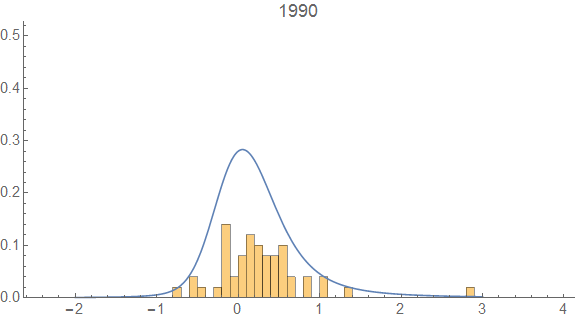

I re-ran the analysis [presented here](http://informationtransfereconomics.blogspot.com/2016/12/stocks-and-k-states.html) (using a different random sample of 50 companies from the NYSE) for a longer period 1990-2010 and the distribution of stock market "_k_\-states" (see previous link) is much more stable than the cumulative returns ‒ more evidence for the "[statistical equilibrium](http://informationtransfereconomics.blogspot.com/2016/09/the-economic-state-space-mini-seminar.html)" of _k_\-states.

_k_

Except for the Great Recession (2088-2009), the distribution is stable. And here are the cumulative returns alone:

In both figures, the blue distribution is more intended to guide the eye than a particular measure ‒ I eyeballed the parameters of a [stable distribution](https://en.wikipedia.org/wiki/Stable_distribution) to look a bit like the k-state distribution and scaled the parameters for the cumulative return space to give an "equivalent" distribution over the different domain.
