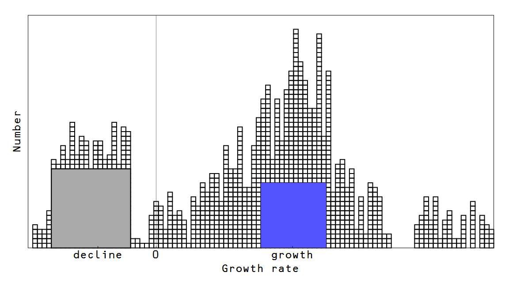

The [picture of stock markets presented here](http://informationtransfereconomics.blogspot.com/2016/12/stocks-and-k-states.html) lends support to [this picture](http://informationtransfereconomics.blogspot.com/2015/04/do-macro-models-need-financial-sector.html) of the financial sector. We can see the distribution of _k_\-states (relative growth rate states) moves in concert during the financial crisis:

This means that, to first order, the financial sector (gray) can experience a shock behaving like an "anti-Keynesian" government sector (blue) where the rest of the distribution represents the entire economy:

[here](http://informationtransfereconomics.blogspot.com/2015/01/keynesian-economics-in-three-graphs.html)

> [@dsquareddigest](https://twitter.com/dsquareddigest) [@dandolfa](https://twitter.com/dandolfa) [@AdamPosen](https://twitter.com/AdamPosen) [@t0nyyates](https://twitter.com/t0nyyates) Could you model finance in a more realistic way? And if so, how?
>
> — Noah Smith (@Noahpinion) [January 14, 2017](https://twitter.com/Noahpinion/status/820395328146804736)
