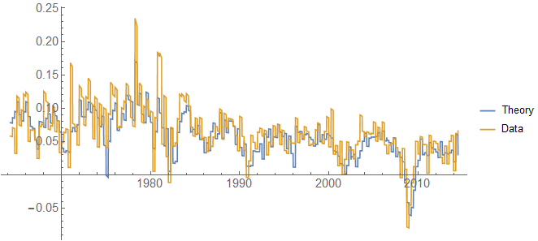

I added the simple [labor model](http://informationtransfereconomics.blogspot.com/2013/08/scott-sumners-model-part-2_30.html) (Okun's law), [Solow model](http://informationtransfereconomics.blogspot.com/2014/12/the-information-transfer-solow-growth.html), and the "[Quantity Theory of Labor and Capital](http://informationtransfereconomics.blogspot.com/2016/03/a-quantity-theory-of-labor-and-capital.html)" (QTLK) to the GitHub information equilibrium [repository](http://informationtransfereconomics.blogspot.com/2017/02/information-equilibrium-code.html):

[https://github.com/infotranecon/informationequilibrium](https://github.com/infotranecon/informationequilibrium)

Let me know if you can see these files. They're _Mathematica_ notebooks (made in v10.3).
