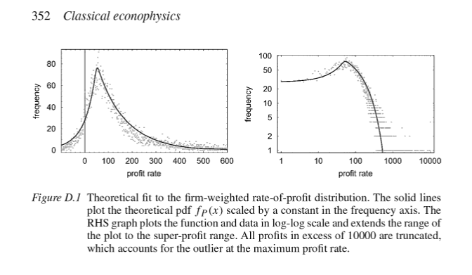

That's the title of a book co-authored by Ian Wright (see [here](https://ianwrightsite.wordpress.com/2017/01/02/classical-econophysics/)) that looks at "statistical equilibrium". Here's Ian (from the link):

> _The reason we can be a bit more optimistic \[about understanding the economy\] is that some very simple and elegant models of capitalist macrodynamics exist that do a surprisingly effective job of replicating empirical data. ... I co-authored a book, in 2009, that combined the classical approach to political economy (e.g., Smith, Ricardo, Marx) with the concept of statistical equilibrium more usually found in thermodynamics. A statistical equilibrium, in contrast to a deterministic equilibrium that is normally employed in economic models, is ceaselessly turbulent and changing, yet the distribution of properties over the parts of the system is constant. It’s a much better conceptual approach to modelling a system with a huge number of degrees-of-freedom, like an economy._

I think that this kind of approach is the statistical mechanics to information equilibrium's (generalized) thermodynamics/equations of state. Much like how you can compute the pressure and volume relationship of an idea gas from expectation values and partition functions \[e.g. [here](http://www.damtp.cam.ac.uk/user/tong/statphys/two.pdf), pdf\], information equilibrium gives general forms those equations of state can take.

I curated a ["mini-seminar" of blog posts](http://informationtransfereconomics.blogspot.com/2016/09/the-economic-state-space-mini-seminar.html) connecting these ideas, in particular [this post](http://informationtransfereconomics.blogspot.com/2016/09/balanced-growth-maximum-entropy-and.html). I try to make the point that an economic system _"... is ceaselessly turbulent and changing, yet the distribution of properties over the parts of the system is constant."_ (to quote Ian again). That is key to a point that [I also try to make](http://informationtransfereconomics.blogspot.com/2015/10/economics-as-and-versus-social-science.html): maybe "economics" as we know it only exists when that distribution is constant. When it undergoes changes (e.g. recessions), we might be lost as physicists (usually) are in dealing with non-equilibrium thermodynamics (which for economics might be analogous to _sociology_).

PS I also tried to look at some information equilibrium relationships in one of Ian's agent-based models ([here](http://informationtransfereconomics.blogspot.com/2016/11/information-equilibrium-in-agent-based.html), [here](http://informationtransfereconomics.blogspot.com/2017/01/dynamic-equilibrium-in-agent-based-model.html)).
