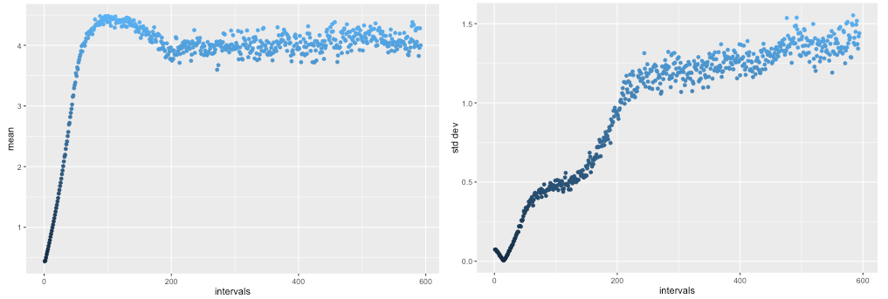
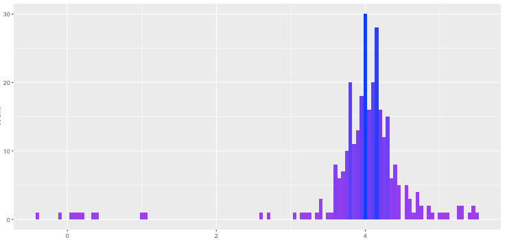
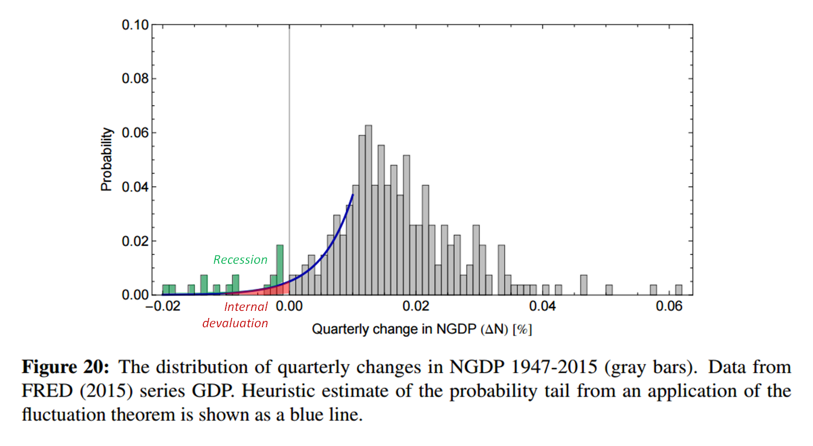
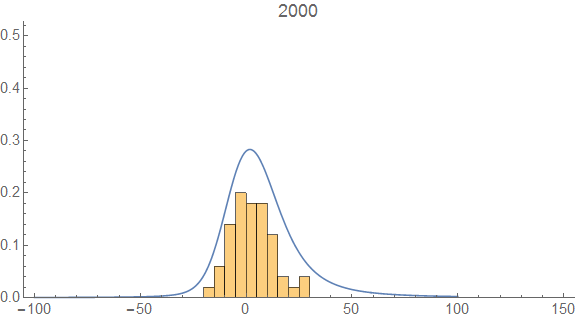

This is kind of a placeholder for some thoughts when I get a bit more time. There was a tweet today about Generative Adversarial Networks (GANs) leading to [this Medium post](https://medium.com/@devnag/generative-adversarial-networks-gans-in-50-lines-of-code-pytorch-e81b79659e3f#.wjh4w0cgm). I immediately retweeted it:

> Wow; this may be the mechanism behind markets. D (detective) is the price, R (real data) is demand, and G (generator) is supply. [https://t.co/PXr9XtgRT9](https://t.co/PXr9XtgRT9)
>
> — Jason Smith (@infotranecon) [February 17, 2017](https://twitter.com/infotranecon/status/832717345386700801)

This is very interesting for a couple of reasons. It demonstrates how a simple "price" (the judgments of the discriminator _D_) can cause the supply distribution (_G_, the generated distribution) to match up with the demand distribution (_R_, the real distribution). In this setup, however, the discriminator doesn't aggregate information (as it does in the traditional Hayekian view of the price mechanism), but merely notes that there are differences between _G_ and _R_ (the information equilibrium view). See more [here](http://informationtransfereconomics.blogspot.com/2015/03/the-price-system-as-communication.html).

[information equilibrium model](http://informationtransfereconomics.blogspot.com/2016/02/slides.html)

with _D_ as the detector, except we have a constant information source (_R_, the real data). I hope to put this in a more formal statement soon. Real markets would also have demand (_R_) also adjust to the supply (_G_).

The example shown at the Medium post is exactly the generator attempting to match to a real distribution, which is [one way to see information equilibrium operating](http://informationtransfereconomics.blogspot.com/2016/08/is-information-equilibrium-silly.html). Here are the results for the mean and standard deviation of the distribution _R_:

The other thing I noticed is that there is a long tail towards zero mean in the final result:

> _Not bad. The left tail is a bit longer than the right, but the skew and kurtosis are, shall we say, **evocative** of the original Gaussian._

[this](http://ssrn.com/abstract=2894072)

[this](http://informationtransfereconomics.blogspot.com/2016/12/stocks-and-k-states.html)

