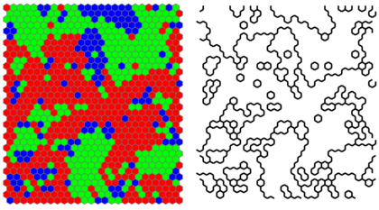

I have been looking for a good explanation of the physical meaning of the general form of the [invariance of the information equilibrium condition](http://informationtransfereconomics.blogspot.com/2016/10/invariance-under-inversion.html) (shown by commenter M). The equation:

is invariant under transformations of the form:

The physical (well, economic) meaning of this is that the information equilibrium condition is invariant under transformations that leave the ratio of the local (instantaneous) log-linear growth rates of $A$ and $B$ constant. This is because

and likewise for $B$. Among other things, this preserves the value of information transfer index which means that the information transfer index is the defining aspect of the information equilibrium relationship.

This is interesting because the IT index determines a ["power law" relationship](http://informationtransfereconomics.blogspot.com/2016/02/power-laws-and-information-equilibrium.html) between $A$ and $B$. Power law exponents will often have some deep connection to the underlying degrees of freedom. Some vastly different physical systems will behave the same way when they have the same critical exponents (something called [universality](https://en.wikipedia.org/wiki/Universality_\(dynamical_systems\))). Additionally, $k$ is related to [Lyapunov exponents](http://informationtransfereconomics.blogspot.com/2016/05/lyapunov-exponents-and-information.html) which also represent an important invariant property of some systems.

This is to say that the information equilibrium condition is invariant under a transformation that preserves a key (even defining) property of a variety of dynamical systems.

(This is why physicists pay close attention to symmetries. They often lead to deep insights.)

