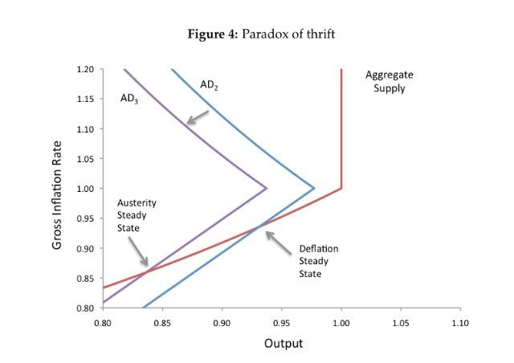

[John Handley asks](https://twitter.com/jwhandley17/status/832178561049956352) via Twitter, "\[W\]here do models like \[[Eggertsson and Mehrotra](http://cep.lse.ac.uk/seminarpapers/20-05-14-GE.pdf)\] fit into your view of quantitative, qualitative, and toy models?"

I think my answer would have to be a qualitative model, but an unsatisfying one. The major problem is that it is much too complex. However, a lot of the complexity comes from the "microfoundations" aspects, the result of which is exactly as put by _[Mean Squared Errors](https://meansquarederrors.blogspot.com/2016/09/houdinis-straightjacket.html)_:

> _Consider the macroeconomist. She constructs a rigorously micro-founded model, grounded purely in representative agents solving intertemporal dynamic optimization problems in a context of strict rational expectations. Then, in a dazzling display of mathematical sophistication, theoretical acuity, and showmanship (some things never change), she derives results and policy implications that are exactly what the IS-LM model has been telling us all along. Crowd -- such as it is -- goes wild._

Except in this case it's the AD-AS model. The IS-LM model is already a decent qualitative model of a macroeconomy when it is in a protracted slump, and what this paper does is essentially reproduce an AD-AS model version of Krugman's zero-bound/liquidity trap modification of the IS-LM model \[[pdf](https://www.gc.cuny.edu/CUNY_GC/media/LISCenter/pkrugman/1998b_bpea_krugman_dominquez_rogoff.pdf)\]. This simple crossing curves (e.g. shown above) are far simpler and tell basically the same story as the "microfounded" model.

The model does meet the requirement of being qualitatively consistent with the data. For example, it is consistent with a flattening Phillips curve:

> _This illustrates a positive relationship between inflation and output - a classic Phillips curve relationship. The intuition is straightforward: as inflation increases, real wages decrease (as wages are rigid) and hence the firms hire more labor. Note that the degree of rigidity is indexed by the parameter γ. As γ gets closer to 1, the Phillips curve gets flatter ..._

This is [observed](http://informationtransfereconomics.blogspot.com/2016/01/the-slope-of-phillips-curve-is-roughly.html). The model also consists of stochastic processes:

> _An equilibrium is now defined as set of stochastic processes ..._

This is also qualitatively consistent with the data (in fact, pure stochastic processes [do rather well](http://informationtransfereconomics.blogspot.com/2016/10/forecasting-it-versus-all-comers.html) at forecasting).
