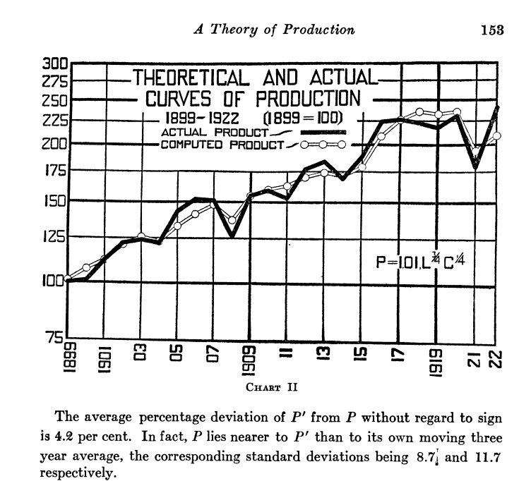
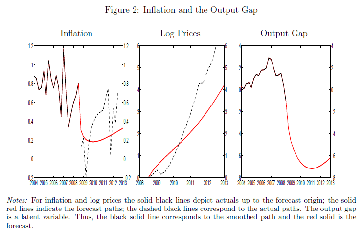

> _This post is Part 1 of a series. [Part 2](https://informationtransfereconomics.blogspot.com/2017/02/qualitative-economics-done-right-part-2.html) (on Keen), [part 2a](https://informationtransfereconomics.blogspot.com/2017/02/qualitative-economics-done-right-part-2a.html), and [part 3](https://informationtransfereconomics.blogspot.com/2018/01/qualitative-economics-done-right-part-3.html) (on Godley) are also available. Added in December of 2020: [Part N](https://informationtransfereconomics.blogspot.com/2020/12/qualitative-economics-done-right-part-n.html) (on Farmer)._

I entered into a discussion with UnlearningEcon [on Twitter](https://twitter.com/infotranecon/status/828305258677821440) about qualitative analysis in economics. Different people mean different things by "qualitative" ranging from vague handwaving to detailed order of magnitude estimates of magnitudes and directions of effects. However since our discussion concerned the models of Steve Keen and Wynne Godley, which are both _mathematical_ models, I think it is safe to take qualitative analysis to mean:

-   Identifying scales (size) separating large effects from small effects
-   Identifying the scale (size) of error and noise in the data
-   The order of magnitudes of effects
-   The direction of effects
-   The relevant variable dependencies of effects

Qualitative analysis plays a major role in theory development. All theories must go through four tests:

1.  Qualitative description of the data
2.  Qualitative predictions
3.  Quantitative description of the data
4.  Quantitative predictions 

Now you could switch 2 and 3 in the ordering. And you could jump right to 3 and 4 (essentially using 3 and 4 to "test out" of 1 and 2). Sometimes you never hear about a theory because it fails 1 or 2. Sometimes you only hear about it when it reaches 3. However, under no circumstances should you ever **start** with 2. A theory that does not describe data even qualitatively should not be validated by qualitative predictions, and theories that do not describe the data qualitatively should not be used to make qualitative predictions. 

I think a lot of economic theory out there from RBC and DSGE to SFC and MMT, from the mainstream to the heterodox is suffering from something I'd like to call "data disease" using a metaphor with [Baumol's cost disease](https://en.wikipedia.org/wiki/Baumol's_cost_disease). With the increasing availability of economic data, the productivity of theory (how much data a theory of a given complexity can explain) has noticeably decreased. Cobb and Douglas had very little data, but the theoretical model quantitatively captured a lot of the variation of the data:

That's two parameters for >20 data points over > 20 years. Today we have things like this ([reference](http://noahpinionblog.blogspot.com/2013/05/dsge-financial-frictions-macro-that.html)) that have 40-50 parameters looking out over three years:

Cobb and Douglas wanted you to know their result was quantitative. I think we're supposed to look at the the latter model as a qualitative model. I know; the latter model works out a lot more variables. I'd actually like to commend them on comparing the results to data at all! That was the first thing to go as a result of "data disease". And because the productivity of mainstream theory became so low, a lot of non-mainstream theorists decided they also didn't need to compare theory to data. I mean, why hold yourself to a higher standard than mainstream economists hold themselves?

I'd like to push back against this tide of pretending knowledge where none actually exists. Saying a model is a qualitative model ought to mean something. At least it should mean something besides "please don't compare this model to data". So what should qualitative description of the data mean for economics? 

**The "mainstream separation"**

There are a couple of possible starting points that I think can be illustrated using employment data. The first is what I'll call the "mainstream separation". As frequently happens in physical theories, in this case there is a scale that separates large effects (e.g. long run economic growth) and small effects (fluctuations, e.g. the business cycle). In economics, this actually separates two sub-fields (growth economics and macroeconomics). Qualitative analysis in this picture sets up one or more scales for "the long run" versus "the short run", as well as a scale for fluctuations and the size of expected error ‒ I drew a diagram using the unemployment level to illustrate this:

In this picture it can actually make sense to talk about fluctuations separately from economic growth (i.e. the two sub-fields don't have to talk to each other much). There could be one theory for the long run (e.g. Solow model) and another for the short run (e.g. DSGE). Additionally, the errors are separable as well. The errors in the former are set by the scale of the latter theory (and the latter's errors are irrelevant to the former). One theory's signal is another theory's noise.

However, if you've made this separation, your short run model is only valid (only has scope) in the neighborhood of the long run equilibrium. The rational expectations in your DSGE model may then only be valid if the fluctuations are small (discussed more extensively [here](http://informationtransfereconomics.blogspot.com/2016/02/one-more-physics-analogy.html)).

This view can easily encompass most ideas from Minsky's credit cycles to Real Business Cycle models (RBC) using random AR processes. That is to say that this picture doesn't really eliminate a lot of theories since the next picture can be represented as this picture at least locally.

**Multi-scale holism**

The other possibility is that your long run and short run scales are too close to each other to be separated, or there exist many different scales. This approach sees a single complex system (nonlinear dynamics, or linear dynamics with multiple scales) and the relevant diagram looks like this:

In this view there is no independent "business cycle" and "the long run" and "the short run" cease to have well-defined meanings. The fluctuations are part and parcel of the long run process.

There is a particular interpretation of Minsky's credit cycles that sees credit cycles as having scales on the order of a generation (e.g. culminating in the Great Depression and Great Recession). You could even posit a self-similar fractal system where there are multiple scales from generational down to the typical time between recessions of about 8 years in the US.

**Aside: dynamic equilibrium**

One thing I'd like to point out is that the [dynamic equilibrium](http://informationtransfereconomics.blogspot.com/2017/01/dynamic-equilibrium-presentation.html) approach I've been looking at recently is mostly an attempt to understand which of the two approaches above is the most economical way to understand the data and in the case of the former what the long run equilibrium is. For employment, the system really looks like a single dynamic equilibrium subjected to stochastic shocks that is [deeply connected to matching theory](http://informationtransfereconomics.blogspot.com/2017/01/matching-theory-and-employment-in.html).

**What does the data say?**

First, since we really only have about 60 years of decent data, we only have information about regular cycles that have a period of less than 20 years. You can immediately discount e.g. [Kondratiev waves](https://en.wikipedia.org/wiki/Kondratiev_wave) as a theory that either will be considered lucky (much like Democritus's atoms or Newton's photons) or [pareidolia](https://en.wikipedia.org/wiki/Pareidolia). This is a fundamental result [of mathematics and information theory](https://en.wikipedia.org/wiki/Nyquist%E2%80%93Shannon_sampling_theorem); enough information to determine long regular cycles simply does not exist.

The way out of this limit is to say we are not looking at regular cycles, but rather stochastic "cycles" (e.g. [autoregressive processes](https://en.wikipedia.org/wiki/Autoregressive_model#Graphs_of_AR.28p.29_processes)). In that case, the limit of complexity is set by the number of data points. With at best monthly data over 60 years, that is 720 data points limiting complexity to about 36 parameters for the entire series (20 data points per parameter is a good heuristic for a qualitative analysis ‒ we'd expect an error on the order of 20% ~ 1/√20).

I pause to note that the [dynamic equilibrium description of the unemployment data](http://informationtransfereconomics.blogspot.com/2017/01/dynamic-equilibrium-unemployment-rate.html) uses 22 parameters (one for the dynamic equilibrium plus 3 for each of seven shocks).

You may ask what the details of the data and the number of parameters in the theory have to do with a _qualitative_ analysis. Let me illustrate with another diagram:

Theories above the heuristic complexity limit (i.e. cycles greater than 20 years and theories with more than about 40 parameters) lose explanatory power through overfitting (too many parameters given the data) or unwarranted extrapolation (which is actually just another kind of overfitting that uses too many Fourier components). Theories below the heuristic complexity limit have some explanatory power. However: theories pushing up against the complexity limit have sufficient complexity (a sufficient number of degrees of freedom) that they should be able to fit the data fairly well. Therefore we should expect a complex theory to be a quantitative theory. Qualitative theories that push the complexity limit are seriously underperforming.

This is why I tend to chuckle when 40 parameter DSGE models looking at 10 years of data are purported to be considered qualitative ‒ just a way to organize thinking. It would probably be best to re-organize your thinking around a completely different paradigm.

The data also tells us that the scale of macroeconomic fluctuations is on the order of a few percent for most large economies (the US, EU, Japan, etc) ‒ for example the unemployment rate fluctuates between 5 and 15% nearly all of the time. This means that with natural coefficients an expansion around a given state _x_ (equilibrium) will be of the form

_f(x) ~ c₀ + c₁ δx/x + c₂ (δx/x)²_

and it will be good **quantitatively** to about the 10% level keeping just the (log-)linear terms. This sets a pretty high bar: most of the data can be quantitatively described by a fluctuations around a couple of log-linear macro equilibria (simple AR/ARMA processes [do pretty well at forecasting too](http://informationtransfereconomics.blogspot.com/2016/10/forecasting-it-versus-all-comers.html)).

The performance of a simple line on a log graph along with the short length of decent time series data come together to tell us that the two pictures above (the mainstream separation and the multi-scale holism) **cannot be distinguished at the qualitative level.** They also cannot be distinguished at the **quantitative** level unless your precision reaches the 1% level (e.g. the second order terms above). This was the key point of Roger Farmer's argument against non-linear models that I discuss [here](http://informationtransfereconomics.blogspot.com/2016/10/keen-chaos-and-equilibrium.html):

> _But there is currently not enough data to tell a low dimensional chaotic system \[ed.: nonlinear system\] apart from a linear model hit by random shocks. Until we have better data, Occam’s razor argues for the linear stochastic model._

**Summary**

So where does this leave us? What should a qualitative economic model _that fails to be a quantitative model_ look like? A qualitative model ...

-   ... should have only a few parameters.
-   ... should have a linear or log-linear macro equilibrium (or have one as a limit).
-   ... if it has cycles, those cycles should have periods of at most 10-20 years.
-   ... if it is just a theory of macro fluctuations, it should be qualitatively consistent with the shape of the fluctuations.
-   ... if it is a nonlinear theory, it should be consistent with the full time series data at the 10% level (i.e. have the aforementioned log-linear limit).

In part 2 and part 3, I will show how both Steve Keen's and Wynne Godley's models (the ones UnlearningEcon suggested I accept as qualitative models, but not quantitative ones) fail to meet this standard. Failing to meet this standard isn't necessarily conclusive. Most of the arguments above provide _heuristics_. A simple example of a similar heuristic you are probably familiar with is a _p-_value. We tend to look for _p_\-values near 1% or 5% because that was set up as a heuristic. Now the heuristic became a problem in journals when it became codified (leading to _p_\-hacking), so we shouldn't just blindly use heuristics to cut off discussion of some subjects (with p > 5%) and focus on others (with p < 1%). The idea behind the _p_\-value heuristic is to do science ‒ i.e. ask questions. Does the experiment really test what it says it tests? Is there a sample bias? The thing is that we forget a _p_\-value that is exceedingly low is _also_ a sign of potential problems.

In the same vein, failure of qualitative models to meet these heuristics just means we should ask a series of questions:

> _Why aren't these models delivering quantitative results?_ 

> _Why are these models under-performing simplistic log-linear stochastic models?_ 

> _What is the model complexity helping us achieve?_ 

> _What is the model's scope?_ 

> _What does the model tell us we should get wrong versus what it actually gets wrong?_

However there are also two questions we **definitely should not ask**: _What are the policy implications?_ and _What does the model predict?_
